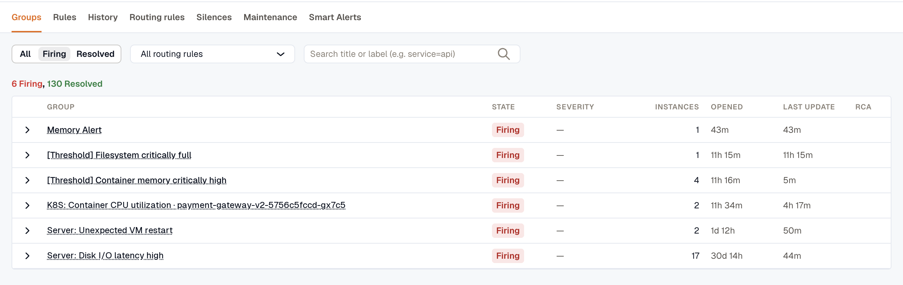
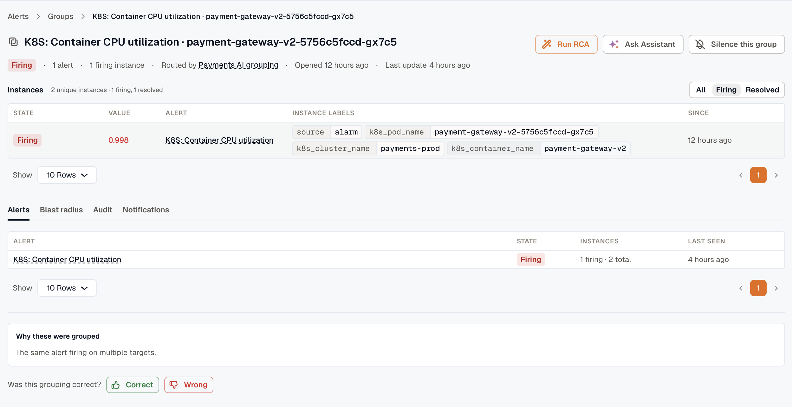
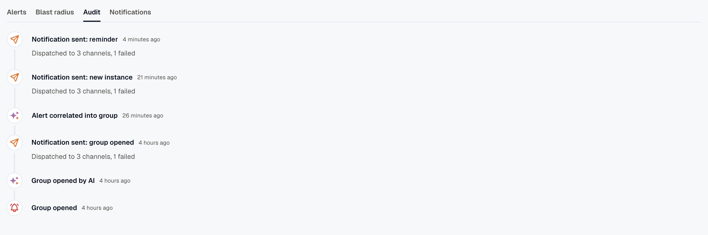

When related alerts fire close together, KloudMate groups them into a single **Alert Group**. Instead of notifying on every individual alert, you get one notification for the group, and new alerts append to it rather than fan out into separate notifications.

## How groups form

An Alert Group forms by static grouping or by the AI correlation engine. Both produce the same kind of group:

- **Static grouping** folds alerts together by the deterministic group-by keys on a routing rule. Alerts that share those label values land in one group.
- **Auto (AI) grouping** hands the decision to the correlation engine, which links related alerts on its own and learns which alerts tend to fire together over time.

You choose the mode per routing rule; see [Routing Rules](../routing-rules/#alert-grouping-static-or-auto-ai). For how membership is decided in each mode, and why a single rule firing on many hosts stays one Auto group, see [How Alert Grouping Works](../how-alert-grouping-works/). However a group forms, it behaves the same everywhere else on this page. An Auto-correlated group also records [why its alerts were grouped](#why-these-were-grouped).

## Where to find groups

Open **Alerts**, which starts on the **Groups** tab: the workspace-wide view of every group, firing or resolved.

Above the list, a summary shows how many groups are firing and how many are resolved, such as **6 Firing, 130 Resolved**.

Columns: **Group** (title), **State** (**Firing** or **Resolved**), **Severity**, **Instances** (the number of unique instances in the group), **Opened**, **Last update**, and **RCA** when an investigation is attached (a manual **Run RCA** or [Auto-RCA](../auto-rca/)).

Expand any row to preview that group's alerts inline, with each alert's state, instance counts, and when it was last seen. The group title links straight to the full detail page.

Filter the list by:

- **State:** **All**, **Firing**, or **Resolved**. Defaults to **Firing**.
- **Routing rule:** a single rule, or **All routing rules**.

To find a group by title or by a label such as `service=api`, use the search box. On the **Resolved** and **All** filters, the search matches titles only.

Severity isn't a filter on the list.

## Anatomy of a group

A group carries:

- **Title:** for a **Static** group, the rendered **Title** annotation when every instance that opened the group renders the same text, and otherwise the name of the alert that opened it. The correlation engine names an **Auto (AI)** group. See [Set a custom notification title](../annotations-and-severity/#set-a-custom-notification-title).
- **Severity:** the most severe **Severity** annotation among the instances that opened the group.
- **State:** **Firing** while at least one underlying instance is firing, and **Resolved** as soon as none is. A firing group whose firing instances are **all silenced** stays **Firing** and is marked **Muted**. Muting gates notifications; it doesn't resolve the group.
- **Labels:** the labels that define the group, read from the alerts that joined it (the group-by keys, in Static mode).
- **Alerts and instances:** how many distinct alerts and firing instances the group holds so far.
- **Routing rule:** the rule that opened the group.
- **Group ID:** the durable identifier you can share with teammates or paste into the assistant.
- **Correlation reason:** for an Auto-correlated group, why these alerts were grouped. See [Why these were grouped](#why-these-were-grouped).
- **Investigation:** a root-cause investigation, when one is attached. Start it manually with **Run RCA**, or automatically with [Auto-RCA](../auto-rca/); see [Run RCA and View RCA](#run-rca-and-view-rca).

## Group detail

Click a group's title to open its detail page.

### Header

- **Title:** named from the alerts that opened the group. See [Anatomy of a group](#anatomy-of-a-group).
- **Run RCA / View RCA:** starts or opens a root-cause investigation for the group. See [Run RCA and View RCA](#run-rca-and-view-rca).
- **Ask Assistant:** opens the assistant chat panel with the group's labels, state, alert and instance counts, and routing rule pre-loaded into the prompt, so you can start investigating without retyping context.
- **Silence this group:** opens the silence creator with matchers derived from the group, bound to the group so the silence lifts when the group resolves. The binding sets when the silence ends, not what it mutes: the silence covers any alert in the workspace whose labels match its matchers, group member or not. See [From an Alert Group](../silences/#from-an-alert-group).

### Instances

The **Instances** panel lists the unique alert instances in this group. Filter it by **All**, **Firing**, or **Resolved**; it shows **Firing** instances by default.

- **Common labels:** labels shared by every instance, so the per-row labels column only shows what varies.
- **Columns:**
  - **State:** **Firing** or **Resolved**. Instances muted by a silence or maintenance window are also marked **Muted**, so you can see at a glance which ones are firing but suppressed.
  - **Value:** the last evaluated value behind the instance's state.
  - **Alert:** the alert rule name. Links to the rule when the alert is KloudMate-native (carries an `alarm_id` label).
  - **Instance labels:** the labels that distinguish this instance from its siblings (common labels are stripped out).
  - **Since:** how long this instance has been in its current state.

Use this panel to see what's firing inside the group at a glance. Switch to **All** to see, for example, that service A's `prod` and `staging` are firing while `dev` has already recovered.

### Run RCA and View RCA

The root-cause button's label depends on whether an investigation is attached:

- **Run RCA:** shown when no investigation is attached. It starts a root-cause investigation for the group on demand.
- **View RCA:** shown once an investigation is attached. It opens the root-cause summary, which links to the full investigation.

This is the manual trigger. To investigate every group a rule opens automatically instead, enable [Auto-RCA](../auto-rca/) on the routing rule; the result appears under the same **View RCA**.

### Tabs

- **Alerts:** one row per alert rule in the group, with its state, how many of its instances are firing, and when it was last seen. The alert name links to its rule when the alert is KloudMate-native.
- **Blast radius:** what the group's firing resources connect to. See [Blast radius](#blast-radius).
- **Audit:** a timeline of the group's history, from when it opened to when it resolved. It records each notification and reminder sent, notifications suppressed by a silence or skipped, and investigations. For Auto-correlated groups, it also logs when the engine opened the group and when it correlated each alert.
- **Notifications:** every notification sent for the group, reminders included, with each channel's result and a link to where it landed: the Slack thread, the Jira ticket, the KloudMate Incidents incident, and so on.

### Blast radius

The **Blast radius** tab resolves the group's firing alerts to the resources they name, then graphs what each one depends on, so you can see how far the incident reaches.

Each affected resource anchors its own graph, its neighbors connected by labeled edges: **runs on**, **talks to**, **calls**. Neighbors of the same kind collapse into one node (for example, *116 Pods · runs on*) that you click to list them.

The same graph appears on a single alert's **Blast radius** tab and on a resource's **Dependencies** tab in Cloud Inventory. An empty graph means KloudMate hasn't mapped a connection yet, not that the lookup failed. When nothing is firing or the alerts don't match a known resource, there's no graph to draw.

### Why these were grouped

**Why these were grouped** gives the reason in plain English, the shared labels, and supporting detail.

This reason appears only when the engine grouped more than one alert instance, either several alerts or the same alert firing on multiple targets. A lone instance the engine left on its own has none, which is expected (see [Cold start](#cold-start)).

### Cold start

A new workspace has little co-occurrence history for the engine to learn from, so it leaves most alerts as separate singletons with no correlation chip. That's expected, not a failure. Correlation strengthens over the following days as the engine sees which alerts tend to fire together.

### Feedback

You can rate the grouping **Correct** or **Wrong**.

Choosing **Wrong** lets you point at the specific alert that doesn't belong, or mark the whole group as wrong. That feedback trains the correlation engine: a **Wrong** verdict makes it less likely to pair those alerts again, and **Correct** reinforces the grouping.

## When a group resolves

KloudMate marks a group **Resolved** as soon as none of its instances is firing. If a matching alert fires again after that, it opens a new group. Resolved groups stay in the list under the **Resolved** filter.

## Related

- [Routing Rules](../routing-rules/): define which alerts a group accepts, and whether it groups by keys (Static) or by the correlation engine (Auto).
- [Silences](../silences/): suppress notifications for matching labels.
- [Auto-RCA](../auto-rca/): automatic investigations on group open.
