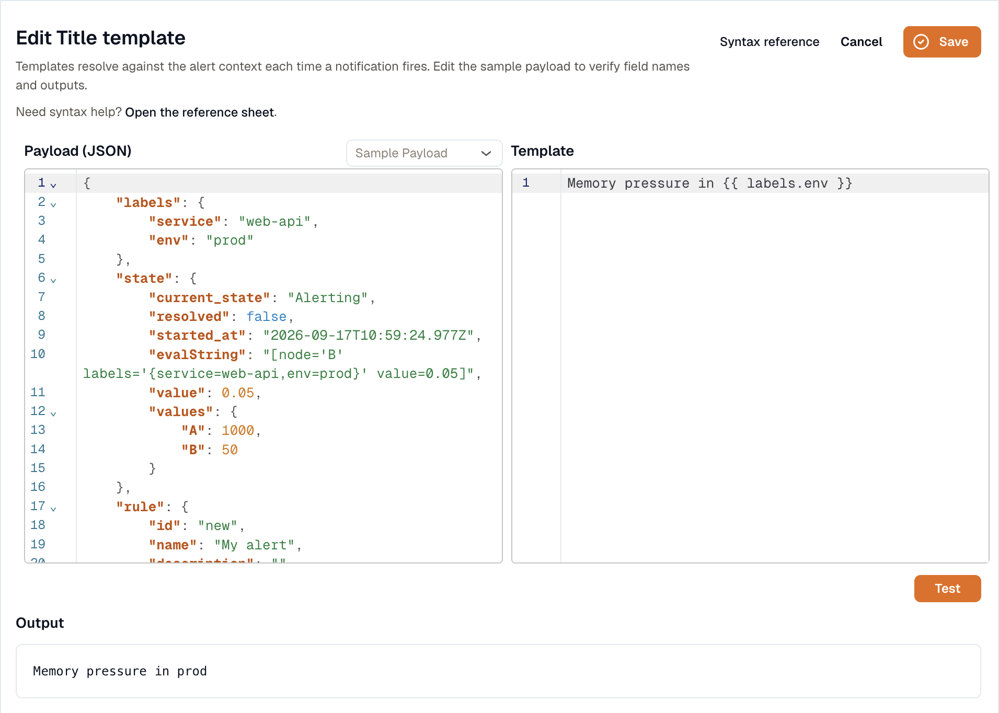
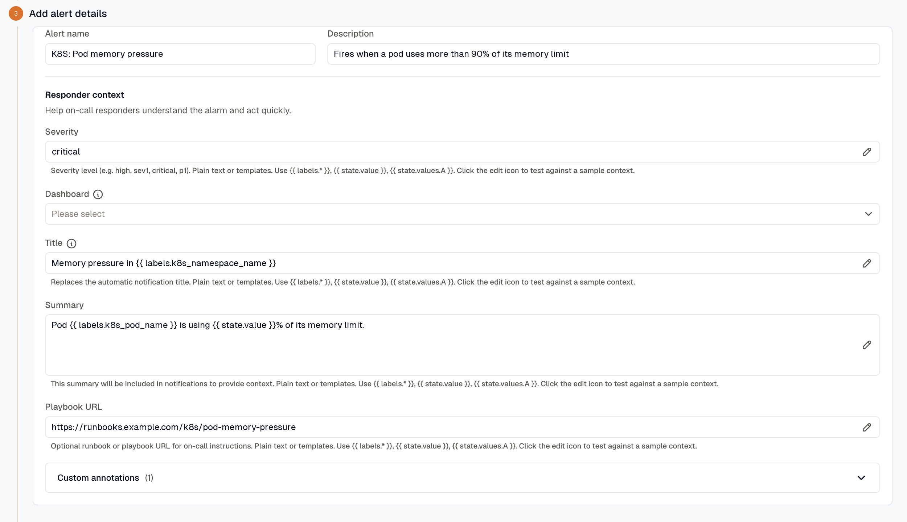
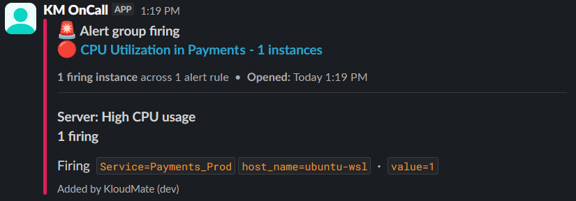

import { Steps } from '@astrojs/starlight/components';

**Annotations** are key-value pairs you attach to an alert. They flow into notifications and incidents along with the alert itself.

Annotation values support **Liquid templating**, so you can pull live data from the firing alert into the notification text. The reserved key `severity` drives how incident-management and routing tools prioritize the alert.

## Where to find annotations

Annotations live in the **Responder context** section of the alert rule editor. The pre-defined annotation keys are:

- **Severity:** free-form severity string, for example `sev1`, `critical`, or `p1`. Plain text or a Liquid template.
- **Dashboard:** pick a workspace dashboard to link from the notification.
- **Panel:** when a dashboard is picked, narrows the link to a specific panel.
- **Title:** the notification headline, in place of the automatic title. Plain text or a Liquid template. See [Set a custom notification title](#set-a-custom-notification-title).
- **Summary:** body text included in notifications. Supports templates.
- **Playbook URL:** link to the runbook responders should follow. Supports templates.

Any other key is a **custom annotation**. Custom annotations are available only in Advanced mode, where you add them with **Add annotation**.

## Add a custom annotation

<Steps>
1. **Open the rule in Advanced mode.** Editing an existing rule opens it in Advanced mode. For a new rule, click **Advanced mode** first. In **Add alert details**, expand **Custom annotations**.

2. **Click Add annotation.**

3. **Provide a key.** Use any key except the pre-defined ones, for example `service_owner`, `region`, or `runbook_section`.

4. **Provide a value.** This can be static text (`payments-team`) or a Liquid template (`{{ labels.service }} is degraded`).

5. **Save the rule.** Annotation values render at notification time, not at save time. See [Failure mode](#failure-mode) below.
</Steps>

## Using Liquid templates

You can interpolate live alert data into any annotation value with the `{{ }}` syntax. The render context shape is:

```jsonc
{
  "labels": {
    "service": "checkout-api",
    "env": "prod"
    // ...the rule's labels plus the series labels from the query
  },
  "state": {
    "current_state": "Alerting",
    "resolved": false,
    "started_at": "2026-05-19T12:00:00Z",
    "value": 0.05,                          // the evaluated value of the condition node
    "values": { "A": 1000, "B": 50 }        // raw outputs of each query/expression node
  },
  "rule": {
    "id": "alm_abc123",
    "name": "High error rate",
    "description": "Error rate ratio vs request volume"
  }
}
```

`labels` holds the rule's own labels merged with the labels on the series. If both use the same key, the series value wins.

### Common references

- `{{ labels.service }}`: the value of the `service` label on the firing instance.
- `{{ state.value }}`: the evaluated number that crossed the threshold.
- `{{ state.values.A }}`, `{{ state.values.B }}`: raw outputs of each query or expression node (by node ID).
- `{{ state.current_state }}`: `Alerting`, `Normal`, and so on.
- `{{ state.resolved }}`: boolean, useful in `…` branches.
- `{{ rule.name }}`, `{{ rule.id }}`: the alert rule's name and id. Prefer these over `labels.alarm_id` / `labels.alarm_name`, which aren't available at render time.

### Example: contextual summary

If you watch CPU utilization with query `A` grouped by `host_name`, you might write:

- **Key:** `Description`
- **Value:** `Host {{ labels.host_name }} is at {{ state.value }}% CPU.`

When the alert fires for `web-server-01` at 95%, the notification reads: *Host web-server-01 is at 95% CPU.*

## Testing a template

To preview how a template renders, click the edit icon in any templated field. The template editor opens with your current template loaded.

1. Edit the sample labels, state, and rule JSON the template renders against.
2. Click **Test** to preview the rendered output. Any parse errors are shown so you can fix them before saving.
3. Click **Save** to put the template back in the field, then save the rule.



Testing is optional; KloudMate doesn't validate templates on save. If a template can't render at notification time, KloudMate uses the raw template string instead, so the notification still goes out. **Title** is the exception, as described below.

### Failure mode

- A broken template stays in the value field as-is when you save.
- At render time, a parse failure makes that single annotation surface the raw template text instead of an evaluated value.
- Other annotations on the same alert keep rendering normally.
- **Title** doesn't fall back to raw text. If it renders empty, or still contains `{{` or `{%`, the notification uses the automatic title.

This fail-soft behavior is intentional: a typo shouldn't silence a real incident.

## Set a custom notification title

A custom title gives the alert a readable headline in every channel. **Title** is an optional field in **Responder context**, in both Simple and Advanced mode, and it takes plain text or a Liquid template.



The title replaces the automatic title in the email subject, the Slack and Microsoft Teams message, the Jira summary and heading, the SNS subject, the KloudMate Incidents incident title, and the webhook payload's `group.title`. It also names the group on **Alerts → Groups**, set when the group opens. The instance count is added to the end, for example `- 3 instances`.

The title is used only when it renders the same for every instance in the group, and every rule in the group has the same title. Build it from labels that are the same across the group, such as a service or a namespace. A value that differs between instances, such as a pod name, a host name, or `state.value`, gives each instance a different title. Notifications then use the automatic title, and the group on **Alerts → Groups** keeps the alert's name.

For example, with a [routing rule](../routing-rules/) that groups by `k8s_namespace_name`, set **Title** to:

```liquid
Memory pressure in {{ labels.k8s_namespace_name }}
```

When three instances in the `payments` namespace are firing, the title reads `Memory pressure in payments - 3 instances`.



The template can use `labels.*` (the rule's labels plus the series labels), `state.value`, `state.values.*`, `rule.name`, and `rule.description`. If it renders empty, or still contains `{{` or `{%` because the template didn't render, the automatic title is used.

The automatic title for a single rule is the alert name with its shared label values. For several rules grouped by labels, it's the group-by values with alert and instance counts. For an auto-correlated group, it's the correlation title with the instance count.

## Dynamic severity

Severity flows out of the reserved `severity` annotation. It's a string that downstream notification channels and incident-management tools use to prioritize the alert. Combine Liquid with `if` / `elsif` to compute severity from the firing value.

### Example: severity by threshold

Suppose query `B` is an error-rate ratio. You want:

- Error rate > 10% → `critical`
- Error rate > 5% → `warning`
- Anything below that → `info`

Set the `severity` annotation value to:

```liquid
criticalwarninginfo
```

At notification time, KloudMate evaluates the template against the firing alert's state and writes the resolved string into the outgoing payload.

## Severity vs. tags

Earlier versions of KloudMate routed by **notification tags** on the rule. Tags are gone now, replaced by:

- **Labels:** the labels you add to the rule with **Add label**, plus labels from query dimensions and folders. These are what [Routing Rules](../routing-rules/) match against.
- **Annotations:** human-readable context that flows into the notification.
- **Severity:** the reserved annotation key, free-form, optionally Liquid-templated.

If you used to route by tag, switch to a routing rule that matches on the equivalent label (for example, `service=checkout-api`).

## Related

- [Routing Rules](../routing-rules/): how labels match alerts to channels.
- [Creating Alerts](../create-alerts/): where annotations live in the rule editor.
