An alert watches a query, evaluates a condition, and when the condition holds long enough, fires into the grouping and routing engine so the right people get notified. This page walks through creating one, step by step.

## Getting started

Open **Alerts → Rules**.

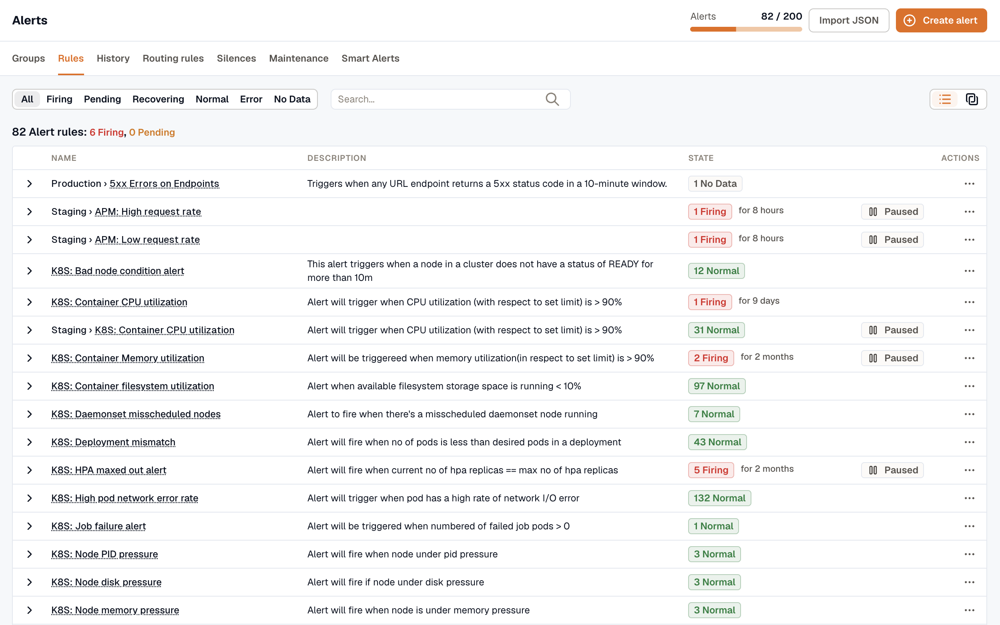

The **Rules** tab lists your alert rules with their current state, name, and description. You can group rules into [Folders](../folders/). Select a rule's name to open it.

From the **more options (⋯)** icon on any rule, you can:

- **Edit** the rule configuration
- **Duplicate** the rule
- **Move to folder…** to move the rule into a different [folder](../folders/)
- **Export as JSON** to copy the rule into another workspace. See [Export and Import Alerts](../export-and-import/)
- **State history** to see the rule's past state changes
- **Pause Evaluation** or **Pause Notifications**
- **Delete** the rule

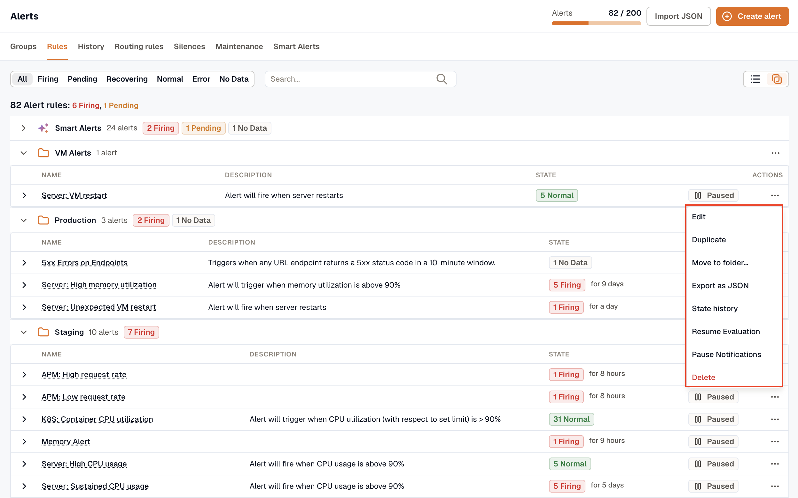

**Pause Notifications** creates a temporary [silence](../silences/) scoped to this alert: the rule keeps evaluating, but KloudMate suppresses its notifications until the silence expires. While it's paused, the rule is marked **Silenced**; view or end the pause from **Alerts → Silences**. Add matchers to limit it to specific instances.

For the key concepts, see the [Alerts Overview](../).

## Creating a new alert

Click **Create alert**, then choose how to start:

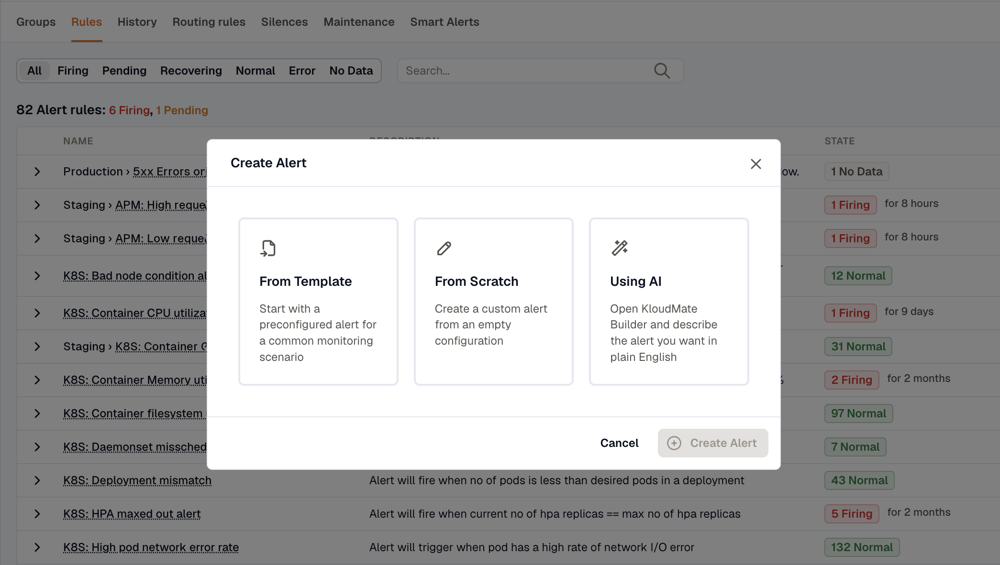

- **From Template:** start with a pre-configured alert for a common monitoring scenario.
- **From Scratch:** create a custom alert from an empty configuration.
- **Using AI:** open **KloudMate Builder** and describe the alert you want in plain English.

### From Template

Instead of building an alert from scratch, start from a pre-configured template that covers a common monitoring scenario.

1. In the **Create Alert** dialog, select **From Template**.
2. Open the **Template** dropdown and choose a template that matches your monitoring needs.

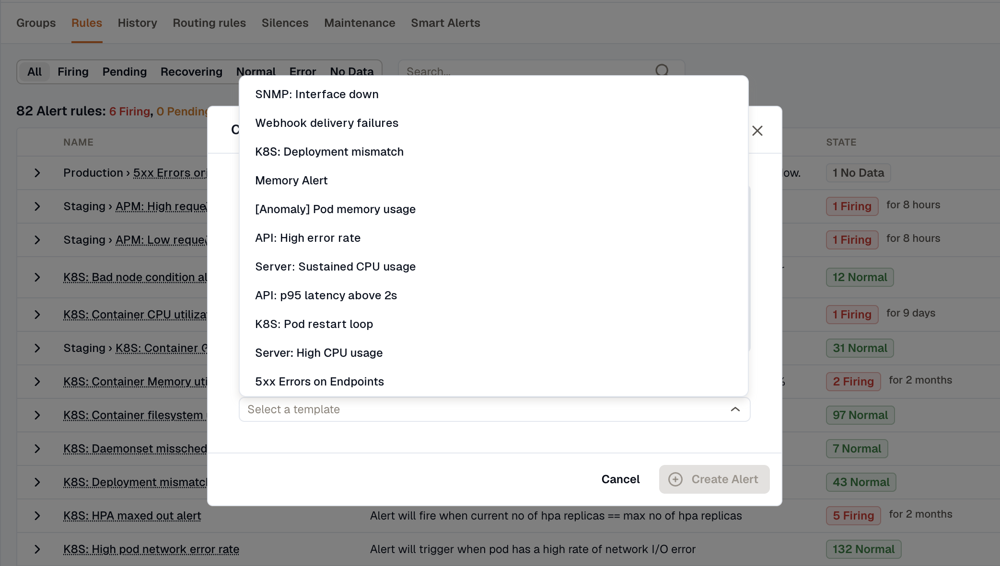

3. Click **Create Alert**. The rule is saved right away and appears on the **Rules** tab.
4. To configure it, click the menu next to the rule and select **Edit**.
5. The alert opens pre-configured with the query, aggregation, and threshold from the template. Review it and adjust any filters to match your environment.
6. Click **Save** or **Save & Close** when you're done.

### Using AI

**KloudMate Builder** drafts an alert from a plain-English description and fills in the alert editor for you. Nothing is saved until you click **Save**.

1. In the **Create Alert** dialog, select **Using AI**.
2. Describe the alert you want to create.

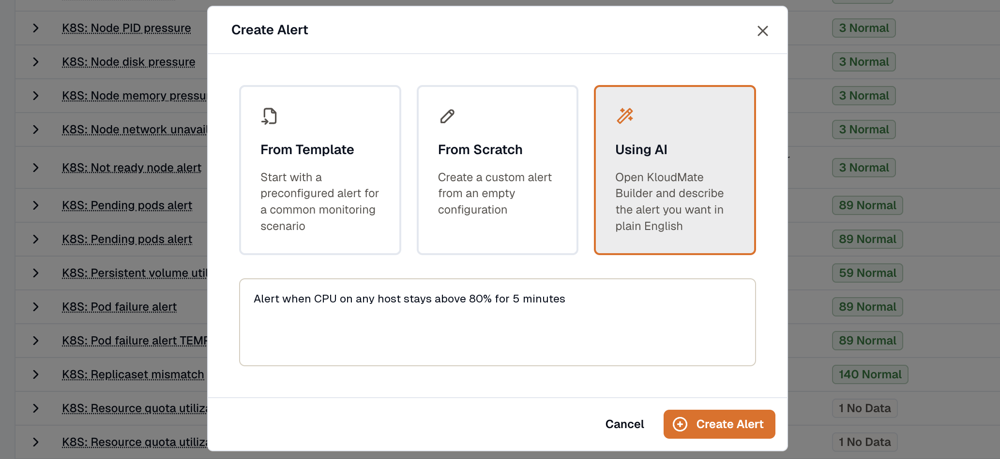

3. Click **Create Alert**. KloudMate Builder opens with your description as a draft message.

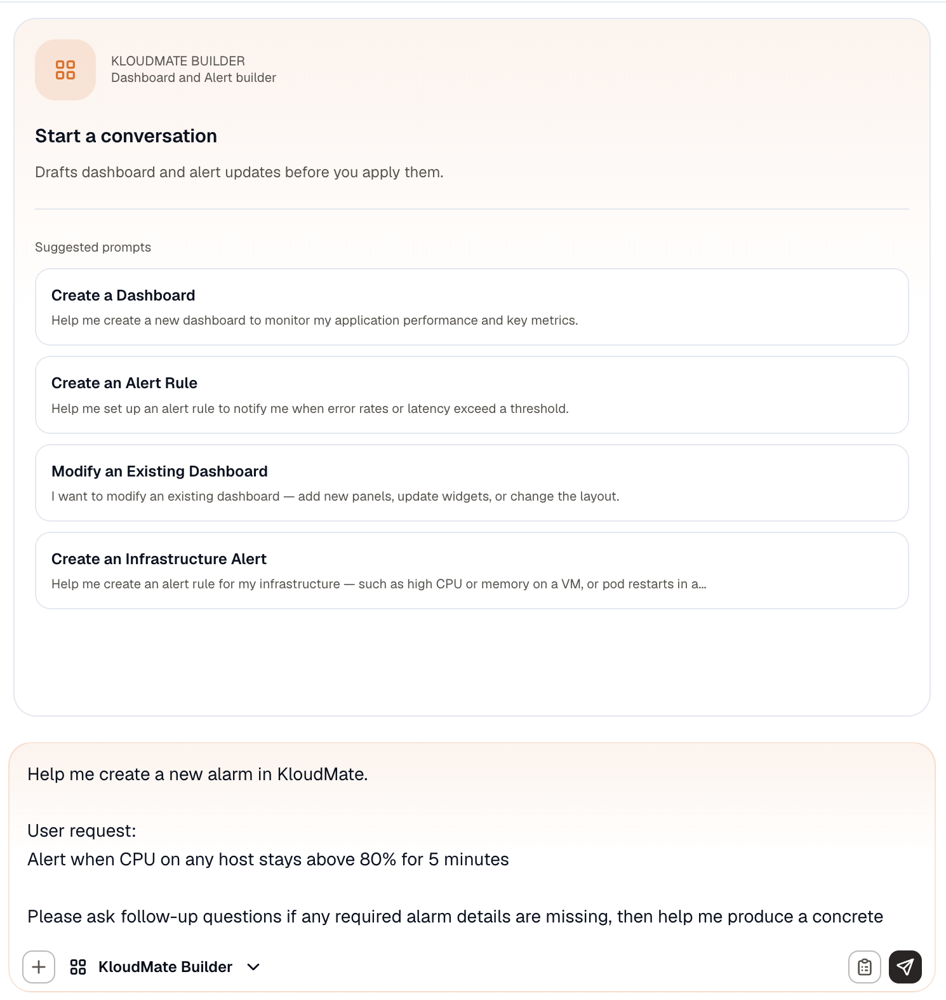

4. Send the message. The Builder may ask follow-up questions before it fills in the rule in the alert editor. A draft that Simple mode can't represent, such as one with several queries or expressions, opens in Advanced mode.
5. Review the query, condition, and evaluation settings, and change anything that doesn't match your environment.
6. Click **Save**.

### From Scratch

Select **From Scratch** in the **Create Alert** dialog and click **Create Alert**. The alert editor opens in Simple mode.

- **Simple mode** builds the rule from one query and one condition, on a single page. It's the only mode with the **Detection method** toggle for Anomaly and Forecast alerts. See [Build an alert in Simple mode](#build-an-alert-in-simple-mode).
- **Advanced mode** lets you add more queries and combine them with math, reduce, and condition expressions. It's also the only mode with custom annotations. See [Build an alert in Advanced mode](#build-an-alert-in-advanced-mode).

To switch, click **Advanced mode**. You can't switch back to Simple mode afterward. Editing or duplicating an existing rule always opens it in Advanced mode.

## Build an alert in Simple mode

Simple mode puts the whole rule on one page.

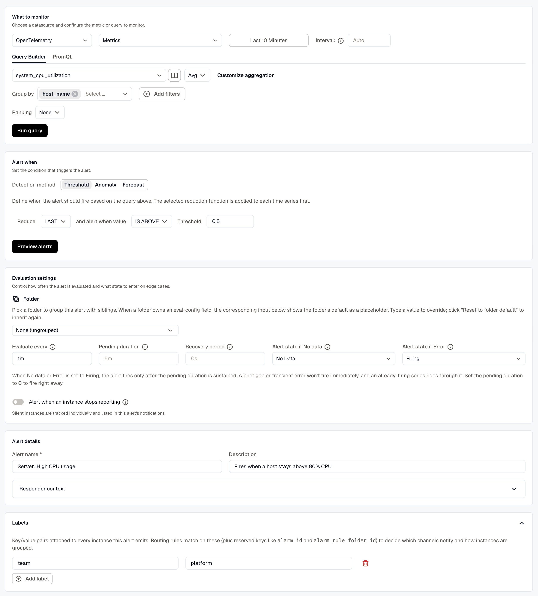

1. In **What to monitor**, choose a data source and set up the query. The query fields are the same as in [Advanced mode](#1-setup-query-conditions-and-expressions). Click **Run query** to chart the result.
2. In **Alert when**, set the condition. For a **Threshold**, pick a reduction, a comparison, and a threshold value. To alert on unusual values or a trend instead, [choose a detection method](#choose-a-detection-method). Click **Preview alerts** to check the result.
3. In **Evaluation settings**, pick a folder and set how the rule is evaluated. The fields are described in [Configure evaluation settings](#2-configure-evaluation-settings).
4. In **Alert details**, enter an **Alert name** and a description. Expand **Responder context** to add annotations such as a severity, a title, or a summary. See [Add alert details](#3-add-alert-details).
5. Expand **Labels** and add the labels you want routing rules to match on. See [Notifications](#4-notifications).
6. Click **Save**, or **Save & Close** to save and return to the **Rules** tab.

### Choose a detection method

The **Alert when** section sets the firing condition with a **Detection method** toggle:

- **Threshold:** the classic fixed rule. Pick a reduction (such as `mean` or `max`), a comparison, and a value; the alert fires when the reduced value crosses it.
- **Anomaly:** KloudMate learns the metric's normal range for each entity and alerts when a value moves well outside it, with no threshold to set. Choose a **Sensitivity** (High, Medium, or Low) and a **Direction** (Above, Below, or Both).
- **Forecast:** KloudMate follows the recent trend and alerts before the value reaches a **Limit**, within an **Alert horizon** of 1, 4, or 7 days. Set the **Direction** toward the max or the min. Good for disks, memory, and quotas.

Add a **Group by** key (such as host or service) so each entity is scored or forecast on its own baseline. The preview shows the learned range or the projected trend; click **Preview live data** to pull this workspace's own data.

Anomaly and Forecast are the same detection [Smart Alerts](../smart-alerts/) provisions and maintains automatically for common infrastructure. Both need a plan with anomaly detection; Threshold works on any plan.

Anomaly and Forecast rules evaluate every 5 minutes, so **Evaluate every** is fixed for them. If you leave **Pending duration** empty, it's saved as `30m`. Set **Sensitivity**, **Direction**, **Limit**, and **Alert horizon** before you save. Editing the rule opens it in Advanced mode, which doesn't have these controls.

:::note
The **Detection method** toggle appears only in Simple mode, and only for KloudMate metric queries. Anomaly and Forecast rely on the learned baselines KloudMate builds from your metrics, which aren't available for AWS (CloudWatch) or log and trace queries. Those sources use a **Threshold** condition.
:::

## Build an alert in Advanced mode

Advanced mode is for rules that need more than one query, or expressions that transform query results. The editor is split into steps: **Setup query conditions and expressions**, **Configure evaluation settings**, **Add alert details**, and **Notifications**, followed by a save.

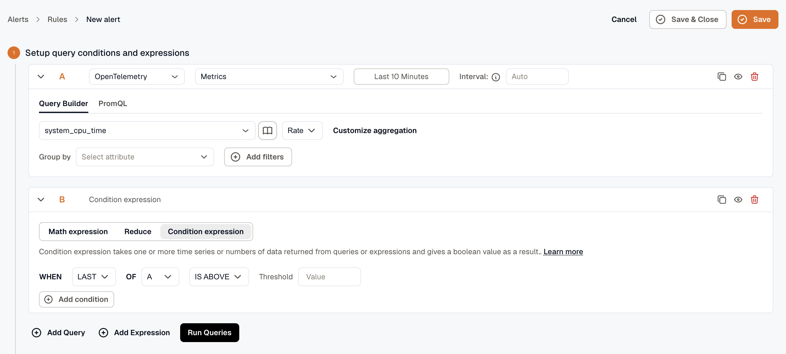

### 1. Setup query conditions and expressions

Create more queries and expressions with the **Add Query** and **Add Expression** buttons. KloudMate assigns each one a letter, such as **A**, **B**, or **C**, and you can duplicate any block with its copy icon.

#### Setting up query conditions for OpenTelemetry / KloudMate

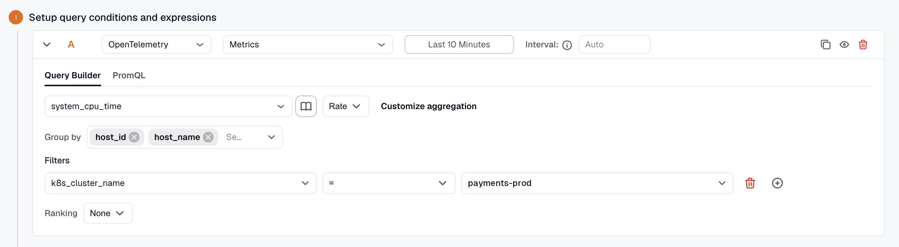

- **Data Set:** select the dataset you want to retrieve from your data source.
- **Metric to Aggregate:** select the metric you want to monitor from that dataset.
- **Aggregation:** choose the function applied to the metric, such as `Avg` or `Rate`. Click **Customize aggregation** for temporal and spatial aggregation controls. See [Metrics Aggregations](../../visualize-data/explore/metrics-aggregations/).
- **Group By:** enter the attributes used to group the data points.
- **Filters:** add filters to narrow the retrieved data points.
- **Ranking:** control how the series are ordered.

OpenTelemetry users can also use **Prometheus query language** to retrieve data and configure alerts.

#### Setting up query conditions for AWS (CloudWatch)

- **Time Range:** set how far back to fetch data with the dropdown, or enter a custom value in seconds.
- **Region:** select the AWS region of the service you want to monitor.
- **Namespace:** select the AWS service namespace you want to alert on.
- **Metric:** select the metric from that namespace.
- **Statistic:** select the statistical function to apply when calculating data points.
- **Dimensions:** optionally scope the alert to grouped resources within the namespace. For EC2, for example, you can filter by autoscaling group name, image ID, instance type, and more.

Click **Run Query** to fetch data.

#### Time range expressions for custom time

Query time ranges support the following:

- **Operators:** `-` for subtracting time
- **Supported values:** the same units and keywords used in dashboards
- **Examples:** `now`, `now-5m`

#### Setting up evaluation expressions

Expressions let you apply logic to query results. Reference any query or expression by its letter, such as **A**, **B**, or **C**. An expression can be passed as a parameter only when multiple expressions are configured.

Choose from these expression types:

- **Math expression:** enter a mathematical expression to apply to a query or expression, such as `$A+1`, `$A<$B`, or `$A && $C`. See [Alert Expressions](../expressions/).
- **Reduce:** aggregate a query or expression into a single number with a function, then pick the target from the **Input** dropdown. Available functions include `mean()`, `max()`, `min()`, `sum()`, `last()`, and `count()`.
- **Condition expression:** pick a function and a query or expression, then choose a condition and a threshold to evaluate against. You can add multiple conditions and combine them with **AND** or **OR**.

Click **Run Queries** to execute everything you've configured.

:::tip
To avoid the **NoData** issue when a single alert uses multiple queries, use the `ifNull` operator to assign a default value. See [Alert Expressions](../expressions/).
:::

### 2. Configure evaluation settings

In Simple mode, these fields are in **Evaluation settings**, without **Alert condition**.

Pick a **Folder** to organize the rule: select an existing folder, or type a new name to create one inline. A folder can set defaults for **Evaluate every**, **Alert state if No data**, **Alert state if Error**, **Alert when an instance stops reporting**, and **Auto-close after**. See [Folders](../folders/).

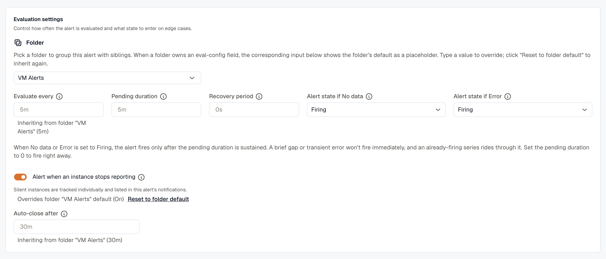

- **Alert condition:** the query or expression that triggers the alert, such as **A**, **B**, or **C**.
- **Evaluate every:** how often the alert condition is evaluated (for example, `60s` or `1m`).
- **Pending duration:** how long the condition must stay true before the alert fires (for example, `5m`). Leave empty to fire immediately.
- **Recovery period:** how long the condition must stay within threshold before the rule resolves (for example, `5m`). This stops a flapping metric from resolving and immediately re-firing. While the rule waits out this window, the instance shows as **Recovering**: still firing, not yet back to Normal. Leave empty to resolve as soon as the condition clears.
- **Alert state if No data:** which state the alert enters when the query returns no data points. Options: **Firing**, **No Data**, **Normal**, or **Error**.
- **Alert state if Error:** which state the alert enters when a query returns an error. Options: **Firing**, **Error**, or **Normal**.
- **Alert when an instance stops reporting:** track each instance the query returns, and alert when one goes silent while the others keep reporting. Turning this on also sets **Alert state if No data** to **Firing**. Set **Auto-close after** to control how long a silent instance stays tracked. See [Instance Absence Detection](../instance-absence-detection/).

:::note[How “Firing” interacts with the pending duration]
When **Alert state if No data** or **Alert state if Error** is set to **Firing**, the alert doesn't fire the instant data goes missing or a query errors. It fires only after the condition has held for the **Pending duration** above, so a brief gap or a transient error won't notify anyone, and a series that's already firing rides through the blip without resetting. Set the **Pending duration** to `0` to fire immediately instead.
:::

:::tip
For the full lifecycle, and how **Pending duration**, **Recovery period**, and the **No data** / **Error** states interact across an alert's states, see [Alert Lifecycle & States](../alert-lifecycle/).
:::

Click **Preview alerts** to run the query immediately and check the result.

:::tip[Folder defaults on a new rule]
A new rule starts with **Evaluate every** set to `1m`, **Alert state if No data** set to **No Data**, and **Alert state if Error** set to **Firing**. These values override the folder's defaults until you click **Reset to folder default** on each field. On an existing or duplicated rule, a blank field inherits from the folder. **Alert when an instance stops reporting** and **Auto-close after** inherit from the folder on every rule until you change them.
:::

### 3. Add alert details

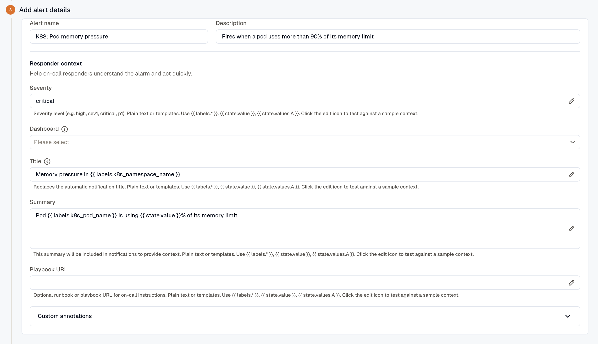

Set the alert's name and description, then fill in the responder context. In Simple mode, these fields are in the **Alert details** section.

- **Alert name:** a name for the alert.
- **Description:** a short description of the alert's purpose.

**Responder context** holds the annotations responders see when the notification lands.

- **Severity:** free-form severity (for example, `sev1`, `critical`, or `p1`). Supports Liquid templates, so severity can depend on the firing value.
- **Dashboard:** optional dashboard link included with the notification.
- **Panel:** after you pick a dashboard, narrows the link to a specific panel.
- **Title:** replaces the automatic notification title. Supports templates. See [Set a custom notification title](../annotations-and-severity/#set-a-custom-notification-title).
- **Summary:** multiline message included in notifications. Supports templates.
- **Playbook URL:** optional runbook URL. Supports templates.

In Advanced mode, open **Custom annotations** and click **Add annotation** to add your own key-value pairs (for example, `service_owner` or `region`). Values support Liquid templates. Simple mode doesn't have custom annotations. See [Annotations & Severity](../annotations-and-severity/).

### 4. Notifications

The Notifications step controls how this alert flows into the grouping engine. In Simple mode, add labels in the **Labels** section. Routing rules match on **labels**, not free-form tags:

- **Labels:** key/value pairs attached to each alert this rule fires. Add them with **Add label**, or leave the list empty. Routing rules match on these labels, plus the reserved `alarm_id`, `alarm_rule_folder_id`, and per-instance query labels, to decide which channels notify and how alerts group.
- **Routing:** [Routing Rules](../routing-rules/) in **Alerts → Routing rules** match alerts by label and send them to one or more notification channels.
- **Severity:** flows through the reserved `severity` annotation from the previous step; downstream tools use it to prioritize.

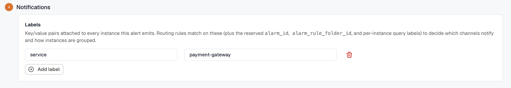

If you're migrating a rule that used notification tags, it keeps working; routing now matches on labels instead.

### 5. Save the alert

Click **Save** to save the alert, or **Save & Close** to save it and return to the **Rules** tab.

## Viewing an alert

To open an alert, select its name on the **Rules** tab. The detail page has these tabs:

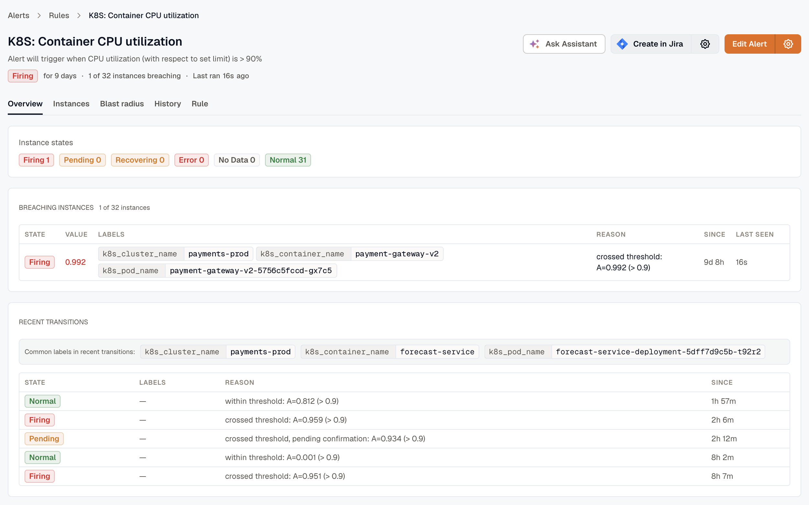

- **Overview:** instance states, breaching instances with their labels, reason, and duration, plus recent state transitions.
- **Instances:** the full list of alert instances and their current states.
- **Blast radius:** the resources the alert's instances map to, and what those resources depend on.
- **History:** the state-change history over time.
- **Rule:** the alert configuration and query definition.

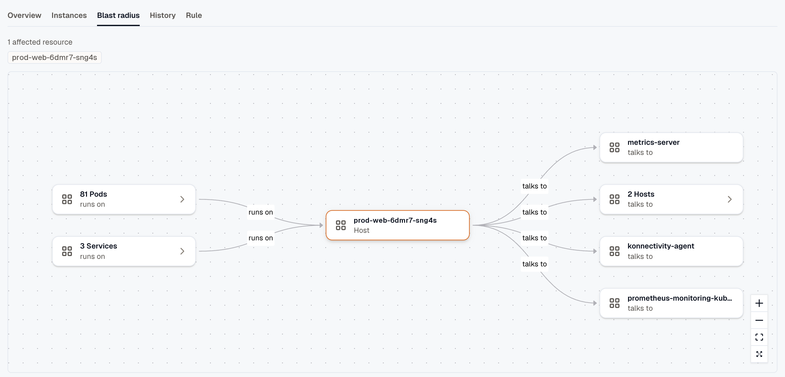

The instance tables on **Overview** and **Instances** also show each instance's last evaluated value and when it was **Last seen**.
