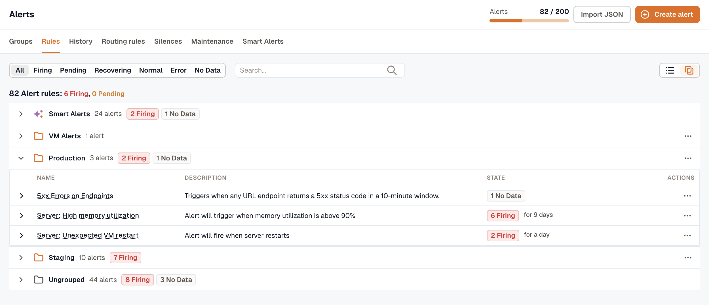
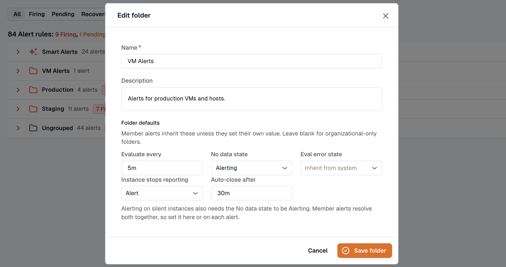
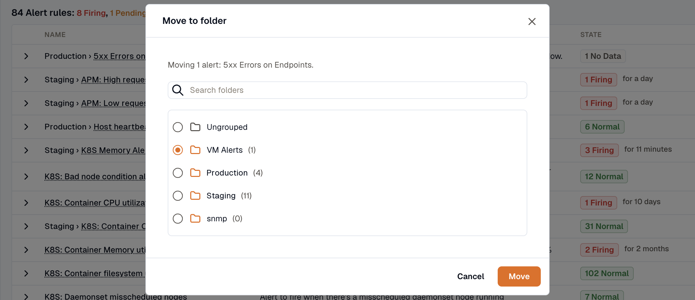

Folders organize related alert rules and let member rules inherit shared evaluation defaults, the same grouping pattern dashboards use.

On **Alerts → Rules**, switch between a flat **List view** and a grouped **Folder view**. In Folder view, rules are grouped under their folder, and rules without one appear under **Ungrouped**. Rules that [Smart Alerts](../smart-alerts/) manages appear under **Smart Alerts** until you move them into a folder.

There's no separate Folders page. You manage folders from the **Rules** tab and the rule editor.

## Create a folder

You create folders inline from the alert rule editor's **Folder** picker; there's no separate "New folder" button.

1. Open an alert rule (create a new one or edit an existing one).
2. In **Configure evaluation settings** (**Evaluation settings** in Simple mode), click the **Folder** dropdown.
3. Type a new folder name, then select the `+ Create "<name>"` option that appears.
4. KloudMate creates the folder and assigns the current rule to it.
5. Save the rule. A folder appears in Folder view only after it contains at least one saved rule.
6. To set folder defaults, switch to **Folder view** on the **Rules** tab, open the folder's kebab menu, and select **Edit folder**.

## Edit folder defaults

In Folder view, each folder header row has a kebab menu with **Edit folder**, **Export alerts as JSON**, and **Delete folder**.

**Edit folder** opens a dialog with the folder's settings:

| Field | What it controls |
|---|---|
| **Name** | Required, unique within the workspace. |
| **Description** | Optional. |
| **Evaluate every** | Default evaluation interval (for example `60s`, `1m`, or `2h`). Members inherit when blank. |
| **No data state** | Default state when queries return no data. Options: **Alerting**, **Normal**, **No Data**, or **Error**. |
| **Eval error state** | Default state when evaluation errors out. Options: **Alerting**, **Normal**, **No Data**, or **Error**. |
| **Instance stops reporting** | Whether members alert when an instance stops reporting. Options: **Alert** or **Don't alert**. **Alert** also needs **No data state** set to **Alerting**, on the folder or on each member rule. See [Instance Absence Detection](../instance-absence-detection/). |
| **Auto-close after** | How long a silent instance stays tracked before it closes on its own, from `5m` to `72h` (for example `30m` or `24h`). |

Member alerts inherit these defaults unless they set their own value. Leave a folder's fields blank to make it organizational-only.

## Move rules into a folder

You move rules one at a time, from the **Rules** tab or from the rule editor:

- **From the Rules tab:** open the rule's more options (⋯) menu and select **Move to folder…**. Choose a folder or **Ungrouped**, then click **Move**.
- **From the rule editor:** open the rule, pick the folder from the **Folder** dropdown in the **Configure evaluation settings** section, and save the rule.

Moving a rule does **not** rewrite its own **Evaluate every**, **No data state**, or **Eval error state** values. Whatever the rule had before the move stays. The folder defaults only apply where the rule's field is blank.

## Inheritance and overrides

A rule's evaluation fields resolve like this:

| Rule field | What runs |
|---|---|
| Blank, inheriting from its folder | The folder's default |
| Set, overriding its folder | The rule's own value |
| Blank, with no folder | The system default |
| Set, with no folder | The rule's own value |

**Reset to folder default** clears an overridden field so it inherits again. A blank field keeps inheriting, so when the folder default later changes, the rule picks up the new value automatically.

New rules start with **Evaluate every** set to `1m`, **Alert state if No data** set to **No Data**, and **Alert state if Error** set to **Firing**, and those values override the folder's defaults. To inherit the folder's value instead, click **Reset to folder default** on the field. Existing and duplicated rules keep inheriting wherever a field is blank. **Alert when an instance stops reporting** and **Auto-close after** inherit from the folder on every rule, new ones included, until you set them.

:::tip
To detach a rule from its folder entirely, set its **Folder** to **None (ungrouped)**. The rule keeps its stored evaluation values and stops inheriting.
:::

## Delete a folder

From the folder's kebab menu, select **Delete folder**. Member alerts become ungrouped, keeping their stored evaluation values. KloudMate detaches the members first, then deletes the folder; the rules survive.

## Folder labels in alert groups

A rule's folder identity flows into the alert's labels as `alarm_rule_folder_id` and `alarm_rule_folder_name`. That means:

- [Routing Rules](../routing-rules/) can match on folder identity (for example, `alarm_rule_folder_name in [Kubernetes, Networking]`).
- The folder name appears automatically as a label on the [Alert Group](../alert-groups/).

## Related

- [Creating Alerts](../create-alerts/): picking a folder during rule creation.
- [Routing Rules](../routing-rules/): matching on folder labels.
- [Export and Import Alerts](../export-and-import/): exporting a folder's rules into another workspace.
