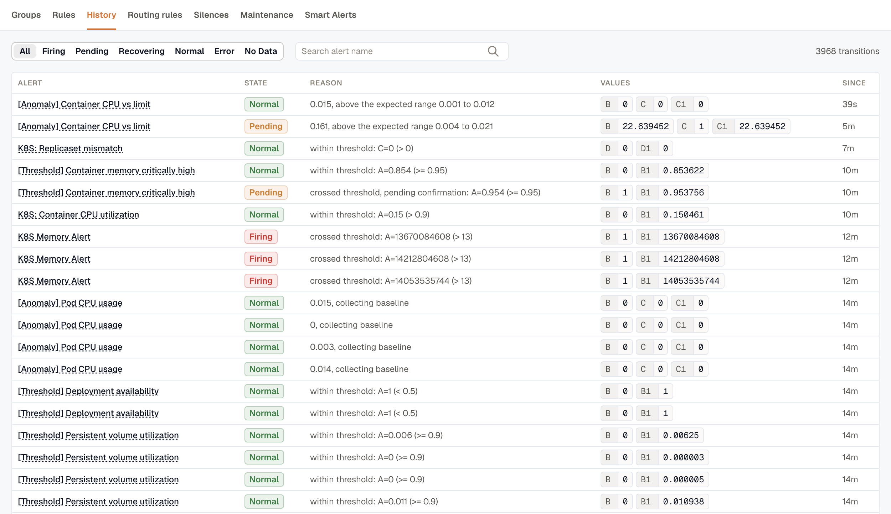

import { LinkCard, CardGrid } from '@astrojs/starlight/components';

Alerts tell you when something needs attention: an error-rate spike, a service going quiet, a budget threshold crossed. You write the rule once; KloudMate evaluates it on a schedule, groups related firings together, and routes notifications to the channels you care about.

This page covers the concepts behind the Alerts module. The rest of this section covers each feature in detail.

## Navigate the Alerts module

**Alerts** opens on the **Groups** tab, where related alerts are collected into [alert groups](./alert-groups/). The **Rules** tab lists your alert rules and their [folders](./folders/), and **History** records every alert state change in the workspace. The other tabs control how alerting behaves: [Routing rules](./routing-rules/) decide where notifications go, [Silences](./silences/) and [Maintenance](./maintenance-windows/) windows suppress notifications for a set period, and [Smart Alerts](./smart-alerts/) creates and maintains rules for common infrastructure.

## Key concepts

### Alert rule

An alert rule contains the evaluation criteria: one or more queries, expressions, and a condition. It also specifies how often KloudMate evaluates the rule, how long the condition must hold before the rule fires, and how long it must stay clear before the rule resolves.

### Alert query

A query fetches data from a source. KloudMate alerts support AWS CloudWatch and KloudMate's own telemetry (logs, metrics, spans) as sources.

### Alert expressions

Expressions transform query output with math, reductions, or conditions. They reduce time series to a single number you can compare against a threshold. See [Alert Expressions](./expressions/).

### Alert labels

Labels are key-value pairs attached to each firing alert. They come from query dimensions, the labels you add to the rule with **Add label**, and any folder the rule lives in. [Routing Rules](./routing-rules/) match against them to decide where notifications go.

### Annotations and severity

Annotations carry human-readable context (title, summary, runbook URL, dashboard link) into each notification. Values support Liquid templates, so you can interpolate live label and state data into the message. The reserved `severity` annotation key drives downstream routing and incident severity. See [Annotations & Severity](./annotations-and-severity/).

### Folders

Folders group related alert rules and let member rules inherit shared defaults: evaluation interval, no-data state, eval-error state, whether to alert when an instance stops reporting, and how long a silent instance stays tracked. See [Folders](./folders/).

### Alert groups

When matching alerts fire close together, KloudMate bundles them into a single **Alert Group**: a durable, deduplicated container that updates as higher-severity alerts join, holds the auto-RCA if you've enabled one, and gives you a single thread to notify against. See [Alert Groups](./alert-groups/).

### Routing rules

Routing rules decide which channels get notified for which alerts. Each rule matches alerts by their labels, groups them by chosen label keys, and dispatches notifications to one or more channels. See [Routing Rules](./routing-rules/).

### Silences

A silence suppresses notifications for matching labels for a bounded time window. Use it when you know an alert will be noisy and you don't want to flood your channels. See [Silences](./silences/).

### Multi-dimensional alerts

A single rule can produce multiple alert instances, one per dimension. A rule watching Lambda throttling generates one instance per throttled function.

### Smart alerts

Instead of hand-authoring thresholds, turn on curated detectors and let KloudMate create and maintain the rules for you. Smart Alerts covers common infrastructure with anomaly, forecast, and threshold detection. See [Smart Alerts](./smart-alerts/).

## The alert workflow

1. A rule retrieves data from its source using queries.
2. Expressions reduce or transform query results.
3. The condition is evaluated; if it holds for the pending duration, the rule fires.
4. The firing alert is tagged with labels and annotations and sent into the grouping engine.
5. The grouping engine matches the alert against [Routing Rules](./routing-rules/), opens or appends to an [Alert Group](./alert-groups/), and dispatches notifications to the rule's destination channels.
6. Active [Silences](./silences/) and [Maintenance Windows](./maintenance-windows/) can suppress the outbound notification at this step. The rule keeps evaluating in the background, and the state change is still recorded on the **History** tab.

## Alert states

- **Firing / Alerting:** the rule's condition has held longer than the pending duration.
- **Pending:** the condition is currently true but hasn't held long enough yet.
- **Recovering:** the condition has cleared, but the rule is still firing while it waits out the recovery period before resolving.
- **Normal:** everything's quiet.
- **Error:** the evaluation hit an error (bad query, source unreachable).
- **No Data:** the query returned no data for the configured window.

For how these states transition, and how the pending duration, recovery period, and no-data or error settings shape them, see [Alert Lifecycle & States](./alert-lifecycle/).

## Review alert history

The **History** tab lists every alert state change in the workspace, newest first, with the reason for each change and the query and expression **Values** at that moment. The total number of transitions is shown above the list. Filter by state or search by alert name to narrow the list. For example, select **Firing** and search for `checkout` to see each time a checkout alert moved to **Firing**. Select an alert's name to open its rule.

## Next steps

<CardGrid>
  <LinkCard title="Create an alert" description="Walk through the alert creation form end to end." href="./create-alerts/" />
  <LinkCard title="Smart Alerts" description="Turn on curated detectors and let KloudMate maintain the rules." href="./smart-alerts/" />
  <LinkCard title="Export and import alerts" description="Copy alert rules into another workspace as JSON." href="./export-and-import/" />
  <LinkCard title="Lifecycle & states" description="How alerts move through pending, firing, recovering, and resolve." href="./alert-lifecycle/" />
  <LinkCard title="Annotations & severity" description="Add Liquid-templated context to your notifications." href="./annotations-and-severity/" />
  <LinkCard title="Routing rules" description="Send the right alerts to the right channels." href="./routing-rules/" />
  <LinkCard title="Alert groups" description="See how related alerts deduplicate into a single notifiable unit." href="./alert-groups/" />
  <LinkCard title="How alert grouping works" description="Why alerts land in the same group, and how to get per-host groups." href="./how-alert-grouping-works/" />
</CardGrid>

## Related resources

<CardGrid>
  <LinkCard title="Reliability / SLOs" description="Track service health proactively with service-level objectives." href="../reliability/" />
  <LinkCard title="Notification Channels" description="Configure Slack, Email, Webhook, Jira, KloudMate Incidents, and more." href="../platform/settings/notification-channels/" />
  <LinkCard title="Incident Management" description="Turn fired alerts into incidents with on-call routing." href="../incident-management/" />
</CardGrid>
