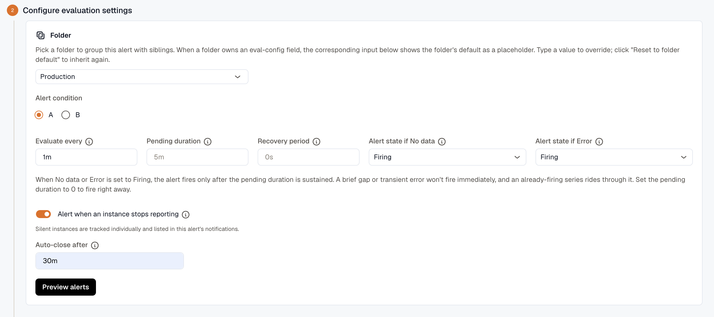
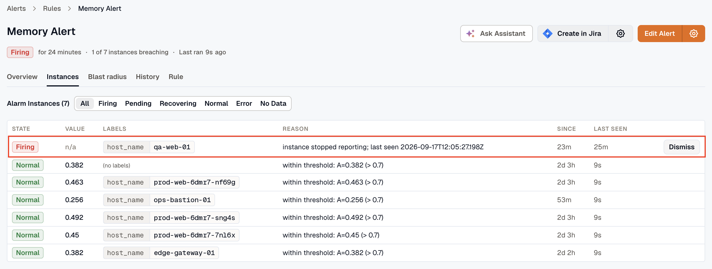

import { LinkCard, CardGrid } from '@astrojs/starlight/components';

A threshold alert only evaluates the datapoints that arrive. When the datapoints stop, it has nothing to evaluate. **Alert when an instance stops reporting** covers that case: turn it on for a rule and KloudMate remembers every instance the rule has seen, then alerts when any of them goes silent.

An **instance** is a unique series identified by its distinct labels. A heartbeat metric grouped by `host_name` produces one instance per host; group by `serviceName` and `pod_name` and you get one per pod. Absence detection tracks each instance individually: it has its own state, its own history, and its own dismissal.

The setting is off by default and opt-in, per rule or per folder, so existing rules don't change until you enable it. It works with any datasource, whether the data comes from the KloudMate agent or not.

## How it works

On every evaluation, KloudMate compares the query results against the set of instances the rule has seen. An instance missing from the results is evaluated as if the query had returned no data for it, and it moves through the normal [lifecycle](../alert-lifecycle/): **Pending** for the pending duration, then **Firing**. From **Pending** onward, its reason is `instance stopped reporting; last seen <timestamp>`. The moment the instance reports again, it recovers through the usual path, including any recovery period.

Absence detection changes what fires, not how notifications are threaded. Threading comes from the [routing rule](../routing-rules/) that matches, through its **Group-by** keys, exactly as it does for threshold alerts:

- **No grouping dimension** (empty, or only `alarm_id`): one thread per alert rule. Every silent instance is listed in that thread, and instances that go silent later arrive as updates to it rather than as separate notifications.
- **Grouped by an instance dimension**, such as `host_name`: one thread per host. Two hosts going silent gives you two threads and two [Alert Groups](../alert-groups/), which is what grouping by host means. Each of those threads also collects every other alert rule firing for that host, not just this one.

Routing itself works as usual, since each instance carries its own labels.

## Turn it on

1. Create or edit an alert rule and go to **Configure evaluation settings** (**Evaluation settings** in Simple mode).
2. Turn on **Alert when an instance stops reporting**.
3. Optionally set **Auto-close after**: how long a silent instance stays tracked, and firing, before it closes on its own, which happens only while other instances are still reporting. Leave it blank to inherit the folder default, or the system default of 24 hours. It accepts durations from `5m` to `72h`, for example `30m` or `48h`.
4. Save the rule.

Absence detection runs only while **Alert state if No data** is **Firing**, so turning the toggle on sets that field to **Firing** as well. If you later change **Alert state if No data** to another state, absence detection stops. Turning the toggle off leaves the No-data state alone, in case you still want the rule to fire when the whole query returns nothing.

Both settings inherit from [folders](../folders/): the rule's own value wins, a blank field falls back to the folder default, and the system default applies last. Folders expose the same two settings, **Instance stops reporting** (**Alert** / **Don't alert**) and **Auto-close after**. A folder set to **Alert** also needs **No data state** set to **Alerting**, either on the folder or on each rule. A new rule starts with **Alert state if No data** set to **No Data**, which overrides the folder, so click **Reset to folder default** on that field to use the folder's setting.

## Make the query window longer than the reporting interval

The query window and the pending duration together decide when an absence fires:

- **The query's time window** decides when an instance counts as missing. As long as the window still contains old datapoints, the instance counts as reporting; it goes missing only after the window slides past its last datapoint.
- **Pending duration** then runs as usual before the instance fires.

So an instance alerts roughly **query window + pending duration** after its last datapoint. Leave the pending duration empty and it fires about one query window after the data stops.

Make the window several times the reporting interval. If instances report every 60 seconds and the window is also 60 seconds, one slightly late datapoint makes a healthy instance flap between reporting and missing. A 5-minute window over a 60-second heartbeat absorbs the jitter and still alerts within minutes.

## Example: a fleet heartbeat

Say every host emits a heartbeat metric once a minute, and you want to know when any of them stops. One rule covers the whole fleet:

1. Query the heartbeat metric (a count of datapoints works well) with **Group By** `host_name` and a 5-minute time window.
2. Set **Evaluate every** to `1m` and **Pending duration** to `2m`.
3. Turn on **Alert when an instance stops reporting** and save.

Here's what happens when `web-7` drops off the network at 10:03, right after its last heartbeat:

- Until about 10:08, the 5-minute window still contains datapoints from `web-7`, so it counts as reporting.
- At 10:09 the window is empty for `web-7`, and the instance enters **Pending** with the reason `instance stopped reporting; last seen 2026-08-03T10:08:12Z`.
- At 10:11, after the 2-minute pending duration, `web-7` starts **Firing**. With a routing rule that doesn't group, the rule's notification thread lists `host_name=web-7`.
- If `web-9` goes quiet at 10:20, it fires the same way. It joins the same thread under that ungrouped rule, or opens its own under a rule grouped by `host_name`.
- When `web-7` comes back, its instance resolves automatically. Nothing to clean up.

That's about eight minutes after the last datapoint: the 5-minute window plus the 2-minute pending duration, rounded up to the next evaluation. New hosts need no registration; each is tracked from the first heartbeat it sends.

## The Instances tab

The **Instances** tab lists every tracked instance and when each was **Last seen**. Last seen records when the instance last appeared in query results, so with a lookback window it can read up to one window later than the instance's final datapoint. While an instance is pending or firing for absence, its reason is `instance stopped reporting; last seen <timestamp>`.

### Dismiss an instance that was terminated on purpose

Autoscalers scale in and hosts get decommissioned. When an instance went away on purpose, close its alert instead of waiting out the auto-close window. With the **Developer** role, you can **Dismiss** any instance that stopped reporting, including one that's still **Pending**.

Dismissal forgets the instance; it isn't a mute. If the instance ever reports again, tracking resumes automatically, so a dismissal can't permanently hide an instance that comes back. Dismiss removes the instance right away, and the instance leaves its alert group within one evaluation interval. The group and any linked ticket resolve only if nothing else in the group is still firing. Dismissing an instance that's already been dismissed changes nothing.

If the instance is coming back later, after planned maintenance or a reboot, use a [silence](../silences/) or [maintenance window](../maintenance-windows/) instead. Both apply to absence alerts like any other: the instance keeps its state, notifications are withheld, and it recovers on its own when it reports again.

## Auto-close and history reasons

Auto-close applies to partial absence, when the rule can still see other instances. A silent instance sitting among reporting ones is genuinely gone, so if it's neither dismissed nor heard from again, it closes on its own once the **Auto-close after** window passes. Auto-close and dismissal both forget the instance, so if it ever reports again it's tracked again from scratch.

If the query returns nothing at all, no instance is auto-closed. Every tracked instance is held, firing, keeping its own labels and grouping, until data returns or you dismiss it. A completely dark query proves nothing about any individual instance, because the collection pipeline itself may be broken, so it isn't safe to conclude that any host is gone.

On a rule that watches a single instance, auto-close therefore never fires in practice: that one instance going quiet is what makes the query dark. Use **Dismiss** for a host you decommissioned on purpose.

Every transition lands in the alert's **History** tab with a reason:

| Reason | What happened |
|---|---|
| `instance stopped reporting; last seen <timestamp>` | The instance went silent and moved to **Pending** or **Firing**. |
| `auto-closed: instance silent past absence retention` | The instance stayed silent past the **Auto-close after** window while other instances kept reporting, and closed on its own. |
| `dismissed: instance deregistered by user` | Someone dismissed the instance. |

## Other behaviors you might notice

- **Tracking starts at first sight.** An instance is tracked from the first time it appears in results after the setting is on. Anything that stopped reporting earlier is never tracked, so enable the toggle while the fleet is healthy.
- **New instances get a short grace period.** An instance appearing for the first time can't fire for absence during its first few evaluations, so a host that reports once mid-provisioning doesn't alert while it settles.
- **Editing the query resets tracking.** Changing the rule's queries clears the tracked set, which is relearned from the next results. Changing the toggle or the auto-close window resets nothing.
- **A failing datasource doesn't mark instances missing.** If the query errors, the rule follows **Alert state if Error** and tracked instances are left as they were.
- **If the whole query goes dark, every tracked instance fires and none of them auto-close.** They stay firing, each with its own labels and grouping, until data returns or you dismiss them. Auto-close only steps in when other instances are still reporting.
- **Some datasources never drop a series.** CloudWatch, with dimensions listed explicitly in the rule, keeps returning the series with empty values, so those instances always count as reporting. The **Alert state if No data** setting is what catches them.

## Related

<CardGrid>
  <LinkCard title="Creating Alerts" description="The full evaluation settings this page builds on." href="../create-alerts/" />
  <LinkCard title="Alert Lifecycle & States" description="How Pending, Firing, and Recovering shape every instance." href="../alert-lifecycle/" />
  <LinkCard title="Folders" description="Share absence defaults across a set of rules." href="../folders/" />
  <LinkCard title="Silences" description="Withhold notifications during planned downtime." href="../silences/" />
</CardGrid>
