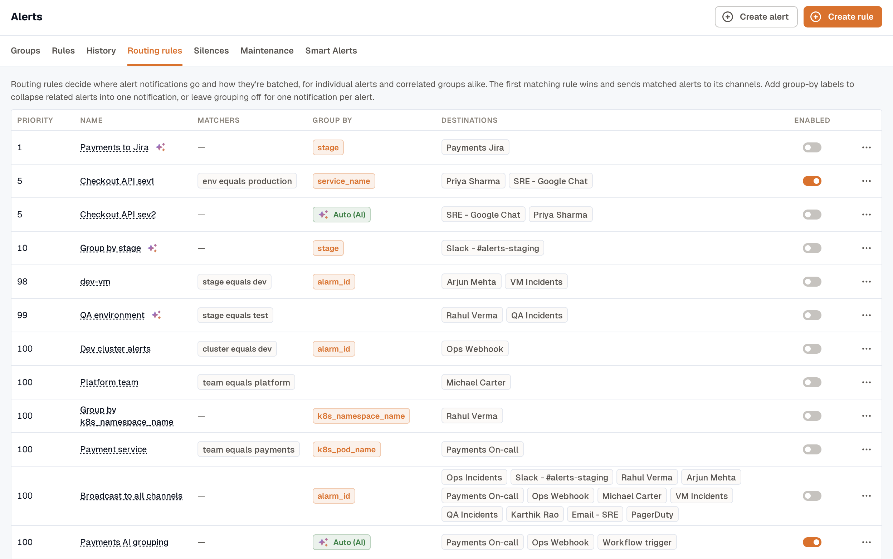
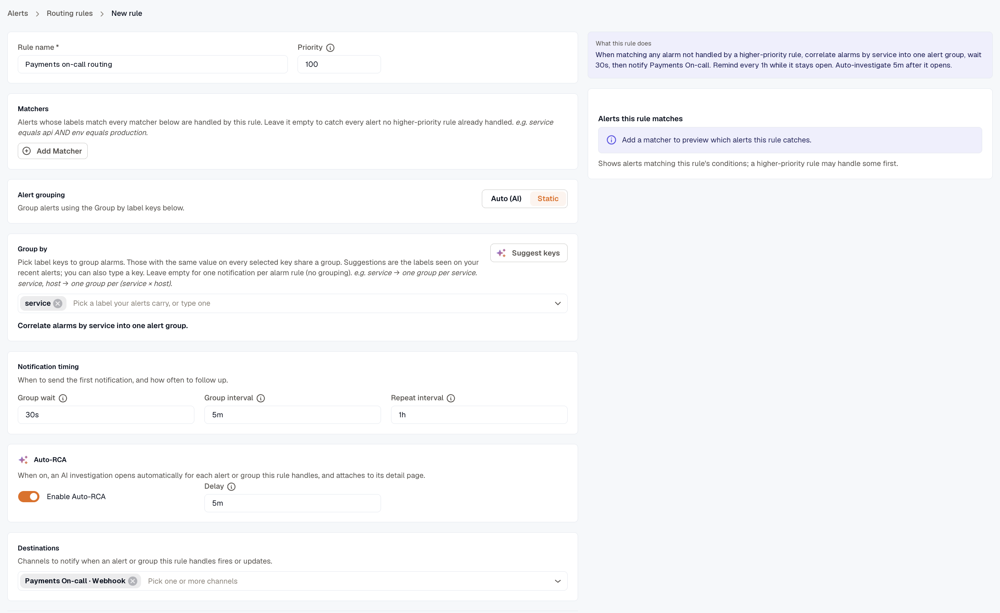
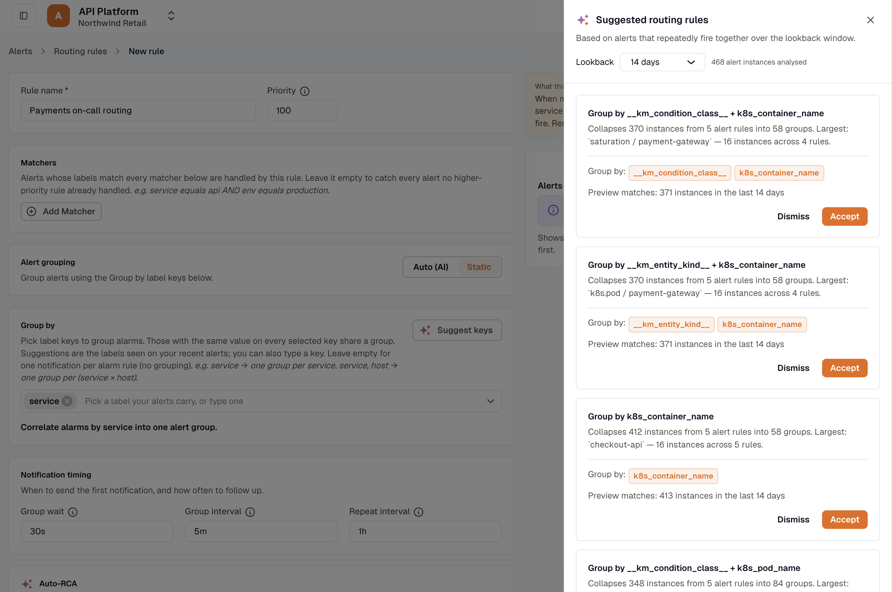

import { Steps } from '@astrojs/starlight/components';

Routing rules decide which channels get notified for which alerts. They govern **every** alert notification, both **individual alerts** and **correlated alert groups**. Each rule matches alerts by their labels; the **first matching rule wins** and sends those alerts to its destination channels. Whether the matched alerts notify one by one or fold into a single [Alert Group](../alert-groups/) comes down to the rule's **Alert grouping** setting: deterministic group-by keys in **Static** mode, or the correlation engine in **Auto (AI)** mode.

:::note[Not the incident routing rules]
This page routes alert *notifications* to channels. To control how an alert becomes an incident inside Incident Management (its service, escalation policy, and severity), see [Incident Management → Routing Rules](../../incident-management/routing-rules/) instead.
:::

Routing rules replace the older **Notification Policies** flow. If you previously routed by tags, KloudMate migrated those policies to routing rules during the upgrade; the matching logic now keys off [labels](../create-alerts/#4-notifications) instead of free-form tags.

## Where to find them

Open **Alerts → Routing rules**. Rules are evaluated in priority order (lowest number wins). The first rule an alert matches decides which channels notify and how often, and whether the alert notifies on its own or correlates with others into one [Alert Group](../alert-groups/).

Rules are sorted by priority, lowest number first. The **default passthrough rule** matches everything no higher-priority rule caught, and it can't be deleted.

## Anatomy of a rule

A routing rule has these fields:

| Field | What it does |
|---|---|
| **Rule name** | How the rule appears in the list and audit log. |
| **Priority** | Lower numbers win. When an alert matches multiple rules, the highest-priority (lowest-numbered) rule routes it. |
| **Matchers** | Label conditions that pick which alerts this rule applies to. |
| **Group by** | In **Static** grouping, whether and how matched alerts correlate. Leave it empty (or set only `alarm_id`) for **one notification per alert rule**, with no grouping. Add a real label key (for example `service`) to **correlate** matching alerts that share that value into one [Alert Group](../alert-groups/). `severity` can't be used here. This field is ignored when the rule uses **Auto (AI)** grouping. |
| **Notification timing** | When the first notification goes out (**Group wait**), the minimum gap between notifications when the group changes (**Group interval**), and how often to re-send while the group stays open and unchanged (**Repeat interval**). |
| **Destinations** | One or more notification channels that receive the dispatched payload. |

Optional:

- **Auto-RCA:** toggle to run KloudMate's AI investigator on every group this rule opens. See [Auto-RCA](../auto-rca/).

### Matchers

Each matcher is one label condition: a label key, an operator, and a value. An alert has to satisfy **every** matcher you add (they combine with AND) before this rule handles it. Leave the list empty and the rule becomes a catch-all: it handles every alert no higher-priority rule already caught.

The available operators:

| Operator | Meaning |
|---|---|
| Equals | Label value matches the string exactly. |
| Not equals | Label value differs from the string (also matches alerts that don't carry the label at all). |
| Matches regex | Label value matches the regular expression. |
| Doesn't match regex | Label value doesn't match the regex (also matches alerts without the label). |

A matcher value is always a single string. To match any of several values, use a regex alternation. For example, `service` **Matches regex** `api|web` matches either service. (There's no `in`/`not_in` operator; the regex form replaces it.)

In **Static** mode, the editor shows a live **Alerts this rule matches** preview as you add or edit matchers: the alert instances this rule currently matches, with a running count, so you can confirm the rule's scope before saving. A higher-priority rule may handle some of those alerts first.

Above the preview, **What this rule does** describes the rule in plain language: which alerts it handles, how it groups them, when it notifies and reminds, and when Auto-RCA starts. Read it before saving to check that the rule does what you intended.

### Alert grouping: Static or Auto (AI)

Each rule has an **Alert grouping** control. New rules start in **Auto (AI)**, and a saved rule keeps the mode it was saved with.

- **Static** groups matching alerts by the label keys you choose, the deterministic behavior described under [Group-by keys](#group-by-keys) below. Alerts that share those key values fold into one group.
- **Auto (AI)** hands grouping to the correlation engine. It correlates related alerts from this rule into a single incident on its own, and learns which alerts tend to fire together over time. In this mode you don't choose grouping keys at all.

Switch a rule to **Static** when you want predictable grouping along keys you control. Keep it on **Auto (AI)** when related alerts don't share a clean label to group on, or when you'd rather let the engine find the connections. Either mode produces the same [Alert Group](../alert-groups/).

For how each mode decides what belongs together, including why one rule firing on many hosts stays a single Auto group, see [How Alert Grouping Works](../how-alert-grouping-works/).

### Group-by keys

Group-by keys apply in **Static** mode. They decide **whether** matched alerts correlate and, if so, along **which** dimension:

- **Leave it empty, or set only `alarm_id`,** and the rule doesn't correlate anything: each alert rule notifies on its own, one notification per rule. These notifications surface through the normal alerts UI, not the [Alert Groups](../alert-groups/) page.
- **Add a real label key** and matching alerts that share that key's value fold into a single alert group. The picker offers the label keys seen on your recent alerts, plus **Alert folder**, which groups alerts from rules in the same folder. You can also type any other label key.

The editor enforces these constraints:

- If you add a real dimension alongside `alarm_id`, KloudMate drops the `alarm_id` automatically. Pinning each group to a single alert rule would defeat the correlation.
- `severity` can't be a grouping dimension. It's a per-instance property fixed when the group opens, not an axis to group on.

You can combine keys (for example, `service` + `env`) to scope each group tightly. Pick keys by which dimension changes the most: aggressive grouping (only `service`) reduces notification noise but sacrifices precision in the group title.

### Notification timing

**Notification timing** decides when the first notification goes out and how often the rule follows up. Enter each setting as duration text, such as `30s`, `5m`, or `4h`.

| Setting | Default | What it controls |
|---|---|---|
| **Group wait** | `30s` | How long to wait before the first notification, so alerts that fire together share one message. |
| **Group interval** | `5m` | The minimum gap between notifications when the group **changes**, such as a new alert joining or an instance recovering. It's driven by those changes, so it never fires on its own. |
| **Repeat interval** | `0` (off) | How often to re-send while the group stays open and **nothing about it changes**. |

#### Repeat interval

Group interval only fires when the group changes, so a group whose instances keep firing goes quiet after the first notification. An alert that starts at 02:00 and is still firing at 09:00 has produced exactly one message, seven hours earlier.

Set a **Repeat interval** and the rule re-sends the notification at that cadence for as long as the group stays open. Every rule starts at `0`, which is off, so nothing changes until you set a value. A blank field reads as off too. The shortest cadence you can set is `5m`, and the form rejects anything shorter unless it's `0`.

Reminders stop on their own when the group resolves. A [silenced](../silences/) group doesn't get them, and it doesn't build up a backlog to deliver once the silence ends. A group that opened while it was already silenced was never announced, so it gets no reminders at all.

Reminders count only firing instances that aren't muted, so a [maintenance window](../maintenance-windows/) that mutes all of a group's firing instances stops them too. Turning off the rule's **Enabled** toggle stops them as well. There's no acknowledge step for a group, so to stop reminders on a group that's still firing, silence it. Any other notification the group sends, such as one for a newly firing instance, restarts the reminder clock.

Slack, email, Microsoft Teams, [webhook](../../platform/settings/notification-channels/#webhooks), and [SNS](../../platform/settings/notification-channels/#sns) deliver reminders. [Jira](../../platform/settings/notification-channels/#jira) and [KloudMate Incidents](../../platform/settings/notification-channels/#kloudmate-incidents) don't. The ticket or the incident is already a standing record that the alert is open, so a comment on it every few hours would only add noise. A rule that routes only to those two sends nothing extra when a reminder is due.

In Slack, the reminder posts as a reply in the alert's existing thread and is broadcast to the channel, so you see it in the channel instead of buried under an hours-old parent message.

:::caution[Check your webhook receivers first]
A reminder is delivered with `"event": "repeat"` in the payload. Everything else about it matches an `appended` notification: the same `totals`, the same `rules`. A receiver that treats every incoming `POST` as a new alert will raise a duplicate every time a reminder fires. Handle or ignore `repeat` explicitly before you turn this on. See [Notification Payloads](../../platform/settings/notification-channels/#notification-payloads).
:::

## The default passthrough rule

Every workspace has a default passthrough rule. It matches everything that didn't match a higher-priority rule. Its matchers and priority are locked, and it can't be deleted. You can edit everything else, including its grouping, notification timing, and destinations.

For a clean "everything else goes to Slack" path, point the default passthrough at your fallback Slack channel.

## Create a routing rule

<Steps>
1. **Open Alerts → Routing rules** and click **Create rule**.

2. **Name the rule** and set its priority. Lower numbers win. Give specific rules low numbers (10, 20, 30) and generic ones higher numbers. The default passthrough sits at priority 1,000,000 so unmatched alerts always have somewhere to land.

3. **Add matchers.** Pick a label key, an operator, and a value. Add as many rows as needed; all matchers combine with AND.

4. **Choose how alerts group.** New rules start in **Auto (AI)**, which lets the correlation engine group related alerts for you, with no keys to set. To group by label keys instead, switch **Alert grouping** to **Static**, then set the **Group by** keys: leave them empty to notify once per alert rule, or add a real label key (start with `service`) to correlate matching alerts into one group (`severity` isn't allowed here). To get keys based on your alert history, click **Suggest keys**. See [Get suggested group-by keys](#get-suggested-group-by-keys).

5. **Set the notification timing.** Leave the defaults (`30s` group wait, `5m` group interval) for most cases. Tighten them for time-sensitive notifications, or loosen them for digest-style summaries. Set a **Repeat interval** such as `1h` to be reminded while the alert stays open, or leave it at `0` for no reminders.

6. **Pick destination channels.** Add one or more channels under **Destinations**. If the workspace doesn't have a [KloudMate Incidents](../../platform/settings/notification-channels/#kloudmate-incidents) channel yet, click **Add a KloudMate Incidents channel** to create one. That link leaves the rule editor, and anything you haven't saved is lost.

7. **Optionally enable Auto-RCA.** Turn on **Enable Auto-RCA** and set the **Delay** (default 5 minutes after the group opens). See [Auto-RCA](../auto-rca/).

8. **Save the rule.** Click **Create rule**, or **Save rule** when you're editing an existing rule.
</Steps>

## Row actions

The kebab menu on each row offers:

- **Edit:** opens the rule editor.
- **Duplicate:** opens the editor pre-filled with the rule's settings under a "(copy)" name, so you can adjust matchers or priority and save as a new rule.
- **Delete:** removes the rule. The delete is **blocked while open alert groups still route through this rule**; resolve or re-route those groups first, then delete. The default passthrough rule can't be deleted at all.

The **Enabled** toggle disables a rule without deleting it. Use it to stage a rule before it goes live.

## Get suggested group-by keys

In **Static** mode, click **Suggest keys** in the rule editor's **Group by** section. KloudMate looks at which alerts fired together in your workspace over the **Lookback** window and proposes up to five groupings. The lookback is 7, 14, or 30 days, and it starts at 14.

Each suggestion shows:

- A title naming the proposed keys (for example, "Group by service + env").
- A short rationale: how many alert instances it would have collapsed into how few groups.
- The proposed **Group by** keys.
- How many instances it would have matched over the lookback window.

**Accept** fills in the rule you're editing with the suggested group-by keys and notification timing. It replaces your matchers only when the suggestion has matchers of its own, and it names the rule only if the name is still blank. **Dismiss** hides the suggestion.

Suggestions aren't saved. Closing the drawer discards them, and reopening it runs the analysis again.

## Related

- [Alert Groups](../alert-groups/): what routing rules produce.
- [Silences](../silences/): temporarily suppress matching alerts.
- [Notification Channels](../../platform/settings/notification-channels/): set up Slack, KloudMate Incidents, email, and more.
- [Auto-RCA](../auto-rca/): automatic investigations on group open.
- [Workflows](../../workflows/): run an automated response when an alert notifies. Attach a webhook channel pointed at the workflow, and see [Triggers](../../workflows/triggers/#start-a-workflow-from-an-alert).
