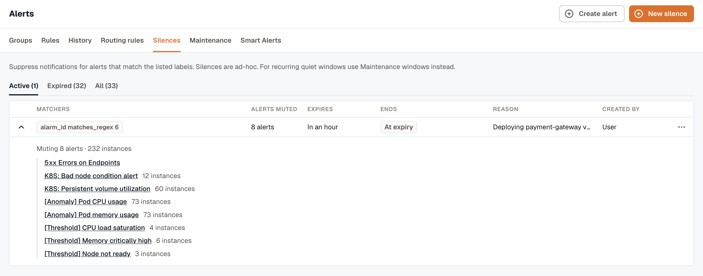
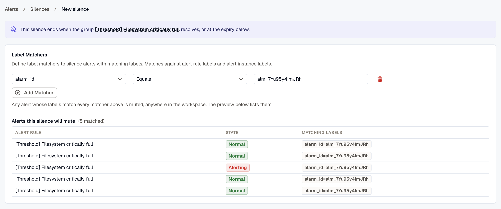
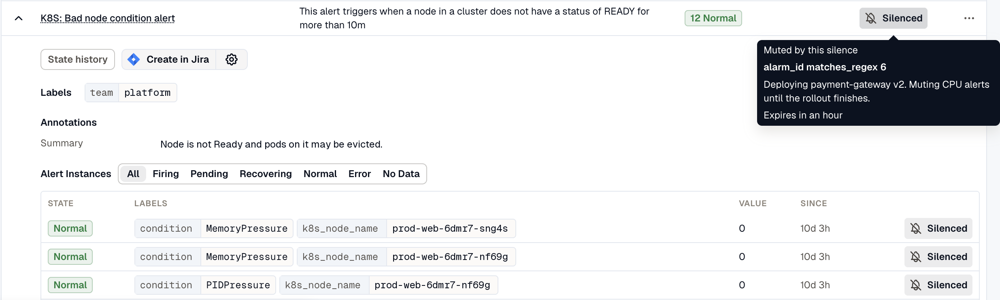

A **Silence** suppresses notifications for alerts whose labels match the silence's matchers, for a bounded time window. Use silences when you know an alert will be noisy and you don't want it notifying anyone: a deployment expected to spike error rates, a known third-party outage, or a maintenance window you can't fully scope.

Silences cap at 30 days. The cap keeps a silence from being forgotten and quietly masking real problems. Re-create one explicitly if you need it longer.

## Where to find silences

Open **Alerts → Silences**. Silences are ad-hoc; for recurring quiet windows, use [Maintenance Windows](../maintenance-windows/) instead.

Silences are grouped into **Active**, **Expired**, and **All** tabs. The **Created by** column shows who created each silence.

## Anatomy of a silence

| Field | What it does |
|---|---|
| **Matchers** | Label conditions that pick which alerts the silence applies to. Same operator set as [Routing Rules](../routing-rules/#matchers): Equals, Not equals, Matches regex, Doesn't match regex. |
| **Expires at** | Date and time the silence stops. Capped at 30 days from creation. |
| **Reason** | Free-form text; recommended so others know why the silence exists. |
| **Ends** | **At expiry**, or **When the group resolves** for a silence bound to an [Alert Group](../alert-groups/). The binding sets when the silence ends, never which alerts it mutes. |

## Create a silence

Create a silence from the Silences page, an alert group, or an alert's Pause Notifications.

### From Alerts → Silences

1. Open **Alerts → Silences** and click **New silence**.
2. Add one or more matcher rows. For each, pick a label key, an operator, and a value.
3. Pick an **Expires at** date and time, up to 30 days out.
4. Add a **Reason** describing why this silence exists.
5. Click **Create silence**.

### From an Alert Group

On any [Alert Group](../alert-groups/) detail page, click **Silence this group**. The silence creator opens with matchers derived from the group and a binding to it.

:::caution[A group binding sets when the silence ends, not what it mutes]
The binding does one thing: when the bound group resolves, the silence's expiry moves to that moment and it lifts early. Matching never looks at it, so the silence mutes every alert in the workspace whose labels match its matchers, group member or not.
:::

**How the matchers are filled in.** They come from the routing rule's group-by keys, taking the value the group carries or the value every live member shares. A rule that groups by nothing falls back to `alarm_id`, so most groups pre-fill with a single matcher such as `alarm_id = alm_7f3c2b`.

**When the group's alerts share no label.** A silence is a set of label matchers that all have to hold, so it can't pick out an arbitrary list of alerts. A group whose alerts share nothing pre-fills no matchers. Instead, the form offers the labels those alerts do carry as one-click chips, each showing how many of the group's alerts it covers, such as `10/17`.

#### Adding every offered label doesn't scope the silence to the group

Building a silence out of the group's own labels fails in both directions.

- **It mutes less than the group.** An alert has to match every matcher, so adding a key that only some members carry drops the rest. On a 17-alert group, a folder label present on 10 of them takes the match from 17 down to 10, and the other 7 keep notifying.
- **It still mutes outside the group.** Two multi-valued keys accept every combination of the two, not just the pairs the group holds. Three rules across seven hosts makes 21 combinations. The group holds 17 alerts.

Use the **Alerts this silence will mute** preview on the create form instead. It counts every alert instance the current matchers would mute, before you save.

### From an alert's Pause Notifications

On an alert rule's **more options (⋯) → Pause Notifications**, KloudMate creates a silence scoped to that alert (an `alarm_id` matcher) with an expiry: the alert keeps evaluating, and only its notifications are suppressed. While paused, the rule is marked **Silenced**; view or end the pause from **Alerts → Silences**. Add matchers to narrow the pause to specific instances.

## See what a silence is muting

The Silences list carries an **Alerts muted** column: how many alert rules each active silence is muting. Expand a row to list those rules, each marked with a chip such as `3 firing` when its instances are firing. The silence detail page shows the same list, along with a link to the group the silence is bound to.

To find what's muting a particular alert, check the alert's row on the **Rules** tab, its expanded instance rows, or its detail page. Each links to the silence or maintenance window that's muting the alert. When more than one applies, you can pick which one to open. A group's **Instances** panel marks muted instances but doesn't name the silence.

A new silence shows up in the **Alerts muted** count and on the alerts it mutes after those alerts are next evaluated. An expired silence clears from them the same way.

## Silence vs. maintenance window

Both features are a **notification gate, not a state change**: the alert still evaluates on its schedule and its state transitions are still recorded in history; only the notification is withheld. Silencing every firing instance of an alert group keeps the group **Firing** (marked **Muted**); it does **not** resolve the group, and muting never emits a *resolved* notification. The differences between the two are operational, not behavioral:

- **Silences** are ad-hoc, label-matcher driven, capped at 30 days, and can be auto-bound to a specific alert group so they expire when the group resolves.
- **Maintenance Windows** are scheduled: **One Time**, with a start and end, or **Recurring**, repeating **Daily**, **Weekly**, or **Monthly** at a set time of day in the window's timezone.

Both use the same label-matcher operators (**Equals**, **Not equals**, **Matches regex**, **Doesn't match regex**), matched against alert rule labels and alert instance labels.

Both leave the alert evaluating. Suppressed state transitions are recorded in the alert's history, so you can always tell after the fact whether a quiet stretch was a real recovery or a suppressed notification.

Pick a silence for a reactive, one-off suppression you'll re-evaluate within 30 days. Pick a [Maintenance Window](../maintenance-windows/) for planned downtime, recurring quiet hours, or anything that needs a calendar schedule.

## Viewing and ending a silence

From a row's kebab menu, select **End silence** (or **View**). Ending an active silence removes suppression for matching alerts immediately; new firings notify as normal.

Silences can't be edited. To change the matchers or extend the expiry, end the silence and create a new one.

## Related

- [Alert Groups](../alert-groups/): the Silence-this-group action.
- [Maintenance Windows](../maintenance-windows/): the scheduled, recurring counterpart to silences.
- [Routing Rules](../routing-rules/): the same matcher model.
