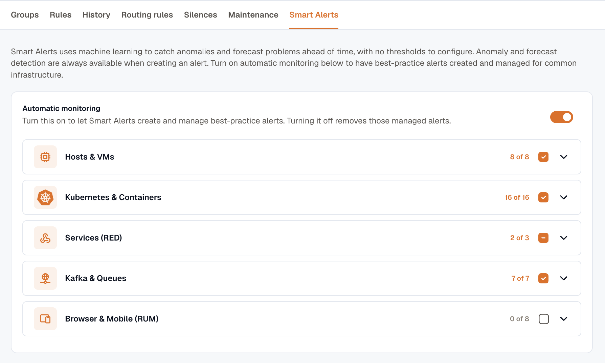
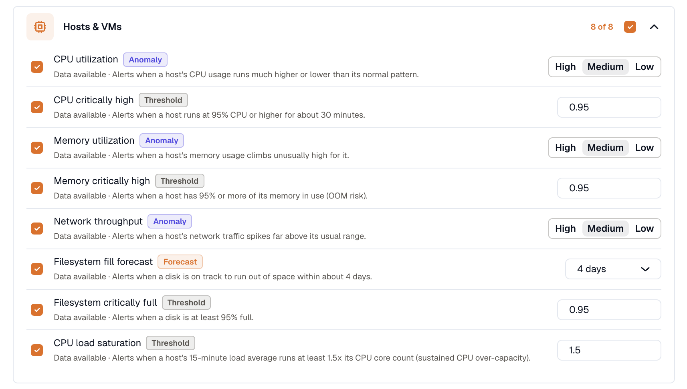

import { LinkCard, CardGrid } from '@astrojs/starlight/components';

**Smart Alerts** creates and maintains common infrastructure alerts for you. Turn on a curated detector and KloudMate writes the alert rule, keeps it current as your hosts and pods come and go, and removes it when you turn the detector off. You get anomaly and forecast coverage without picking a single threshold: CPU drifting out of its normal range, a disk on track to fill, a container creeping toward its memory limit.

Find it under **Alerts → Smart Alerts**.

## How it works

Open the Smart Alerts page and turn on **Automatic monitoring**. Pick the detectors you want, and KloudMate takes it from there:

- KloudMate checks which detectors have matching data in your workspace, then creates one alert rule for each detector you enable.
- As pods restart, hosts scale in and out, or new services appear, the rules follow along.
- Turn a detector off, or turn automatic monitoring off, and the rules it created are removed.

Smart Alerts rules are ordinary alert rules. They move through the same [lifecycle](../alert-lifecycle/) as any rule you write by hand, and they flow into the same [grouping](../how-alert-grouping-works/), [routing](../routing-rules/), and notification channels. In your Alerts list they're named for their method and signal, like `[Anomaly] CPU utilization` or `[Forecast] Filesystem fill forecast`, and collected under a **Smart Alerts** folder.

## Detection methods

Each detector uses one of these methods:

| Method | Fires when | Best for |
|---|---|---|
| **Anomaly** | A value lands well outside the range learned from that entity's own recent history. | Signals with no fixed "bad" value: CPU, memory, request latency, throughput. |
| **Forecast** | The recent trend is on track to cross a limit within the horizon. | Slow fills toward a ceiling, such as disk and volume space. |
| **Threshold** | The value crosses a fixed, known-bad line right now. | States that are wrong at any scale: disk ≥ 95% full, a node not ready, Kafka partitions under min ISR. |

### Anomaly

An anomaly detector learns what normal looks like for each entity from its own recent history, then fires when a reading lands well outside that range. There's no threshold to set. The one knob is **Sensitivity**: **High** catches small deviations, **Low** reacts only to large ones, and **Medium** (the default) suits most metrics.

A brand-new entity has no history to learn from yet. Until enough builds up, it runs on a provisional range and does not fire; its reason reads `collecting baseline`. That's deliberate. A young or flat series would otherwise score an ordinary warm-up ramp as a wild anomaly, and pod names churn on every deploy. The [Threshold](#threshold) detectors below still catch genuine saturation while a baseline forms.

### Forecast

A forecast detector projects an entity's recent trend and fires when it's on track to reach a limit within the horizon. A disk filling steadily trips it days ahead, not at 3am when it's already full. The default horizon is **4 days**; set it to **1**, **4**, or **7** days per detector, or as a workspace default.

Forecasting holds until a series has enough history to tell a real trend from a startup ramp. During that window the reason reads `collecting history for a forecast` and the detector doesn't fire, so a freshly provisioned host can't raise a false "filling in minutes" alert.

### Threshold

A threshold detector is a plain ceiling for a state that's wrong at any scale. It needs no history and fires the moment the value crosses the line: a disk at least 95% full, a container at 95% of its memory limit (OOM risk), a Kubernetes node not Ready, or Kafka partitions under their minimum in-sync replicas. Each threshold ships with a sensible default that you can override per workspace.

## Browse and enable detectors

Detectors are grouped by pack:

- **Hosts & VMs:** CPU, memory, and network anomalies; a disk-fill forecast; CPU-critically-high, memory-critically-high, disk-full, and load-saturation thresholds.
- **Kubernetes & Containers:** pod CPU and memory anomalies; container memory-and-CPU-limit detectors; node, deployment, statefulset, and pod-health thresholds.
- **Services (RED):** request latency and throughput anomalies.
- **Kafka & Queues:** a consumer-lag anomaly; under-replicated, under-min-ISR, and offline-partition thresholds.
- **Browser & Mobile (RUM):** detectors for real user monitoring data from browser and mobile apps.

Each detector row shows whether it can run here:

| Status | Meaning |
|---|---|
| **Data available** | Your workspace emits the metric this detector needs. Enable it. |
| **No data yet** | Nothing matching has arrived. The detector lights up once the data flows. |
| **On · waiting for data** | Enabled, but no matching series yet. It starts watching as soon as data appears. |
| **Not available yet** | KloudMate is still validating this detector, so you can't enable it yet. |

Only detectors with matching data run. Enable a detector and KloudMate creates and maintains its rule; disable it and the rule is removed. A detector you enable while it still shows **No data yet** waits for the data, then starts watching on its own. Use a pack's select-all checkbox to toggle a whole pack at once.

Set a workspace-wide **default sensitivity** and **default forecast horizon** under **Defaults for new managed alerts**. New detectors inherit these unless you override them per detector.

:::note
You need the **Developer** role to change Smart Alerts settings.
:::

## What a responder sees

A Smart Alert notifies like any other alert, threaded by your [routing rules](../routing-rules/). The rule name carries the method and signal, the entity is in the alert's labels, and the reason says what actually happened:

| Situation | Example reason |
|---|---|
| Anomaly firing | `0.82, above the expected range 0.2 to 0.41` |
| Anomaly, still learning | `0.82, collecting baseline` |
| Forecast firing | `0.86, on track to reach 1 in about 3d 4h` |
| Forecast, still learning | `0.86, collecting history for a forecast` |
| Threshold firing | `crossed threshold: A=0.96 (>= 0.95)` |

Values appear in the metric's own units. A utilization reading is a 0 to 1 ratio, so `0.82` is 82%, and a forecast on track to `reach 1` means a full disk.

Smart Alerts won't fire on a single spike. A breach has to hold across several evaluations first: about **30 minutes** for an anomaly or forecast, about **10 minutes** for a threshold. This is the same **Pending duration** every alert uses, so a brief burst settles on its own without notifying anyone. See [Alert Lifecycle & States](../alert-lifecycle/).

## Tune or take over a rule

Adjust a detector in place from the Smart Alerts page: **Sensitivity** for an anomaly detector, the **horizon** for a forecast, or the **threshold** value for a threshold detector. KloudMate applies the change and keeps managing the rule.

Changing how often the rule runs keeps it managed too. Edit **Evaluate every**, **Pending duration**, or **Recovery period** on the rule and KloudMate keeps those values instead of resetting them to the detector's defaults.

Editing the rule's **query**, **threshold**, or **condition** takes it over. The rule detaches from Smart Alerts, is labeled **Customized**, and leaves the **Smart Alerts** folder. From then on it behaves like any alert you wrote by hand: KloudMate stops sending it template updates and no longer manages its lifecycle. Its anomaly or forecast detection keeps running; taking a rule over doesn't turn detection off.

To quiet a managed rule without taking it over, pause it from its row menu with **Pause Evaluation**. The pause holds: saving another Smart Alert won't resume it. To remove a managed rule for good, turn its detector off on the Smart Alerts page. Deleting a managed rule that's still evaluating disables it instead, the same as **Pause Evaluation**, and a disabled managed rule can then be deleted.

## Plan availability

Anomaly and forecast detection needs a paid plan, both for turning on automatic monitoring and for adding an anomaly or forecast condition to an alert you build by hand. You can browse the detector catalog on any plan, and plain threshold alerting works everywhere: you can always [create a threshold alert](../create-alerts/) yourself.

## Related

<CardGrid>
  <LinkCard title="Creating Alerts" description="Hand-author an alert, including threshold rules on any plan." href="../create-alerts/" />
  <LinkCard title="Alert Lifecycle & States" description="How Pending, Firing, and Recovering shape every rule Smart Alerts creates." href="../alert-lifecycle/" />
  <LinkCard title="How Alert Grouping Works" description="How Smart Alerts firings correlate into a single incident." href="../how-alert-grouping-works/" />
  <LinkCard title="Routing Rules" description="Send Smart Alerts notifications to the right channels." href="../routing-rules/" />
</CardGrid>
