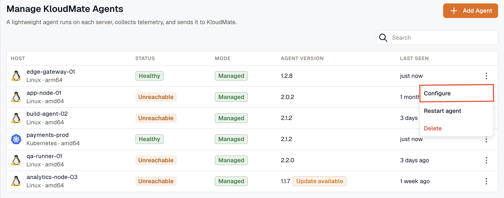
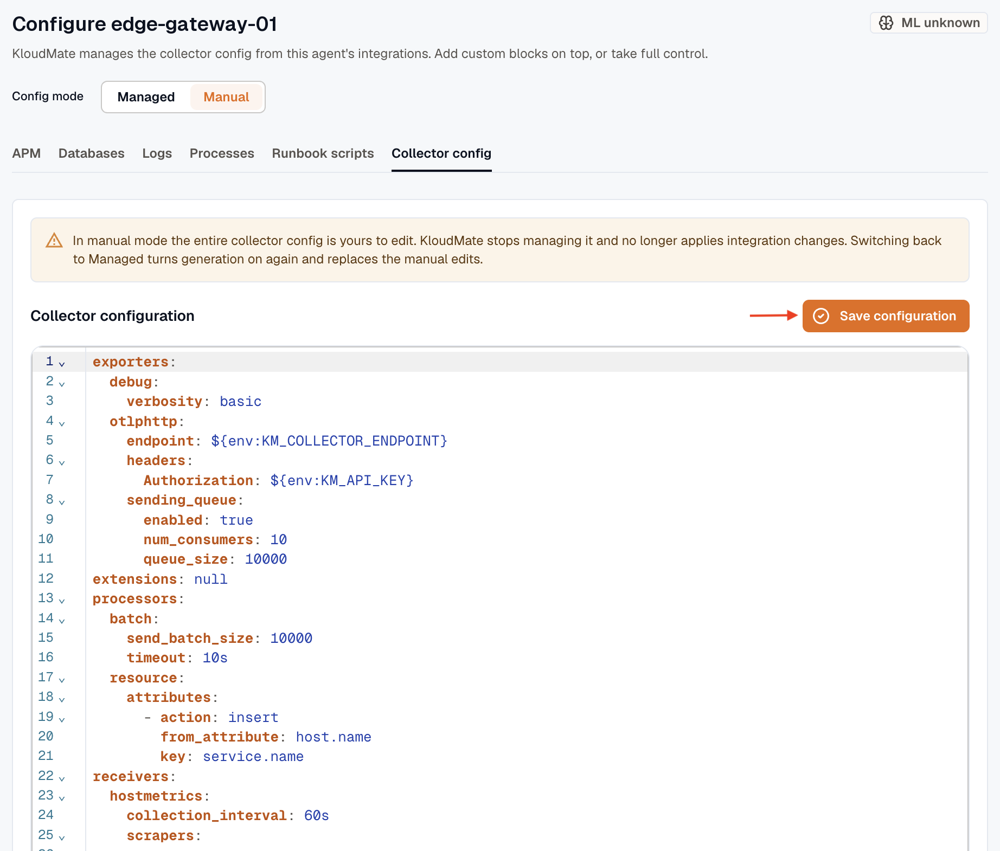

This document provides a step-by-step manual approach to integrating Azure Monitor with KloudMate using **KloudMate agents**. The KloudMate agent scrapes telemetry data from Azure Monitor resources and sends it to KloudMate for centralized monitoring and analysis.

## Pre-requisite
1. **Azure Service Principal for Authentication**: You will need a service principal with appropriate permissions to access Azure Monitor APIs.

   Required settings for authentication:
   `subscription_id`
   `tenant_id`
   `client_id`
   `client_secret` 

   To enable authentication follow the document: [Enable Service Principal Azure.](../enable-service-principal-azure/)
2. KloudMate Agent installed on the server scraping Azure Monitor metrics (see agent installation for [Linux Agent](../../kloudmate-agent/installation/linux-agent/) and [Windows Agent](../../kloudmate-agent/installation/windows-agent/)).

**Step 1: Access Agents and OpenTelemetry Collector Configuration**

- Navigate to the KloudMate platform and log in to your account.
- Go to **Settings** > **Agents** section.
- Here you can:
  - View all installed agents.
  - Access configuration settings for each agent.
  - Review the default configurations provided by KloudMate.
- To edit an agent's collector configuration:
  - Select the desired agent.
  - Click the **Actions** menu (or Agent action tab).
  - Choose **Collector Configuration**.
- A text editor UI will open, allowing you to edit the agent’s YAML configuration directly within the platform.



1\.  In this configuration file, ensure the Azure Monitor receiver is set up to collect and send metrics.

```yaml
extensions:
  health_check:
  pprof:
    endpoint: 0.0.0.0:1777
  zpages:
    endpoint: 0.0.0.0:55679

receivers:
  otlp:
    protocols:
      grpc:
        endpoint: 0.0.0.0:4317
      http:
        endpoint: 0.0.0.0:4318

  azuremonitor:
    # Add the correct credentials as per Service Principal
    subscription_id: "<subscription_id>"
    tenant_id: "<tenant_id>"
    client_id: "<client_id>"
    client_secret: "<client_secret>"
    cloud: AzureCloud
    collection_interval: 60s
    initial_delay: 1s
    # Uncomment and configure to monitor specific resource groups or services
    # resource_groups: []
    # services: []
```

:::info
*To monitor a specific service or resource group, the user can uncomment the `resource_groups[]` and `services[]` entries in the configuration file.*
:::

2\.  Set up the exporter as the KloudMate backend by specifying the endpoint and authorisation key in the agent configuration file, and configure the pipeline.

```yaml
processors:
  batch:
    send_batch_size: 10000
    timeout: 30s

exporters:
  debug:
    verbosity: detailed

  otlphttp:
    endpoint: 'https://otel.kloudmate.com:4318'
    headers:
      Authorization: XXXXX  # Replace with your actual KloudMate authentication key
service:

  pipelines:
    metrics:
      receivers: [otlp, azuremonitor]
      processors: [batch]
      exporters: [debug, otlphttp]

  extensions: [health_check, pprof, zpages]
```

**Step 2: Save Configuration and Restart Agent**

After updating the configuration, click "**Save Configuration** " in the UI 



or, from your server’s console, run:

**For Linux:**

1. Execute the following commands:

```bash
systemctl restart kmagent
systemctl status kmagent
```

These commands will restart the KloudMate agent and display its current status.

**For Windows:**

1. Open the Services window:
   - Press `Win + R`, type `services.msc`, and press `OK`.
   - Alternatively, search for "`Services`" in the Windows Start menu.
2. In the Services window, locate the "`KloudMate agent`" service.
3. Right-click the service and select "`Restart`."

Once data is flowing, monitor the metrics in KloudMate and set up an alert to be notified when metrics for a specific application exceed a threshold.
