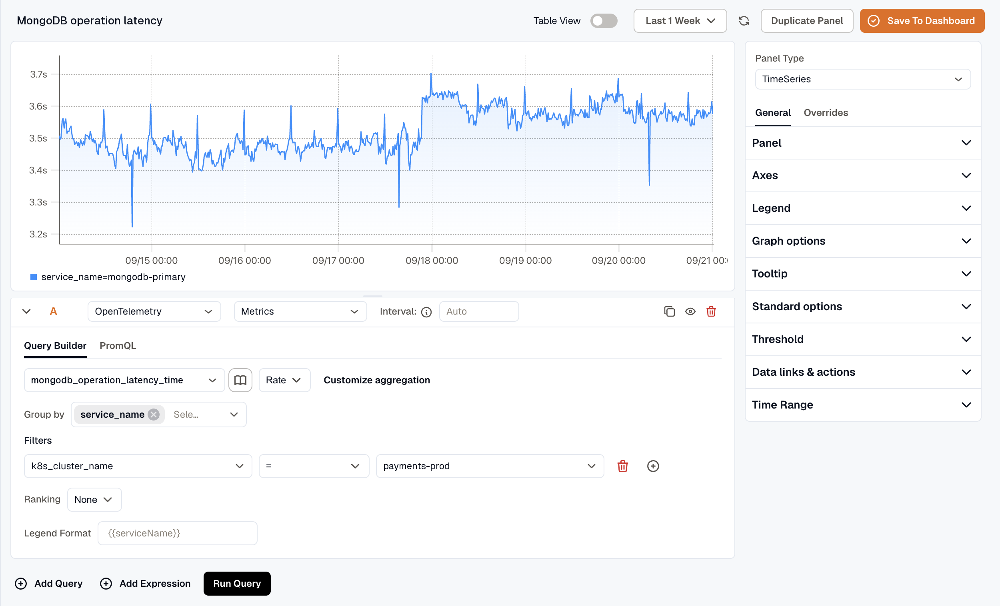

This guide sets up MongoDB monitoring with the **KloudMate Agent** and OpenTelemetry. It collects metrics and logs so you can watch the health, performance, and behavior of MongoDB instances running on AWS EC2, Azure Virtual Machines, or on-premise servers.

### **What This Integration Provides**

With MongoDB Monitoring enabled, KloudMate collects telemetry at multiple levels, including:

- Server-level performance metrics
- Database and collection-level metrics
- Connection, operation, and lock behavior
- Network and storage usage
- MongoDB server logs

This visibility helps identify performance bottlenecks, abnormal query behavior, resource saturation, and availability issues.

### **Pre-requisites**

Before configuring MongoDB Monitoring, ensure the following:

1. MongoDB server is running
2. Supported MongoDB versions: 4.0+, 5.0, 6.0, 7.0
3. KloudMate Agent installed on the MongoDB host
   - Refer to Agent installation for [Linux](../../../kloudmate-agent/installation/linux-agent/) or [Windows](../../../kloudmate-agent/installation/windows-agent/)
4. MongoDB user configured with least-privilege access. 

MongoDB recommends creating a user with the [clusterMonitor role](https://www.mongodb.com/docs/v5.0/reference/built-in-roles/#mongodb-authrole-clusterMonitor) to collect metrics. Refer to [lpu.sh](https://github.com/open-telemetry/opentelemetry-collector-contrib/blob/main/receiver/mongodbreceiver/testdata/integration/scripts/lpu.sh) for an example of how to configure these permissions.

Example:

```text
mongosh
use admin
db.createUser({
  user: "USER",
  pwd: "PASSWORD",
  roles: [{ role: "clusterMonitor", db: "admin" }]
})
exit
```

### **Step 1: Access Agents and OpenTelemetry Collector Configuration**

1. Log in to the KloudMate platform
2. Navigate to **Settings → Agents**
3. Select the agent running on the MongoDB host
4. Open **Collector Configuration** from the agent actions
5. The configuration editor opens, allowing you to modify the YAML directly


### **Step 2: Add Required Extensions and Receivers**

**Extensions**

Add the following extensions to support health checks, debugging, and local storage:


```yaml
  extensions:
    file_storage:
      create_directory: true
  ```

  ```none
  ```


**Receivers**

Two receivers can be used with MongoDB:

- **MongoDB Receiver –** Collects MongoDB metrics
- **File Log Receiver –** Collects MongoDB logs

If you only need metrics, configure only the MongoDB receiver.

```yaml
receivers:
  mongodb:
    hosts:
      - endpoint: localhost:27017
    username: otel  #Change the correct username
    password: PASSWD  #change the correct password
    collection_interval: 60s
    initial_delay: 1s
    tls:
      insecure: true
      insecure_skip_verify: true
  filelog:
    include: [/var/log/mongodb/*.log]
    storage: file_storage
    retry_on_failure:
      enabled: true
```

### **Step 3: Configure Processors**

Set up the processor component to identify resource information from the host and either append or replace the resource values in the telemetry data with this information.

Choose **one configuration** based on where MongoDB is running.

- **Server (On-premise / Non-cloud / Cloud)**

```yaml
processors:
  batch:
    send_batch_size: 5000
    timeout: 10s

  resourcedetection:
    detectors: [system]
    system:
      resource_attributes:
        host.name:
          enabled: true
        host.id:
          enabled: true
        os.type:
          enabled: false
  resource:
    attributes:
      - key: service.name
        action: insert
        from_attribute: host.name
```

- **AWS EC2:**

(Optional) To collect EC2 tags, attach an IAM role with `EC2:DescribeTags` permission.

```yaml
processors:
  batch:
    send_batch_size: 5000
    timeout: 10s

  resourcedetection/ec2:
    detectors:  ["ec2"]
    ec2:
      tags:
        - ^tag1$
        - ^tag2$
        - ^label.*$ 
        - ^Name$

  resource:
    attributes:
      - key: service.name
        action: insert
        from_attribute: ec2.tag.Name
      - key: service.instance.id
        action: insert
        from_attribute: host.id
```

- **Azure Virtual Machines:**

```yaml
processors:
  batch:
    send_batch_size: 5000
    timeout: 10s

  resourcedetection/azure:
    detectors: ["azure"]
    azure:
      tags:
        - ^tag1$
        - ^tag2$
        - ^label.*$
        - ^Name$

  resource:
    attributes:
      - key: service.name
        action: insert
        from_attribute: azure.vm.name
      - key: service.instance.id
        action: insert
        from_attribute: host.id
```

### **Step 4: Configure Exporter and Pipelines**

Configure the KloudMate backend exporter and define pipelines for metrics and logs.

```yaml
exporters:
  debug:
    verbosity: detailed
  otlphttp:
    endpoint: 'https://otel.kloudmate.com:4318'
    headers:
      Authorization: xxxxxxxx  # Use the auth key

service:
  pipelines:

    metrics:
      receivers: [mongodb]
      processors: [batch, resourcedetection, resource]  # Apply the correct resourcedetection
      exporters: [otlphttp]

    logs:
      receivers: [filelog]
      processors: [batch, resourcedetection, resource]  # Apply the correct resourcedetection
      exporters: [otlphttp]

  extensions: [health_check, pprof, zpages, file_storage]
```

### **Step 5: Save Configuration and Restart Agent**

After updating the configuration, click **Save Configuration** in the KloudMate UI.


You can also restart the agent from your server’s console.

**For Linux:**

1. Execute the following commands:

```none
systemctl restart kmagent
systemctl status kmagent
```

These commands restart the KloudMate Agent and display its current status.

**For Windows**

1. Open the **Services** window
   - Press `Win + R`, type `services.msc`, and press `OK`
   - Or search for **Services** from the Start menu
2. Locate the **KloudMate Agent** service.
3. Right-click the service and select **Restart**.

After restarting the agent, verify that MongoDB metrics and logs are visible in the KloudMate dashboard.

## Post‑Integration Data Validation

Verify that metrics are flowing into KloudMate using the **Explore** view.

After the agent restarts:

1. Log in to KloudMate
2. Navigate to **Explore**
3. Select **OpenTelemetry → Metrics**
4. Choose a MongoDB metric and run the query

Seeing time-series data confirms that MongoDB telemetry is flowing successfully.



## Standard MongoDB Dashboards

KloudMate provides prebuilt MongoDB dashboards through [dashboard templates](https://templates.kloudmate.com/mongo-db/index.html). These dashboards visualize MongoDB server performance, operations, storage, and resource usage.

To import and start using these templates, follow the steps described in [Importing a Dashboard](../../../visualize-data/dashboards/#importing-a-dashboard). Alternatively, use [From Template](../../../visualize-data/dashboards/create-a-dashboard/#from-template) when creating a new dashboard to pick from KloudMate's built-in templates.

## **Default MongoDB Metrics**

MongoDB Monitoring automatically collects commonly used MongoDB metrics when enabled.

Example Metrics

| **Metric Name**                   | **Description**                                                          |
| --------------------------------- | ------------------------------------------------------------------------ |
| mongodb\_connection\_count        | The number of connections.                                               |
| mongodb\_operation\_count         | The number of operations executed.                                       |
| mongodb\_operation\_latency\_time | The latency of operations.                                               |
| mongodb\_data\_size               | The size of the collection. Data compression does not affect this value. |
| mongodb\_storage\_size            | The total amount of storage allocated to this collection.                |
| mongodb\_network\_io\_receive     | The number of bytes received.                                            |
| mongodb\_network\_io\_transmit    | The number of bytes transmitted.                                         |
| mongodb\_lock\_acquire\_count     | Number of times the lock was acquired in the specified mode.             |
| mongodb\_lock\_acquire\_time      | Cumulative wait time for the lock acquisitions.                          |
| mongodb\_health                   | The health status of the server.                                         |
| mongodb\_uptime                   | The amount of time that the server has been running.                     |

For the complete metrics list, refer to the [metrics reference](https://github.com/open-telemetry/opentelemetry-collector-contrib/blob/main/receiver/mongodbreceiver/documentation.md).

## Optional Deployment Methods

### VM/EC2 with Fluent Bit  
[Streaming MongoDB Metrics & Logs to KloudMate Using Fluent Bit](https://blog.kloudmate.com/streaming-mongodb-metrics-logs-to-kloudmate-using-fluent-bit-32b54e91fe93?postPublishedType=initial)

### Docker Compose  
[Monitoring MongoDB with KloudMate Using Docker Compose](https://blog.kloudmate.com/monitoring-mongodb-with-kloudmate-using-docker-compose-49a5dc59c660?postPublishedType=initial)

##

