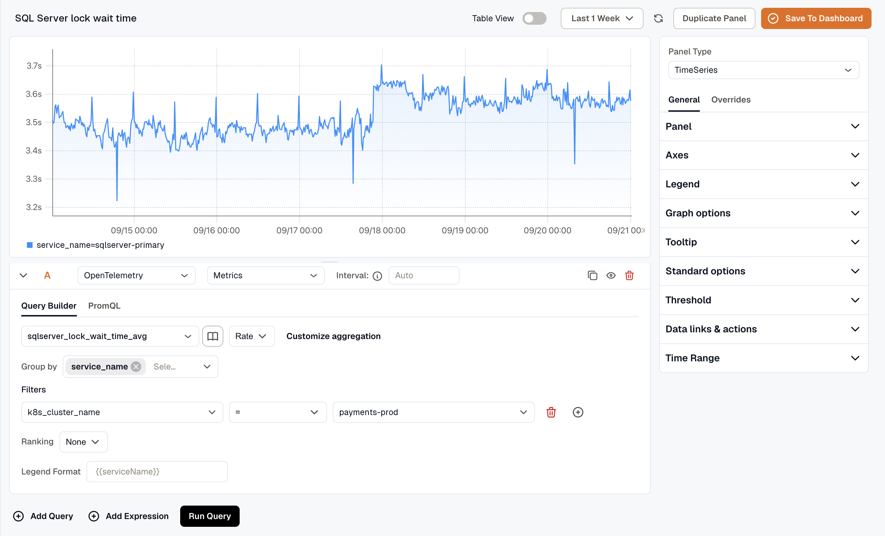

This guide sets up Microsoft SQL Server (MSSQL) monitoring with the KloudMate Agent and OpenTelemetry. It collects metrics and logs so you can watch the health, performance, and query behavior of MSSQL instances running on Windows hosts, AWS EC2, Azure Virtual Machines, or on-premise servers.

# MSSQL Integration using KloudMate Agents

### What This Integration Provides

With MSSQL Monitoring enabled, KloudMate collects telemetry that provides visibility into:

- Database health and performance metrics
- Lock waits, blocking processes, and transaction behavior
- Buffer pool efficiency and I/O performance
- Transaction log usage and growth patterns
- Resource pool throttling and disk I/O latency
- Server-level resource utilization

This visibility helps identify performance bottlenecks, blocking issues, transaction log problems, buffer pool inefficiencies, and availability concerns.

### Prerequisites

- MSSQL Server must be installed and running
- KloudMate Agent installed on the MSSQL host (see Agent Installation for Linux and Windows)
- Run agents as Administrator to collect all Windows Performance Counters

### Required Permissions

1. **Windows Performance Counters**
   Run the KloudMate Agent as Administrator to collect all performance counter-based metrics.
2. **Direct Database Connection**
   When configured for direct SQL Server connection, the monitoring user must have:

- **Database Permissions** (at least one of):
  •  `CREATE DATABASE`
  •  `ALTER ANY DATABASE`
  •  `VIEW ANY DATABASE`
- **Server State Permissions:**
  •  SQL Server pre-2022: `VIEW SERVER STATE`
  •  SQL Server 2022+: `VIEW SERVER PERFORMANCE STATE`

## Configuration Overview

### Step 1: Configure the KloudMate Agent with
•  `hostmetrics` receiver (system metrics)
•  `sqlserver` receiver (MSSQL performance metrics)
•  `sqlquery` receiver (custom SQL metrics)
•  `filelog` receiver (MSSQL logs)

### **Step 2: Access Agents and OpenTelemetry Collector Configuration**

- Log in to the KloudMate platform
- Go to **Settings → Agents**
- Select the agent running on the MSSQL host
- Click **Actions → Collector Configuration**
- YAML editor opens for configuration


### **Step 3: Add Required Extensions and Receivers**

```yaml
extensions:
  health_check:
  pprof:
    endpoint: 0.0.0.0:1777
  zpages:
    endpoint: 0.0.0.0:55679
  file_storage:
    create_directory: true

receivers:
  otlp:
    protocols:
      grpc:
        endpoint: 0.0.0.0:4317
      http:
        endpoint: 0.0.0.0:4318

  hostmetrics:
    collection_interval: 30s
    scrapers:
      cpu:
        metrics:
          system.cpu.utilization:
            enabled: true
      load:
        cpu_average: true
      memory:
        metrics:
          system.memory.utilization:
            enabled: true
      filesystem:
        metrics:
          system.filesystem.usage:
            enabled: true
          system.filesystem.utilization:
            enabled: true
      disk: {}
      network: {}
      processes: {}

  sqlserver:
    collection_interval: 30s
    username: <username>  #use the username
    password: <Password> #use the secure password
    server: 0.0.0.0
    port: 1433
    metrics:
      sqlserver.database.count:
        enabled: true
      sqlserver.database.io:
        enabled: true
      sqlserver.database.latency:
        enabled: true
      sqlserver.database.operations:
        enabled: true
      sqlserver.processes.blocked:
        enabled: true
      sqlserver.resource_pool.disk.throttled.read.rate:
        enabled: true
      sqlserver.resource_pool.disk.throttled.write.rate:
        enabled: true

  sqlquery/upmetrics:
    driver: mssql
    datasource: "sqlserver://<user>:<password>@localhost:1433?database=Kloudmate-test&encrypt=disable"  #modify the username and password 
    queries:
      # Query: Collect SQL Server Uptime as a Metric
      - sql: |
          SELECT
              sqlserver_start_time,
              DATEDIFF(MINUTE, sqlserver_start_time, GETDATE()) AS Minutes_Uptime
          FROM
              sys.dm_os_sys_info;
        metrics:
          - metric_name: sqlserver.uptime.minutes
            value_column: Minutes_Uptime
            attribute_columns: ["sqlserver_start_time"]
            static_attributes:
              dbinstance: mydbinstance
  filelog:
    include:
    # Ensure the path is appropriate for your server's operating system. Uncomment the line below if the server is running Windows.
      - /var/opt/mssql/log/errorlog*#- 'C:\Program Files\Microsoft SQL Server\MSSQL\LOG\ERRORLOG*'   
    storage: file_storage
    multiline:
      line_start_pattern: ^\d{4}-\d{2}-\d{2} \d{2}:\d{2}:\d{2}\.\d{2}
    retry_on_failure:
      enabled: true
# query to show client connections and IP
  sqlquery/connection:    
    driver: mssql
    datasource: "sqlserver://<user>:<password>@localhost:1433?database=Kloudmate-test&encrypt=disable"
    storage: file_storage
    queries:
      - sql: |
          SELECT
              c.session_id,
              c.client_net_address AS client_ip_address,
              s.host_name,
              s.login_name,
              s.program_name,
              s.login_time,
              s.last_request_start_time,
              s.last_request_end_time,
              'mssql_client_log' AS log_source
          FROM
              sys.dm_exec_connections AS c
          JOIN
              sys.dm_exec_sessions AS s
          ON
              c.session_id = s.session_id
          WHERE
              s.last_request_start_time > $$1
          ORDER BY
              s.last_request_start_time ASC;
        tracking_column: last_request_start_time
        tracking_start_value: "" # add today date
        logs:
          - body_column: client_ip_address
            attribute_columns: ["session_id", "host_name", "login_name", "program_name", "login_time", "last_request_start_time", "last_request_end_time", "log_source"]
# To show slow query
  sqlquery/slowquery:
    driver: mssql
    datasource: "sqlserver://<user>:<password>@localhost:1433?database=Kloudmate-test&encrypt=disable"
    storage: file_storage
    queries:
      - sql: |
          SELECT
            *,
            SUBSTRING(
              st.text,
              (qs.statement_start_offset / 2) + 1,
              (
                (
                  CASE qs.statement_end_offset WHEN -1 THEN DATALENGTH(st.text) ELSE qs.statement_end_offset END - qs.statement_start_offset
                ) / 2
              ) + 1
            ) AS statement_text,
            'mssql_slow_query_log' AS log_source
          FROM
            sys.dm_exec_query_stats AS qs
          CROSS APPLY sys.dm_exec_sql_text(qs.sql_handle) AS st
          WHERE qs.last_execution_time > $$1
          ORDER BY qs.last_execution_time;
        tracking_column: last_execution_time
        tracking_start_value: " "  #add today's date
        logs:
          - body_column: statement_text
            attribute_columns: ["sql_handle", "execution_count", "total_worker_time", "last_execution_time", "creation_time", "total_elapsed_time", "statement_start_offset", "statement_end_offset", "log_source"]   
# To get audit log
  sqlquery/audit:
    driver: mssql
    datasource: "sqlserver://<user>:<password>@localhost:1433?database=Kloudmate-test&encrypt=disable"
    storage: file_storage
    collection_interval: 30s
    queries:
      - sql: "SELECT event_time, action_id, succeeded, session_server_principal_name AS user_name, server_principal_name AS login_name, database_name, schema_name, object_name, statement, additional_information FROM sys.fn_get_audit_file('/var/opt/mssql/log/Audit-*.sqlaudit', DEFAULT, DEFAULT) WHERE event_time > $$1 ORDER BY event_time ASC"
        tracking_column: event_time
        tracking_start_value: " " # modify today date
        logs:
          - body_column: statement
            attribute_columns: ["event_time", "action_id", "succeeded", "user_name", "login_name", "database_name", "schema_name", "object_name", "additional_information", "log_source"]

# Active query that is running
  sqlquery/activequery:
    driver: mssql
    datasource: "sqlserver://<user>:<password>@localhost:1433?database=Kloudmate-test&encrypt=disable"
    queries:
      - sql: |
          SELECT
              r.session_id,
              r.status,
              r.command,
              r.cpu_time,
              r.start_time,
              s.login_name,
              s.host_name,
              s.program_name,
              st.text AS query_text,
              'mssql_active_query' as log_source
          FROM
              sys.dm_exec_requests r
          INNER JOIN
              sys.dm_exec_sessions s
          ON
              r.session_id = s.session_id
          CROSS APPLY
              sys.dm_exec_sql_text(r.sql_handle) st
          WHERE
              s.is_user_process = 1
        logs:
          - body_column: query_text
            attribute_columns: ["session_id", "status", "command", "cpu_time", "start_time", "login_name", "host_name", "program_name", "log_source"]
# user session
  sqlquery/usersession:
    driver: mssql
    datasource: "sqlserver://<user>:<password>@localhost:1433?database=Kloudmate-test&encrypt=disable"
    queries:      
      - sql: |
          SELECT
              session_id,
              login_name,
              host_name,
              program_name,
              login_time,
              status,
              client_interface_name,
              cpu_time,
              memory_usage,
              reads,
              writes,
              'mssql_user_sessions' as log_source
          FROM
              sys.dm_exec_sessions
          WHERE
              is_user_process = 1;
        logs:
          - body_column: login_name
            attribute_columns: ["session_id", "host_name", "program_name", "login_time", "status", "client_interface_name", "cpu_time", "memory_usage", "reads", "writes", "log_source"]
```

### **Step 4: Configure Processors**

Set up the processor component to identify resource information from the host and either append or replace the resource values in the telemetry data with this information.

Choose **one configuration** based on where MSSQL is running.

- **Server (On-premise / Non-cloud / Cloud)**

```yaml
processors:
  batch:
    send_batch_size: 10000
    timeout: 30s
  resourcedetection:
    detectors: [system]
    system:
      resource_attributes:
        host.name:
          enabled: true
        host.id:
          enabled: true
        os.type:
          enabled: false
  resource:
    attributes:
      - key: service.name
        action: insert
        from_attribute: host.name
```

- **AWS EC2:**

Optional: To retrieve AWS EC2 instance tags along with logs and metrics, you need to associate an IAM role with the EC2 instance that includes the EC2\:DescribeTags policy. The processor below needs to be added:

```yaml
processors:
  batch:
    send_batch_size: 5000
    timeout: 10s

  resourcedetection/ec2:
    detectors:  ["ec2"]
    ec2:
      tags:
        - ^tag1$
        - ^tag2$
        - ^label.*$ 
        - ^Name$

  resource:
    attributes:
      - key: service.name
        action: insert
        from_attribute: ec2.tag.Name
      - key: service.instance.id
        action: insert
        from_attribute: host.id
```

- **Azure Virtual Machines:**

```yaml
processors:
  batch:
    send_batch_size: 5000
    timeout: 10s

  resourcedetection/azure:
    detectors: ["azure"]
    azure:
      tags:
        - ^tag1$
        - ^tag2$
        - ^label.*$
        - ^Name$

  resource:
    attributes:
      - key: service.name
        action: insert
        from_attribute: azure.vm.name
      - key: service.instance.id
        action: insert
        from_attribute: host.id
```

### **Step 5: Configure Exporter and Pipelines**

Configure the KloudMate backend exporter and define pipelines for metrics and logs.

:::note
  *Change the pipeline as per your correct configuration.*
:::

```yaml
exporters:
  debug:
    verbosity: detailed
  otlphttp:
    endpoint: 'https://otel.kloudmate.com:4318'
    headers:
      Authorization: xxxxxxxx  # Use the auth key

service:
  pipelines:
    metrics:
      receivers: [sqlserver, hostmetrics, sqlquery/upmetrics]
      processors: [batch, resourcedetection, resource] 
      exporters: [debug, otlphttp]
   
    log:
      receivers: [filelog, sqlquery/activequery, sqlquery/connection, sqlquery/audit, sqlquery/usersession, sqlquery/slowquery]
      processors: [batch, resourcedetection, resource] 
      exporters: [debug, otlphttp]
  extensions: [health_check, pprof, zpages, file_storage]
```

### **Step 6: Save Configuration and Restart Agent**

After updating the configuration, click **Save Configuration** in the KloudMate UI.


You can also restart the agent from your server’s console.

**For Linux:**

1. Execute the following commands:

```none
systemctl restart kmagent
systemctl status kmagent
```

These commands restart the KloudMate Agent and display its current status.

**For Windows**

1. Open the **Services** window
   - Press `Win + R`, type `services.msc`, and press `OK`
   - Or search for **Services** from the Start menu
2. Locate the **KloudMate Agent** service.
3. Right-click the service and select **Restart**.

After restarting the agent, verify that MSSQL metrics and logs are visible in the KloudMate dashboard.

## Post‑Integration Data Validation

Verify that metrics are flowing into KloudMate using the **Explore** view.

After the agent restarts:

1. Log in to KloudMate
2. Navigate to **Explore**
3. Select **OpenTelemetry → Metrics**
4. Choose a MSSQL metric and run the query

Seeing time-series data confirms that MSSQL telemetry is flowing successfully. 



## **Standard MSSQL Dashboards**

KloudMate provides prebuilt MSSQL dashboards through [dashboard templates](https://templates.kloudmate.com/mssql/index.html). These dashboards visualize MSSQL database performance, query operations, connections, and resource usage.

To import and start using these templates, follow the steps described in [Importing a Dashboard](../../../visualize-data/dashboards/#importing-a-dashboard). Alternatively, use [From Template](../../../visualize-data/dashboards/create-a-dashboard/#from-template) when creating a new dashboard to pick from KloudMate's built-in templates.

## Default Metrics

| **Metrics** | **Description** | **Type** | **Unit** |
| ------------------------------------------------------- | -------------------------------------------------------------------------------------- | -------------------- | ------------ |
| sqlserver\_user\_connection\_count                      | Number of users connected to the SQL Server.                                           | Gauge&#xD;&#xA;&#xD; | number       |
| sqlserver\_lock\_wait\_time\_avg                        | Average wait time for all lock requests that had to wait.                              | Gauge&#xD;&#xA;      | milliseconds |
| sqlserver\_lock\_wait\_rate                             | Number of lock requests resulting in a wait.                                           | Gauge&#xD;&#xA;      | number       |
| sqlserver\_batch\_request\_rate                         | Number of batch requests received by SQL Server.                                       | Gauge&#xD;&#xA;      | number       |
| sqlserver\_batch\_sql\_compilation\_rate                | Number of SQL compilations needed.                                                     | Gauge&#xD;&#xA;      | number       |
| sqlserver\_batch\_sql\_recompilation\_rate              | Number of SQL recompilations needed.                                                   | Gauge&#xD;&#xA;      | number       |
| sqlserver\_page\_buffer\_cache\_hit\_ratio              | Pages found in the buffer pool without having to read from disk.                       | Gauge&#xD;&#xA;      | number       |
| sqlserver\_page\_life\_expectancy                       | Time a page will stay in the buffer pool.                                              | Gauge&#xD;&#xA;      | seconds      |
| sqlserver\_page\_split\_rate                            | Number of pages split as a result of overflowing index pages.                          | Gauge&#xD;&#xA;      | number       |
| sqlserver\_page\_lazy\_write\_rate                      | Number of lazy writes moving dirty pages to disk.                                      | Gauge&#xD;&#xA;      | number       |
| sqlserver\_page\_checkpoint\_flush\_rate                | Number of pages flushed by operations requiring dirty pages to be flushed.             | Gauge&#xD;&#xA;      | number       |
| sqlserver\_page\_operation\_rate                        | Number of physical database page operations issued.                                    | Gauge&#xD;&#xA;      | number       |
| sqlserver\_transaction\_log\_growth\_count              | Total number of transaction log expansions for a database.                             | Sum                  | number       |
| sqlserver\_transaction\_log\_shrink\_count              | Total number of transaction logs shrinks for a database.                               | Sum                  | number       |
| sqlserver\_transaction\_log\_usage                      | Percent of transaction log space used.                                                 | Gauge&#xD;&#xA;      | number       |
| sqlserver\_transaction\_log\_flush\_wait\_rate          | Number of commits waiting for a transaction log flush.                                 | Gauge&#xD;&#xA;      | number       |
| sqlserver\_transaction\_log\_flush\_rate                | Number of log flushes.                                                                 | Gauge&#xD;&#xA;      | number       |
| sqlserver\_transaction\_log\_flush\_data\_rate          | Total number of log bytes flushed.                                                     | Gauge&#xD;&#xA;      | bytes        |
| sqlserver\_transaction\_rate                            | Number of transactions started for the database (not including XTP-only transactions). | Gauge&#xD;&#xA;      | number       |
| sqlserver\_transaction\_write\_rate                     | Number of transactions that were written to the database and committed.                | Gauge&#xD;&#xA;      | number       |
| sqlserver\_database\_latency                            | Total time that the users waited for I/O issued on this file.                          | Sum                  | seconds      |
| sqlserver\_database\_operations                         | The number of operations issued on the file.                                           | Sum                  | number       |
| sqlserver\_database\_io                                 | The number of bytes of I/O on this file.                                               | Sum                  | bytes        |
| sqlserver\_resource\_pool\_disk\_throttled\_read\_rate  | The number of read operations that were throttled in the last second                   | Gauge&#xD;&#xA;      | number       |
| sqlserver\_resource\_pool\_disk\_throttled\_write\_rate | The number of write operations that were throttled in the last second                  | Gauge&#xD;&#xA;      | number       |
| sqlserver\_processes\_blocked                           | The number of processes that are currently blocked.                                    | Gauge&#xD;&#xA;      | number       |
| sqlserver\_database\_count                              | The number of databases.                                                               | Gauge&#xD;&#xA;      | number       |

For the complete metrics list, refer to the [metrics reference](https://github.com/open-telemetry/opentelemetry-collector-contrib/blob/main/receiver/sqlserverreceiver/documentation.md).

###

