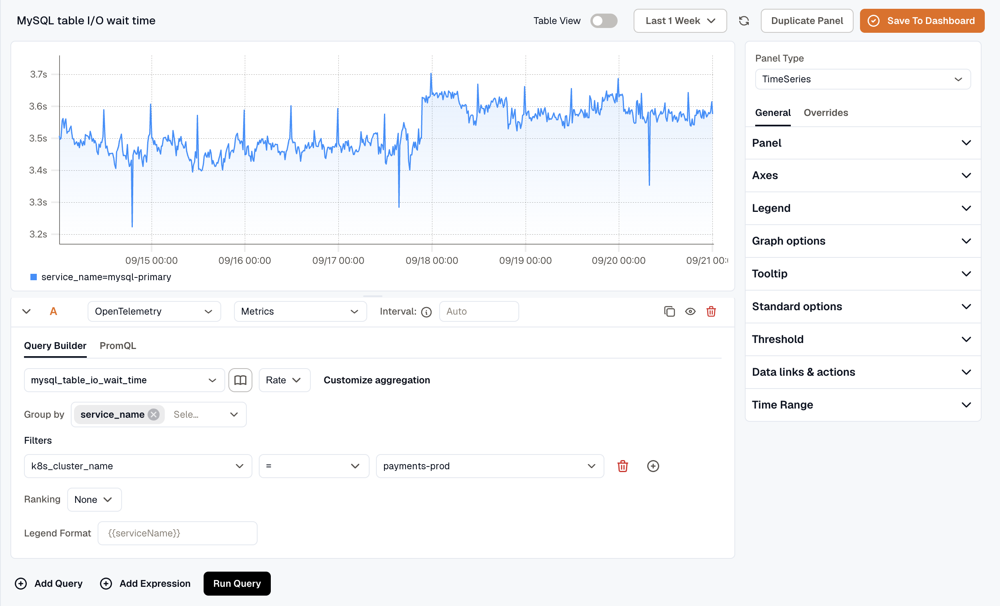
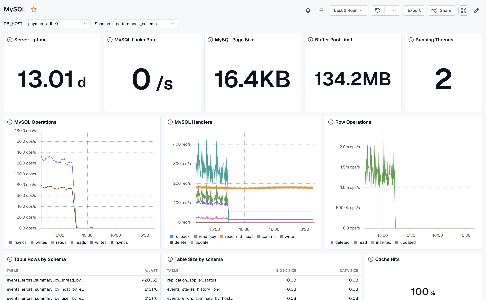

This guide sets up MySQL monitoring with the **KloudMate Agent** and OpenTelemetry. It collects metrics and logs so you can watch the health, performance, and query behavior of MySQL instances running on AWS EC2, Azure Virtual Machines, or on-premise servers. A built-in dashboard visualizes the metrics, and you can set alerts on key MySQL conditions.

# MySQL Integration using KloudMate Agents

### What This Integration Provides

With MySQL Monitoring enabled, KloudMate collects telemetry that provides visibility into:
•  Buffer pool usage and operations
•  Connection handling and thread states
•  InnoDB row locks, double writes, and log operations
•  Index I/O waits and table operations
•  Query execution, sorts, and temporary resources
•  MySQL server uptime and opened resources
•  Slow query logs and error logs

This visibility helps identify buffer pool inefficiencies, connection bottlenecks, InnoDB performance issues, and slow query problems.

### Pre-requisites

Before configuring MySQL Monitoring, ensure the following:

1. MySQL version 8.0 or MariaDB 10.11 is installed and running.
2. Refer to the MySQL documentation for supported versions and configuration requirements.
3. The monitoring user must have permission to execute `SHOW GLOBAL STATUS`.
4. To collect query samples, `performance_schema` must be enabled and the monitoring user must be granted access:
   `` `GRANT SELECT ON performance_schema.* TO <your-user>@'%';` ``
5. KloudMate Agent installed on the MySQL host
   - Refer to Agent installation for [Linux](../../../kloudmate-agent/installation/linux-agent/) or [Windows](../../../kloudmate-agent/installation/windows-agent/).
6. MySQL username and password for authentication.
7. MySQL logs must be enabled from configurations.

### Step 1: Access Agents and OpenTelemetry Collector Configuration

- Log in to the KloudMate platform
- Go to **Settings → Agents**
- Select the agent running on the MySQL host
- Click **Actions → Collector Configuration**
- YAML editor opens for configuration


### Step 2: Add Required Extensions and Receivers

**Extensions**

```yaml
extensions:
  file_storage:
    create_directory: true
```

**Receivers**

Two receivers are used:

- **MySQL Receiver –** collects metrics
- **File Log Receiver –** collects logs (general, error, slow queries)

If you only need metrics, configure only the MySQL receiver.

```yaml
receivers:
  mysql:
    endpoint: localhost:3306
    username: root  #Change the username
    password: 'YourStr0ngPassword!'  #Change the password
    collection_interval: 60s
    initial_delay: 1s
    statement_events:
      digest_text_limit: 120
      time_limit: 24h
      limit: 250

  filelog/mysqlerror:
    include: [/var/log/mysql/error.log]
    exclude: [/var/log/mysql/*.gz]
    storage: file_storage
    retry_on_failure:
      enabled: true
    operators:
      - type: regex_parser
        parse_to: body
        regex: '(?P<time>\d{4}-\d{2}-\d{2}T\d{2}:\d{2}:\d{2}.\d+Z)\s(?P<id>\d+)\s\[(?P<severity>[^ ]*)\]\s\[(?P<name>[^ ]*)\]\s\[(?P<server>[^ ]*)\]\s(?P<message>.*)'
        timestamp:
          parse_from: body.timestamp
          layout: '%Y-%m-%d %H:%M:%S.%f %Z'
        severity:
          parse_from: body.severity
          mapping:
            info:
              - STATEMENT
              - LOG
              - SYSTEM
      - type: remove
        field: body.severity
      - type: remove
        field: body.timestamp

  filelog/mysqlslowquery:
    include: [/var/log/mysql/*-slow.log]
    exclude: [/var/log/mysql/*.gz]
    storage: file_storage
    multiline:
      line_start_pattern: '^# Time: \d{4}-\d{2}-\d{2}T\d{2}:\d{2}:\d{2}\.\d{6}Z'
    retry_on_failure:
      enabled: true
    operators:
      - type: regex_parser
        parse_to: body
        regex: '(?P<time>\d{4}-\d{2}-\d{2}T\d{2}:\d{2}:\d{2}\.\d+Z)\n#\sUser@Host:\s(?P<user>.*)\s+Id:\s+(?P<Id>\d+)\n# Query_time:\s(?P<query_time>\d+.\d+)\s+Lock_time:\s(?P<lock_time>\d+.\d+)\sRows_sent:\s(?P<rows_sent>\d+)\s+Rows_examined:\s(?P<rows_examined>\d+)\n(?P<query>[\s\S]+)'
        timestamp:
          parse_from: body.timestamp
          layout: '%Y-%m-%d %H:%M:%S.%f %Z'
        severity:
          parse_from: body.severity
          mapping:
            info:
              - STATEMENT
              - LOG
      - type: remove
        field: body.severity
      - type: remove
        field: body.timestamp
```

### **Step 3: Configure Processors**

Set up the processor component to identify resource information from the host and either append or replace the resource values in the telemetry data with this information.

Choose **one configuration** based on where MYSQL is running.

- **Server (On-premise / Non-cloud / Cloud)**

```yaml
processors:
  batch:
    send_batch_size: 5000
    timeout: 10s

  resourcedetection:
    detectors: [system]
    system:
      resource_attributes:
        host.name:
          enabled: true
        host.id:
          enabled: true
        os.type:
          enabled: false
  resource:
    attributes:
      - key: service.name
        action: insert
        from_attribute: host.name
```

- **AWS EC2:**

(Optional) To collect EC2 tags, attach an IAM role with `EC2:DescribeTags` permission.

```yaml
processors:
  batch:
    send_batch_size: 5000
    timeout: 10s

  resourcedetection/ec2:
    detectors:  ["ec2"]
    ec2:
      tags:
        - ^tag1$
        - ^tag2$
        - ^label.*$ 
        - ^Name$

  resource:
    attributes:
      - key: service.name
        action: insert
        from_attribute: ec2.tag.Name
      - key: service.instance.id
        action: insert
        from_attribute: host.id
```

- **Azure Virtual Machines:**

```yaml
processors:
  batch:
    send_batch_size: 5000
    timeout: 10s

  resourcedetection/azure:
    detectors: ["azure"]
    azure:
      tags:
        - ^tag1$
        - ^tag2$
        - ^label.*$
        - ^Name$

  resource:
    attributes:
      - key: service.name
        action: insert
        from_attribute: azure.vm.name
      - key: service.instance.id
        action: insert
        from_attribute: host.id
```

### **Step 4: Configure Exporter and Pipelines**

Configure the KloudMate backend exporter and define pipelines for metrics and logs.

```yaml
exporters:
  debug:
    verbosity: detailed
  otlphttp:
    endpoint: 'https://otel.kloudmate.com:4318'
    headers:
      Authorization: xxxxxxxx  # Use the auth key

service:
  pipelines:

    metrics:
      receivers: [mysql]
      processors: [batch, resourcedetection, resource]  #use the correct resourcedetection
      exporters: [otlphttp]
    logs:
      receivers: [filelog/mysqlslowquery, filelog/mysqlerror]
      processors: [batch, resourcedetection, resource]  #use the correct resourcedetection
      exporters: [otlphttp]
  extensions: [health_check, pprof, zpages, file_storage]
```

### **Step 5: Save Configuration and Restart Agent**

After updating the configuration, click **Save Configuration** in the KloudMate UI.


You can also restart the agent from your server’s console.

**For Linux:**

1. Execute the following commands:

```none
systemctl restart kmagent
systemctl status kmagent
```

These commands restart the KloudMate Agent and display its current status.

**For Windows**

1. Open the **Services** window
   - Press `Win + R`, type `services.msc`, and press `OK`
   - Or search for **Services** from the Start menu
2. Locate the **KloudMate Agent** service.
3. Right-click the service and select **Restart**.

After restarting the agent, verify that MySQL metrics and logs are visible in the KloudMate dashboard.

## Post‑Integration Data Validation

Verify that metrics are flowing into KloudMate using the **Explore** view.

After the agent restarts:

1. Log in to KloudMate
2. Navigate to **Explore**
3. Select **OpenTelemetry → Metrics**
4. Choose a MySQL metric and run the query

Seeing time-series data confirms that MySQL telemetry is flowing successfully. 



## **Standard MySQL Dashboards**

KloudMate provides prebuilt MYSQL dashboards through [dashboard templates](https://templates.kloudmate.com/MySql/index.html). These dashboards visualize MYSQL database performance, query operations, connections, and resource usage.

To import and start using these templates, follow the steps described in [Importing a Dashboard](../../../visualize-data/dashboards/#importing-a-dashboard). Alternatively, use [From Template](../../../visualize-data/dashboards/create-a-dashboard/#from-template) when creating a new dashboard to pick from KloudMate's built-in templates.



## Default Metrics

| Metric Name                        |  Description                                                        |
| ---------------------------------- | ------------------------------------------------------------------- |
| mysql\_operations                  | Total operations including fsync, reads and writes                  |
| mysql\_buffer\_pool\_data\_pages   | Number of data pages for an InnoDB buffer pool                      |
| mysql\_buffer\_pool\_limit         | Configured size of the InnoDB buffer pool                           |
| mysql\_buffer\_pool\_operations    | Number of operations on the InnoDB buffer pool                      |
| mysql\_buffer\_pool\_page\_flushes | Sum of Requests to flush pages for the InnoDB buffer pool           |
| mysql\_mysqlx\_connections         | Total MySQLx connections                                            |
| mysql\_tmp\_resources              | Number of temporary resources created                               |
| mysql\_uptime                      | Number of seconds since the server has been up                      |
| mysql\_index\_io\_wait\_count      | Total time of I/O wait events for a particular index                |
| mysql\_handlers                    | Number of requests to various MySQL handlers                        |
| mysql\_locks                       | Total MySQL locks                                                   |
| mysql\_log\_operations             | Number of InnoDB log operations                                     |
| mysql\_index\_io\_wait\_time       | Total time of I/O wait events for a particular index                |
| mysql\_row\_locks                  | Total InnoDB row locks present                                      |
| mysql\_buffer\_pool\_usage         | Number of bytes in the InnoDB buffer pool                           |
| mysql.page\_operations             | Total operation on InnoDB pages                                     |
| mysql\_double\_writes              | Number of writes to the InnoDB doublewrite buffer pool              |
| mysql\_table\_io\_wait\_count      | Total I/O wait events for a specific table                          |
| mysql\_table\_io\_wait\_time       | Total wait time for I/O events for a table                          |
| mysql\_prepared\_statements        | Number of times each type of Prepared statement command got issued  |
| mysql\_sorts                       | Total MySQL sort execution                                          |
| mysql\_row\_operations             | Total row operations executed                                       |
| mysql\_threads                     | Current state of MySQL threads                                      |
| mysql\_opened\_resources           | Total opened resources                                              |
| mysql\_buffer\_pool\_pages         | Sum of pages in the InnoDB buffer pool                              |

For the complete metrics list, refer to the [metrics reference](https://github.com/open-telemetry/opentelemetry-collector-contrib/blob/main/receiver/mysqlreceiver/documentation.md).

##

