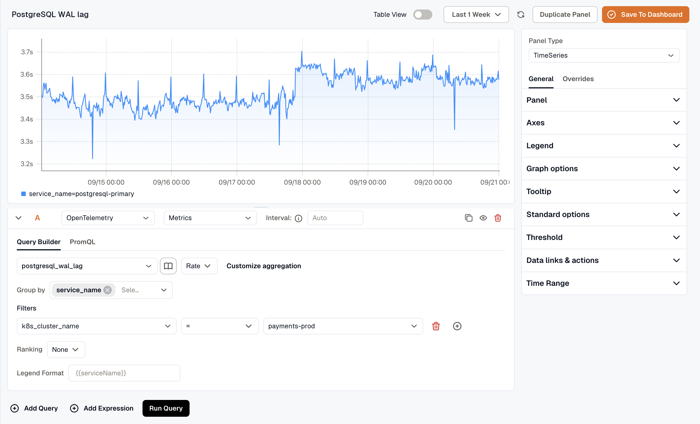
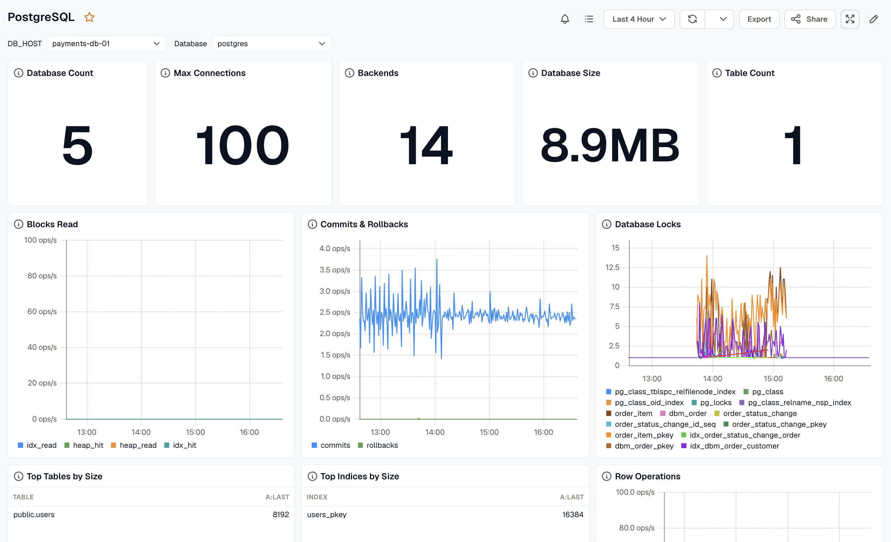

This guide sets up PostgreSQL monitoring with the **KloudMate Agent** and OpenTelemetry. It collects metrics and logs so you can watch the health, performance, and query behavior of PostgreSQL instances running on AWS EC2, Azure Virtual Machines, or on-premise servers.

# PostgreSQL Integration using KloudMate Agents

### **What This Integration Provides**

With PostgreSQL Monitoring enabled, KloudMate collects telemetry that provides visibility into:

- Database health and performance metrics
- Locks, deadlocks, and query behavior
- Slow queries through log analysis
- Resource usage at host level
- PostgreSQL server logs

This visibility helps identify performance bottlenecks, long-running queries, locking issues, and availability problems.

### **Pre-requisites**

Before configuring PostgreSQL Monitoring, ensure the following:

1. Refer to PostgreSQL documentation for [supported versions](https://www.postgresql.org/support/versioning/)
2. Monitoring user must have SELECT permission on pg\_stat\_database
3. PostgreSQL is installed and running
4. KloudMate Agent installed on the PostgreSQL host
   - Refer to Agent installation for [Linux](../../../kloudmate-agent/installation/linux-agent/) or [Windows](../../../kloudmate-agent/installation/windows-agent/)
5. PostgreSQL username and password
6. PostgreSQL logging enabled in the server configuration

### **Step 1: Access Agents and OpenTelemetry Collector Configuration**

- Log in to the KloudMate platform
- Go to **Settings → Agents**
- Select the agent running on the PostgreSQL host
- Click **Actions → Collector Configuration**
- YAML editor opens for configuration


### **Step 2: Add Required Extensions and Receivers**

**Extensions**

```yaml
extensions:
  file_storage:
    create_directory: true
```

**Receivers**

Two receivers are used:

- **PostgreSQL Receiver –** collects metrics
- **File Log Receiver –** collects logs (general, error, slow queries)

If you only need metrics, configure only the PostgreSQL receiver.

```yaml
receivers:
  postgresql:
    endpoint: localhost:5432  #update the endpoint
    transport: tcp
    username: <postgres>  #update postgres username
    password: <password>  #Update postgres password
    databases: []
    collection_interval: 30s
    tls:
      insecure: true
    metrics:
      postgresql.deadlocks:
        enabled: true
      postgresql.database.locks:
        enabled: true

  filelog/pgsql_json:    #use this file log if postgres version >= 15 
    include: [/var/lib/postgresql/*/main/log/postgresql*]
    storage: file_storage
    retry_on_failure:
      enabled: true
    operators:
      - type: json_parser
        parse_to: body
        severity:
          parse_from: body.error_severity
          mapping:
            info: LOG

  filelog/pgsql_log:  #use this file log if postgres version < 15 
    include: [/var/lib/postgresql/*/main/log/postgresql*]
    storage: file_storage
    multiline:
      line_start_pattern: ^\d{4}-\d{2}-\d{2} \d{2}:\d{2}:\d{2}
    retry_on_failure:
      enabled: true
    operators:
      - type: regex_parser
        parse_to: body
        regex: '^(?P<timestamp>[0-9\-]+\s[0-9:\.]+\s\w+)\s+\[(?P<pid>\d+)\](?:\s+(?P<database>\w+)@(?P<user>\w+))?\s+(?P<severity>\w+):(?:\s+duration:\s+(?P<duration>\d+\.\d+)\s+[^ ]*\s+(statement:\s+)?)?\s+(?P<query>.+)$'
        timestamp:
          parse_from: body.timestamp
          layout: '%Y-%m-%d %H:%M:%S.%f %Z'
        severity:
          parse_from: body.severity
          mapping:
            info:
              - STATEMENT
              - LOG
      - type: remove
        field: body.severity
      - type: remove
        field: body.timestamp
```

### **Step 3: Configure Processors**

Set up the processor component to identify resource information from the host and either append or replace the resource values in the telemetry data with this information.

Choose **one configuration** based on where PostgresSQL is running.

- **Server (On-premise / Non-cloud / Cloud)**

```yaml
processors:
  batch:
    send_batch_size: 5000
    timeout: 10s

  resourcedetection:
    detectors: [system]
    system:
      resource_attributes:
        host.name:
          enabled: true
        host.id:
          enabled: true
        os.type:
          enabled: false
  resource:
    attributes:
      - key: service.name
        action: insert
        from_attribute: host.name
```

- **AWS EC2:**

(Optional) To collect EC2 tags, attach an IAM role with `EC2:DescribeTags` permission.

```yaml
processors:
  batch:
    send_batch_size: 5000
    timeout: 10s

  resourcedetection/ec2:
    detectors:  ["ec2"]
    ec2:
      tags:
        - ^tag1$
        - ^tag2$
        - ^label.*$ 
        - ^Name$

  resource:
    attributes:
      - key: service.name
        action: insert
        from_attribute: ec2.tag.Name
      - key: service.instance.id
        action: insert
        from_attribute: host.id
```

- **Azure Virtual Machines:**

```yaml
processors:
  batch:
    send_batch_size: 5000
    timeout: 10s

  resourcedetection/azure:
    detectors: ["azure"]
    azure:
      tags:
        - ^tag1$
        - ^tag2$
        - ^label.*$
        - ^Name$

  resource:
    attributes:
      - key: service.name
        action: insert
        from_attribute: azure.vm.name
      - key: service.instance.id
        action: insert
        from_attribute: host.id
```

### **Step 4: Configure Exporter and Pipelines**

Configure the KloudMate backend exporter and define pipelines for metrics and logs.

```yaml
exporters:
  debug:
    verbosity: detailed
  otlphttp:
    endpoint: 'https://otel.kloudmate.com:4318'
    headers:
      Authorization: xxxxxxxx  # Use the auth key

service:
  pipelines:

    metrics:
      receivers: [postgresql]
      processors: [batch, resourcedetection, resource]  # Apply the correct resourcedetection
      exporters: [otlphttp]

    logs:
      receivers: [pgsql_log]    #use the correct filelog receiver as per your pg version
      processors: [batch, resourcedetection, resource]  # Apply the correct resourcedetection
      exporters: [otlphttp]

  extensions: [health_check, pprof, zpages, file_storage]
```

### **Step 5: Save Configuration and Restart Agent**

After updating the configuration, click **Save Configuration** in the KloudMate UI.


You can also restart the agent from your server’s console.

**For Linux:**

1. Execute the following commands:

```none
systemctl restart kmagent
systemctl status kmagent
```

These commands restart the KloudMate Agent and display its current status.

**For Windows**

1. Open the **Services** window
   - Press `Win + R`, type `services.msc`, and press `OK`
   - Or search for **Services** from the Start menu
2. Locate the **KloudMate Agent** service.
3. Right-click the service and select **Restart**.

After restarting the agent, verify that PostgreSQL metrics and logs are visible in the KloudMate dashboard.

## Post‑Integration Data Validation

Verify that metrics are flowing into KloudMate using the **Explore** view.

After the agent restarts:

1. Log in to KloudMate
2. Navigate to **Explore**
3. Select **OpenTelemetry → Metrics**
4. Choose a PostgreSQL metric and run the query

Seeing time-series data confirms that PostgreSQL telemetry is flowing successfully. 



## **Standard PostgreSQL Dashboards**

KloudMate provides prebuilt PostgreSQL dashboards through [dashboard templates](https://templates.kloudmate.com/postgress/index.html). These dashboards visualize PostgreSQL database performance, query operations, connections, and resource usage.

To import and start using these templates, follow the steps described in [Importing a Dashboard](../../../visualize-data/dashboards/#importing-a-dashboard). Alternatively, use [From Template](../../../visualize-data/dashboards/create-a-dashboard/#from-template) when creating a new dashboard to pick from KloudMate's built-in templates.



## Default Metrics for PostgreSQL

| Name                                 | Description                                                                                                                           | Type  | Unit    |
| ------------------------------------ | ------------------------------------------------------------------------------------------------------------------------------------- | ----- | ------- |
| postgresql\_backends                 | The number of backends                                                                                                                | SUM   | NONE    |
| postgresql\_connection\_max          | Configured the maximum number of client connections allowed                                                                           | GAUGE | NONE    |
| postgresql\_db\_size                 | The database disk usage                                                                                                               | SUM   | Bytes   |
| postgresql\_commits                  | The number of commits                                                                                                                 | SUM   | NONE    |
| postgresql\_deadlocks                | The number of deadlocks.                                                                                                              | SUM   | NONE    |
| postgresql\_database\_locks          | The number of database locks.                                                                                                         | GAUGE | COUNT   |
| postgresql\_wal\_lag                 | The time between flushing the recent WAL locally and receiving notification that the standby server has completed an operation on it. | GAUGE | seconds |
| postgresql\_replication\_data\_delay | The amount of data delayed in replication                                                                                             | GAUGE | Bytes   |

For the complete metrics list, refer to the [metrics reference](https://github.com/open-telemetry/opentelemetry-collector-contrib/blob/main/receiver/postgresqlreceiver/documentation.md).

For complete observability, ensure **PostgreSQL logging** is enabled first. See: [PostgreSQL Logging: Enable Slow Query Logs & JSON Output (v15+)](https://blog.kloudmate.com/postgresql-logging-enable-slow-query-logs-json-output-v15-6ad493f28241)
