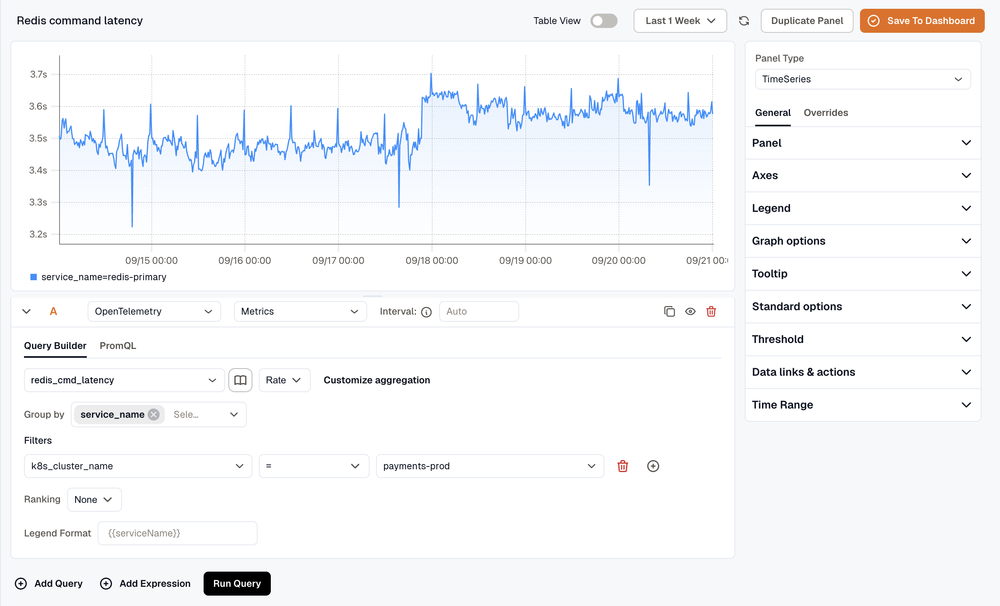

This guide sets up Redis monitoring with the **KloudMate Agent** and OpenTelemetry. It collects metrics so you can watch the health and performance of Redis instances running on cloud virtual machines or on-premise servers.

### What This Integration Provides

With Redis Monitoring enabled, KloudMate collects telemetry that provides visibility into:

- Command execution and throughput
- Memory usage and fragmentation
- Client connections and blocked clients
- Network input and output
- Replication and persistence behavior
- Redis server uptime and CPU time

This visibility helps detect performance degradation, memory pressure, command latency issues, connection limits, and replication problems.

### **Configuring Redis Metrics Collection**

You can achieve Redis performance monitoring by using the KloudMate Agent, which automatically collects Redis metrics and sends them to KloudMate for analysis and visualization.

If you are already running the KloudMate Agent and want to configure it to send Redis telemetry data to KloudMate, update your YAML configuration as shown below.

### **Agent Configuration**

```yaml
extensions:
  health_check:
  pprof:
    endpoint: 0.0.0.0:1777
  zpages:
    endpoint: 0.0.0.0:55679

receivers:
  otlp:
    protocols:
      grpc:
      http:

  redis:
    endpoint: localhost:6379
    collection_interval: 10s

processors:
  resourcedetection:
    detectors: [env, system]
  cumulativetodelta:
  batch:
    send_batch_size: 5000
    timeout: 10s

exporters:
  otlphttp:
    endpoint: 'https://otel.kloudmate.com:4318'
    headers:
      Authorization: <token>

service:

  pipelines:

    metrics:
      receivers: [otlp, opencensus, prometheus, redis]
      processors: [cumulativetodelta, batch, resourcedetection]
      exporters: [otlphttp]

  extensions: [health_check, pprof, zpages]
```

## **Post-Integration Data Validation**

Verify that Redis metrics are flowing into KloudMate using the Explore view.

After the agent restarts:

1. Log in to your KloudMate account
2. Navigate to **Explore**
3. Select **OpenTelemetry → Metrics**
4. Choose a Redis metric exposed by the integration
5. Click **Run Query** to view time-series data

Seeing data confirms that Redis telemetry is being collected successfully.



## Redis metrics

| **Name** | **Description**                                                    |
| ----------------------------------- | ------------------------------------------------------------------ |
| redis\_commands                     | Number of commands processed per second                            |
| redis\_cmd\_latency                 | Command execution latency                                          |
| redis\_memory\_used                 | Total number of bytes allocated by Redis using its allocator       |
| redis\_memory\_fragmentation\_ratio | Ratio between used\_memory\_rss and used\_memory                   |
| redis\_clients\_connected           | Number of client connections (excluding connections from replicas) |
| redis\_keys\_evicted                | Number of evicted keys due to maxmemory limit                      |
| redis\_net\_input                   | The total number of bytes read from the network                    |
| redis\_net\_output                  | The total number of bytes written to the network                   |
| redis\_replication\_offset          | The server's current replication offset                            |
| redis\_uptime                       | Number of seconds since the Redis server started                   |

For the complete Redis metrics list, refer to the [metrics reference](https://github.com/open-telemetry/opentelemetry-collector-contrib/blob/main/receiver/redisreceiver/documentation.md).

