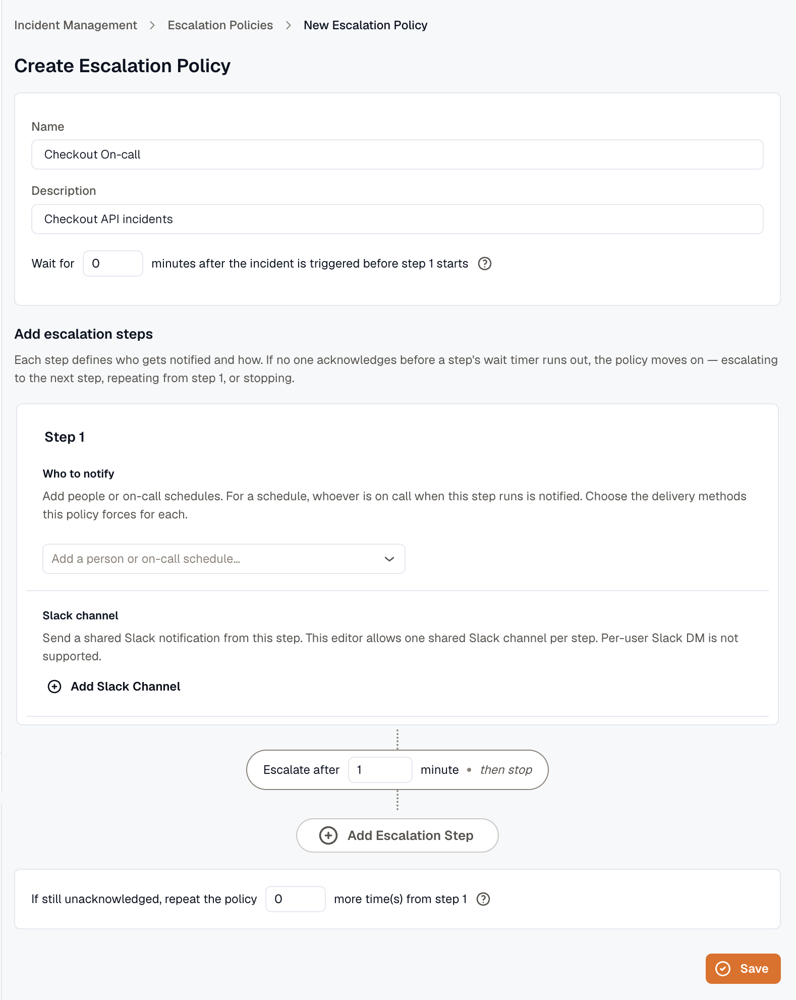
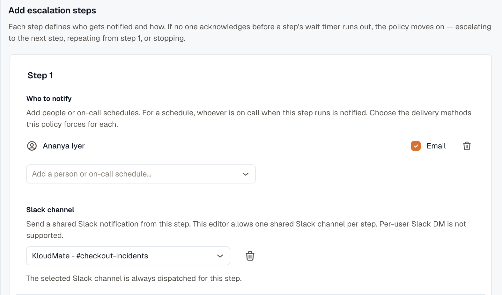
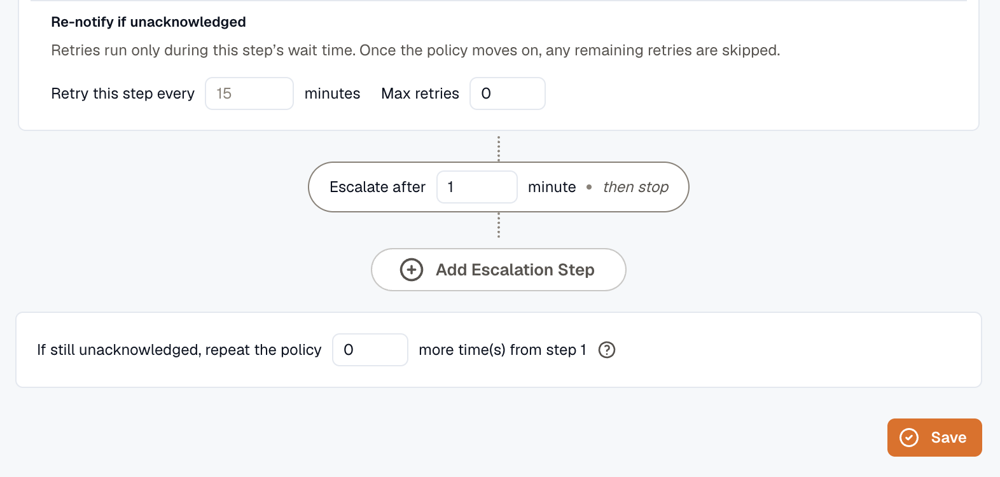

import { Steps } from '@astrojs/starlight/components';

This page walks through building a policy from scratch — the policy-level settings first, then the steps that do the paging.

## Create the policy

<Steps>
1. Open **Incidents → Escalation policies** and click **Add Escalation Policy**.

2. Enter a **name** and **description**.

3. Set the **wait time** — minutes before the first step fires. Leave it at `0` to page immediately.

4. Set the **repeat count** — how many extra times to run the whole policy from step 1 if nobody acknowledges. `0` runs the policy once.
</Steps>

## Add steps

Each step names its recipients and how long to wait before escalating.

<Steps>
1. In a step, add one or more **recipients**:
   - **Users** — pick a user, then choose how to notify them. Select at least one method. **Email** is always available. **SMS** and **voice** appear only when your plan includes them, and they need a verified phone number for the user.
   - **On-call schedule** — pick a schedule; the step notifies whoever is on call when it fires — possibly several people. Requires the Pro plan.
   - **Slack channel** — click **Add Slack Channel** and pick a connected channel. A step can post to one shared channel, and it posts there every time the step runs. Per-user Slack DMs aren't supported. Connect Slack first under [Slack Integration](../../slack-integration/).

2. Set **Escalate after** — minutes to wait for an acknowledgement before the next step fires.

3. *(Optional)* Turn on **retries** for the step: set a **retry interval** and a **max retries** count to re-page the same recipients until someone acknowledges.

4. Add more steps as needed. The connector between steps spells out what happens next — "Escalate after 10 minutes • then escalate to step 2", or "then repeat the policy from step 1", or "then stop".

5. Click **Save**.
</Steps>

:::caution[Retry interval must be shorter than escalate-after]
Retries only run during a step's escalate-after window. If the retry interval is at least as long as that window, the first retry never fires before the policy advances — the editor flags this with a warning. Set the retry interval shorter than escalate-after.
:::

## A worked example

A policy that pages on-call first, then widens if no one answers:

1. **Wait 0 min** — step 1 fires as soon as the incident opens.
2. **Step 1** pages the **on-call schedule** plus a **backup user** by email and SMS. **Escalate after 5 min.**
3. No ack in 5 minutes → **Step 2** posts to a **Slack channel** and pages the **manager** by voice. **Escalate after 10 min.**
4. Still no ack → with **repeat count 1**, the policy runs from step 1 once more.

As soon as anyone acknowledges, the policy stops.

## Related

- [Escalation Policies overview](../) — the model and timing.
- [On-Call Schedules](../../oncall/) — what a schedule recipient resolves to.
- [Slack Integration](../../slack-integration/) — required for channel recipients.
