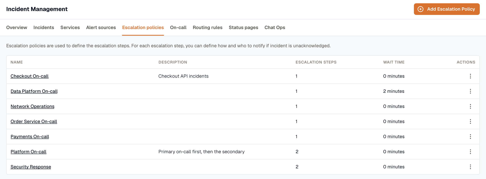

An escalation policy decides who gets paged when an incident opens, and what happens if no one acknowledges. A service points at one policy as its default; when an incident opens, the policy runs until someone acknowledges, the steps run out, or the policy finishes repeating.

The policies list shows each policy's name, description, initial wait time, and number of steps.

## How a policy is built

A policy has two levels: the policy itself, and an ordered list of steps.

**Policy**

- **Name** and **description**.
- **Wait time** — minutes to wait before the first step fires. `0` pages immediately.
- **Repeat count** — how many extra times to run the whole policy from step 1 if nobody acknowledges. `0` means run once; `2` means three passes in total.

**Step**

- **Recipients** — one or more targets (see below).
- **Escalate after** — minutes to wait for an acknowledgement before the next step fires.
- **Retries** *(optional)* — re-page this step's recipients on a timer until someone acknowledges (covered below).

## Step recipients

A single step can mix three kinds of recipient:

- **Users** — each notified by **email**, **SMS**, or **voice**. Pick at least one method per user. SMS and voice need a paid plan and a verified phone number; the editor disables them with a tooltip when either is missing.
- **On-call schedules** — the step notifies whoever is on call on the schedule at the moment it fires. A schedule can resolve to several people at once, and each is notified through their own methods. On-call schedules need the Pro plan.
- **Slack channels** — posted to a shared channel. A channel's **fallback order** lets you tier channels: `0` is primary, higher numbers are fallbacks. Per-user Slack DMs aren't supported — only shared channels.

:::note
A single step can notify several users, an on-call schedule, and a Slack channel at once.
:::

## How the timing plays out

Picture a two-step policy with a repeat:

1. **Wait 0 min** — the incident opens and step 1 fires immediately.
2. **Step 1** pages the on-call schedule and a backup user. **Escalate after 5 min.**
3. No acknowledgement in 5 minutes → **Step 2** pages a Slack channel and the team manager. **Escalate after 10 min.**
4. Still no acknowledgement → with **repeat count 1**, the policy loops back to step 1 and runs the whole thing once more.

The moment someone acknowledges, the policy stops — no more steps, no more repeats.

## Re-page a step until someone acknowledges

Within a step you can re-notify the same recipients on a timer instead of waiting for the next step. Set:

- **Retry interval** (ack timeout) — minutes between re-pages.
- **Max retries** — how many times to re-page.

Retries run only during that step's **escalate-after** window. Once the policy advances, any remaining retries are skipped.

:::caution[Keep the retry interval shorter than the step's wait]
If the retry interval is at least as long as the step's escalate-after time, the first retry may never run before the policy moves on. The editor warns you when that happens — set the retry interval shorter than escalate-after so retries actually fire.
:::

## Next

- [Create an escalation policy](./adding-escalation-policy/) — the step-by-step build.
- [On-Call Schedules](../oncall/) — what a step pages when it targets a schedule.
- [Slack Integration](../slack-integration/) — connect Slack before adding channel recipients.
