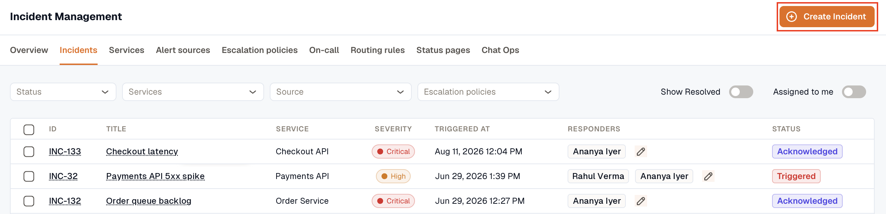
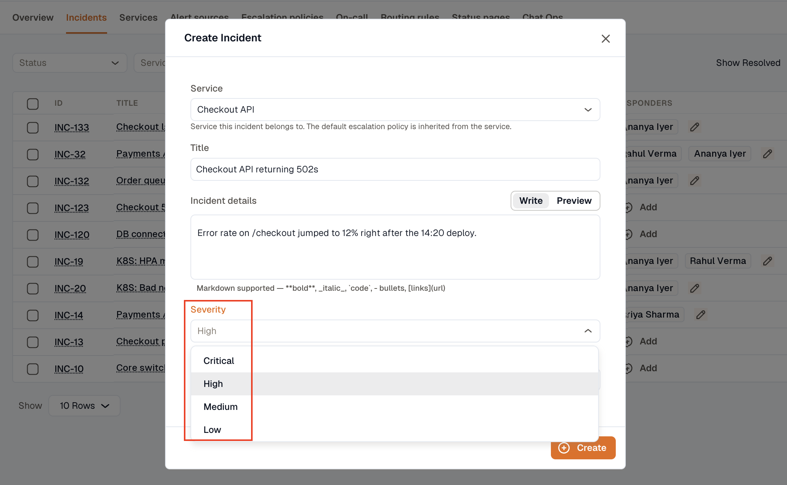
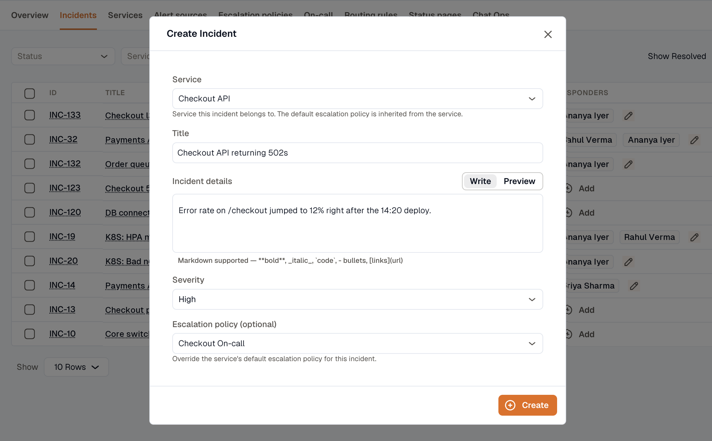

Use the steps below to create an incident manually.

1. Open **Incidents → Incidents** and click **Create Incident**.

2. Select the **Service** the incident belongs to.
3. Enter a **Title** and the **Incident details**.
4. Select a **Severity**: **Critical**, **High**, **Medium**, or **Low**.

5. To override the service's default escalation policy, select a policy in **Escalation policy (optional)**.
6. Click **Create**.

:::note
  **Service**, **Title**, **Incident details**, and **Severity** are required. If you don't have a service yet, [create a service](../../services/creating-services/) first.

  If you don't select an escalation policy, the incident uses the service's default escalation policy.
:::
