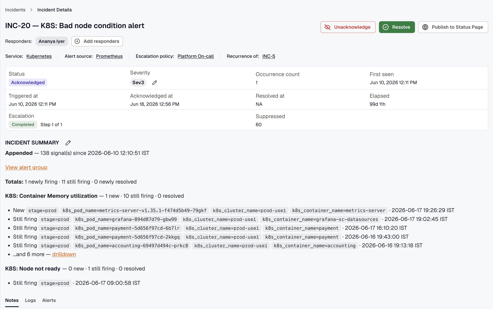
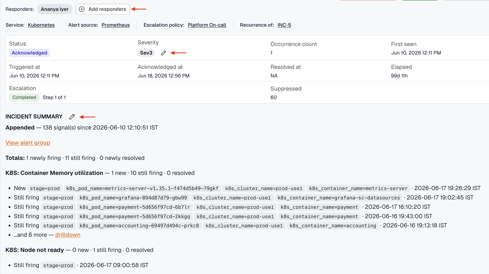
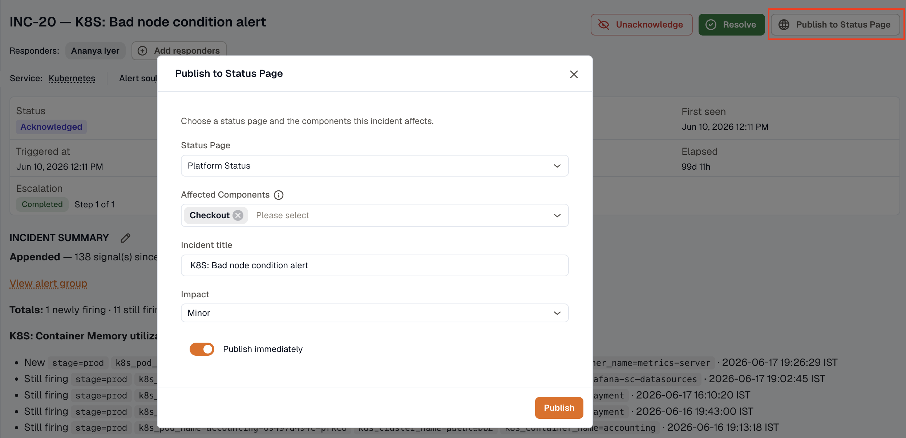
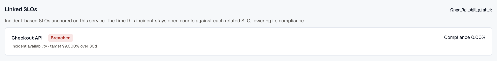
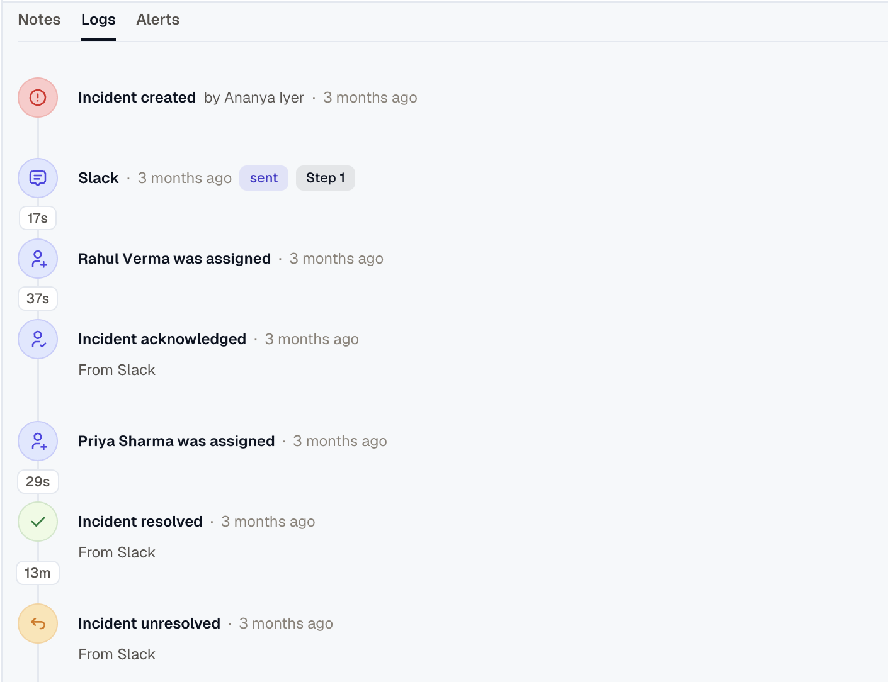

Open any incident from the list to view its detail page. It's the single place to see what happened, who was paged, and how the response unfolded.

## The header

The header identifies the incident and its routing:

- **Responders** — who's assigned. Add or remove them from here.
- **Service**, **alert source**, and **escalation policy** — each links to its own page.
- **Status** — Triggered, Acknowledged, or Resolved, derived from the incident's state.
- **Severity** — edit it inline.
- **Recurrence of** — a link to the earlier incident this one repeats, when there is one.

Use **Acknowledge** or **Resolve** in the top-right to update the status; you can also unacknowledge or unresolve.

## Incident metrics

Alongside the header, the page shows the numbers that matter during response:

- **Occurrence count** and **Suppressed**
- **First seen**, **Triggered at**, **Acknowledged at**, **Resolved at**
- **Elapsed** — how long the incident has been open, or how long it took to resolve
- **Escalation** — how far the escalation policy got, and the step it reached

## Manage the incident

- **Responders** — add or remove the users assigned to the incident.
- **Severity** — change the severity; the change is recorded on the timeline.
- **Summary** — edit the incident description with the context of what happened and its impact.

## Incident summary

The summary sits between the metrics and the tabs. Write it yourself to record what happened and its impact, or let KloudMate keep it current: when an incident is fed by an alert group, each new signal is appended to the summary.

An appended summary opens with how many signals have arrived since the incident was created, followed by the totals across the group — newly firing, still firing, and newly resolved. Below that, each alert rule gets its own breakdown with a few of its most recent signals, their labels, and when they fired. **Drilldown** opens the rest of a rule's signals, and **View alert group** opens the group itself.

## Publish to a status page

When the affected service is linked to a status page, users with the **Developer** role see a **Publish to Status Page** action on an open incident. It opens a dialog that pre-fills the page and affected components from the incident's service, so you can post a customer-facing incident in a couple of clicks. See [Post incidents and updates](../../status-pages/posting-incidents/).

## Linked SLOs

When the affected service has at least one incident-based [SLO](../../../reliability/), a **Linked SLOs** panel appears below the standard service / alert source / escalation-policy labels. Each linked SLO shows as a card with its name, kind + target + window, and current compliance %. Clicking a card opens the [SLO detail](../../../reliability/slo-detail/) page.

The panel only renders when at least one incident-based SLO exists on the affected service — incidents on services without reliability tracking show no panel.

## Activity timeline

The **Logs** tab holds the incident's audit trail. It merges two kinds of entry into one time-ordered stream:

- **Lifecycle events** — Created, Acknowledged, Unacknowledged, Resolved, Unresolved, Assigned, Unassigned, Severity changed, and Summary updated.
- **Notification deliveries** — one entry per attempt to reach a recipient, tagged with its **channel** (email, SMS, voice, Slack, MS Teams, webhook, Jira, or SNS) and a **status**: queued, sent, delivered, failed, skipped — unverified (the recipient had no verified phone), or skipped — no credits.

Delivery entries also note which **step** paged the recipient, the **retry attempt**, and the **fallback order** — so you can trace exactly how the escalation policy unfolded, attempt by attempt. Read it top to bottom and you get the whole story: when it triggered, who was paged on which channel, what was delivered, who acknowledged, and when it resolved.

## Alerts

The **Alerts** tab lists the raw alerts that fed this incident, each with its received time and whether it was suppressed. Expand a row to see the full payload that arrived from the alert source — useful for confirming what the source actually sent.

## Notes

The **Notes** tab is for team commentary: investigation findings, links, and context. Add a note and it's timestamped against your name, building a running record next to the automated timeline.
