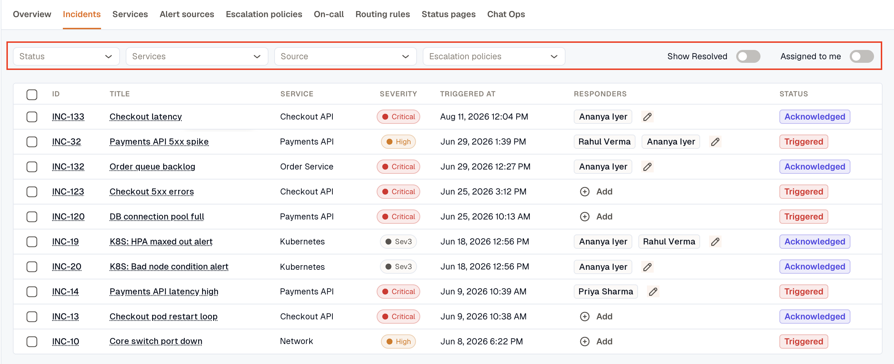

The Incidents overview gives you a high-level view of incident activity across your workspace, including current status counts and incidents assigned to you.

## Incident Statuses

Incidents in KloudMate move through three core statuses:

- **Triggered:** The incident has been created and needs attention.
- **Acknowledged:** A responder has taken ownership and is actively reviewing it.
- **Resolved:** The incident has been fixed and closed.

Status isn't a field you set directly — it's derived from whether the incident has been acknowledged and resolved. Acknowledging a triggered incident moves it to Acknowledged; resolving it moves it to Resolved. You can reverse either action too (unacknowledge, unresolve).

At the top of the page, you can review:

- Total incident count
- Triggered, acknowledged, and resolved counts
- **MTTA** (Mean Time to Acknowledge)
- **MTTR** (Mean Time to Resolve)

## My Incidents

The **My Incidents** list shows incidents currently assigned to you, including severity, responders, triggered time, and current status.

Use **View All** to open the full incident list across the workspace.

## The incident list

The full list is where you work through incidents at scale. Each row shows the incident's **ID** — its stable key, which links to the detail page — along with the title, service, severity, triggered time, responders, and status.

Filter the list by:

- **Status** — triggered, acknowledged, or resolved.
- **Services**, **Source**, and **Escalation policies**.
- **Assigned to me** — only incidents you're a responder on.
- **Show Resolved** — include resolved incidents, which are hidden by default.

You can also act in bulk: select several incidents and acknowledge, resolve, or change the severity of all of them at once — handy when one root cause spawned a wave of incidents.

## Related

- [Incident Details](./incident-details/) — the activity timeline, responders, and status actions.
- [Services](../services/) · [Alert Sources](../integrations/) · [Escalation Policies](../escalation-policy/) — what the list filters on.
