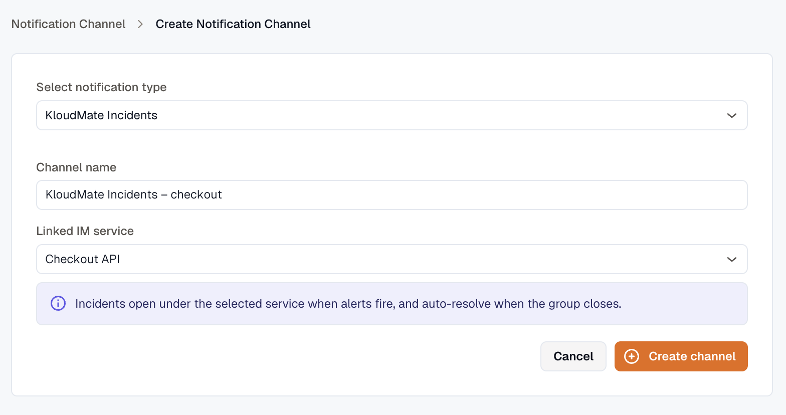
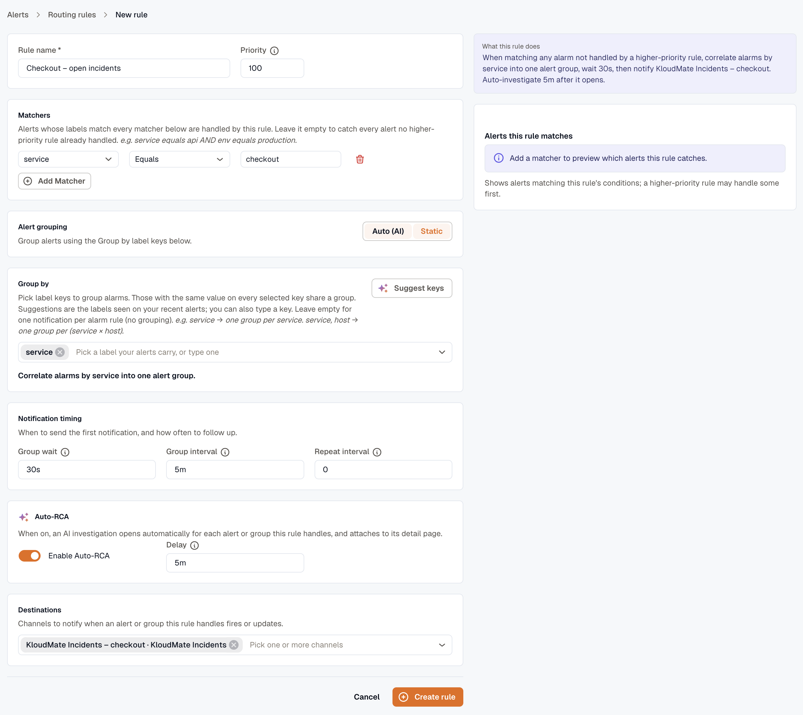

import { Steps } from '@astrojs/starlight/components';

To open an Incident Management incident whenever an alert fires, you wire two things together: a **KloudMate Incidents** notification channel (which bridges KloudMate alerts into the IM service) and a **Routing Rule** (which decides which alerts feed the channel).

This replaces the older "webhook channel + notification policy with Alarm condition" flow. The KloudMate Incidents channel handles the bridge plumbing for you; routing rules give you label-level control over which alerts trigger which IM services.

:::note
The **Routing Rule** on this page is an [Alerts routing rule](../../../alerts/routing-rules/). It routes alert *notifications* to channels. Don't confuse it with [Incidents → Routing rules](../../routing-rules/), which decides how an alert becomes an incident once it has reached IM.
:::

## Prerequisites

- An [IM service](../../services/) you want incidents to open against.
- The **Developer** role (you need it to create channels and routing rules).

## Step 1 — Create a KloudMate Incidents channel

<Steps>
1. Open **Settings → Notification Channels → Create**.

2. Pick **KloudMate Incidents** as the channel type.

3. Give the channel a **Channel name**.

4. Pick the IM service you want to link from the **Linked IM service** dropdown.

5. Click **Create channel**.
</Steps>

KloudMate creates the IM integration row under your service automatically and points the new channel at the integration's signed loop URL. You don't need to copy URLs or paste them anywhere. See [Notification Channels](../../../platform/settings/notification-channels/#kloudmate-incidents) for the channel-side details.

## Step 2 — Route alerts to the channel

<Steps>
1. Open **Alerts → Routing rules** and click **Create rule**.

2. Name the rule and set a priority (lower wins).

3. Add **matchers** that identify which alerts should feed this IM service, e.g. `service equals checkout` to route every checkout alert to the Checkout API IM service.

4. Select **group-by** keys (e.g. `service`, `env`) so related alerts fold into a single notifiable group.

5. Select the **KloudMate Incidents channel** you created in Step 1 as a destination.

6. Optionally enable **Auto-RCA** if you want KloudMate's AI investigator to attach a summary to the incident automatically.

7. Click **Create rule**.
</Steps>

See [Routing Rules](../../../alerts/routing-rules/) for the full rule editor walk-through.

## Step 3 — Verify

Trigger a matching alert. Within the routing rule's `group_wait` (default 30 seconds), an incident opens on the linked IM service under the configured escalation policy.

Things to check:

- The incident shows up on the IM service's incidents tab.
- The originating [Alert Group](../../../alerts/alert-groups/) in **Alerts → Groups** lists the KloudMate Incidents channel under its Notifications tab with the new incident's ID.
- If Auto-RCA was enabled, the investigation summary attaches to both the group and the incident.

## Migrating from the older flow

If you used to wire this up via **Webhook channel + Notification Policy with Alarm condition**, the upgrade migrated each policy to a routing rule. No recreation is required — but the recommended path going forward is the KloudMate Incidents channel, not a raw webhook, because:

- KloudMate Incidents channels carry HMAC signing automatically.
- The KloudMate Incidents receiver knows how to dedupe against existing incidents and append RCA summaries when they arrive late.
- Routing-rule label matchers give you finer control than tag-based policies did.

## Related

- [Alerts Routing Rules](../../../alerts/routing-rules/) — the rule editor used here (routes notifications).
- [IM Routing Rules](../../routing-rules/) — the different feature that turns alerts into incidents.
- [Alert Groups](../../../alerts/alert-groups/) — what gets routed.
- [Notification Channels](../../../platform/settings/notification-channels/#kloudmate-incidents) — KloudMate Incidents channel setup.
- [IM Services](../../services/) — the destination side.
