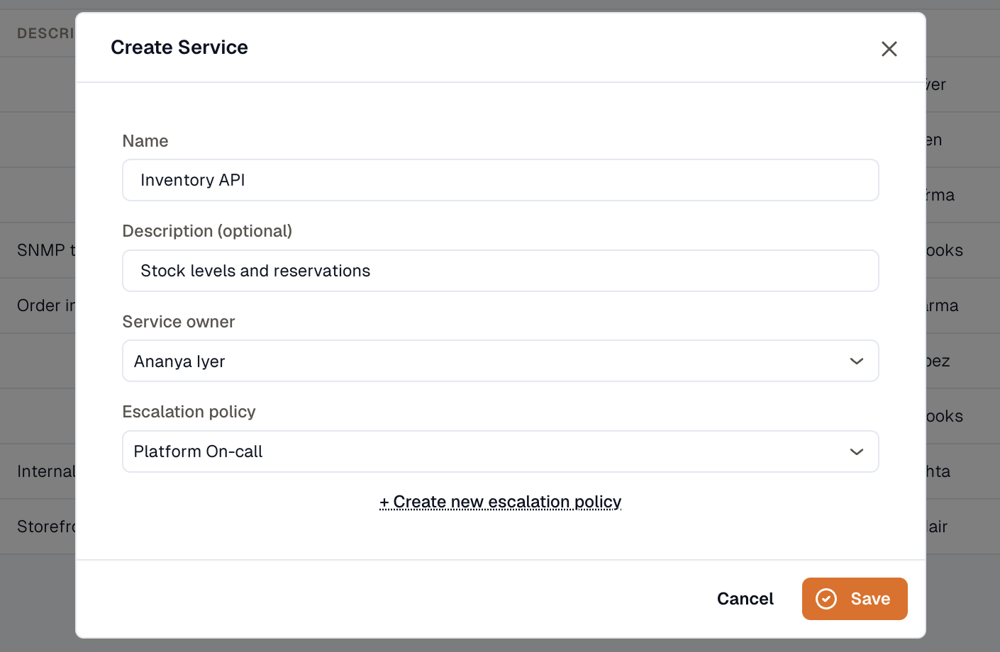

import { Steps } from '@astrojs/starlight/components';

Use the steps below to create a new service.

<Steps>
1. Open **Incidents → Services** and click **Create Service**.

2. Enter the **service name**. A **description** is optional.

3. Select the **service owner** — a user in your workspace.

4. Select the default **escalation policy**. Every service requires one. If you don't have a policy yet, use the **Create new escalation policy** link in the form to make one without leaving the page.

5. Click **Save**.
</Steps>

Once the service exists, open it to add [alert sources](../../integrations/) and review its incidents.
