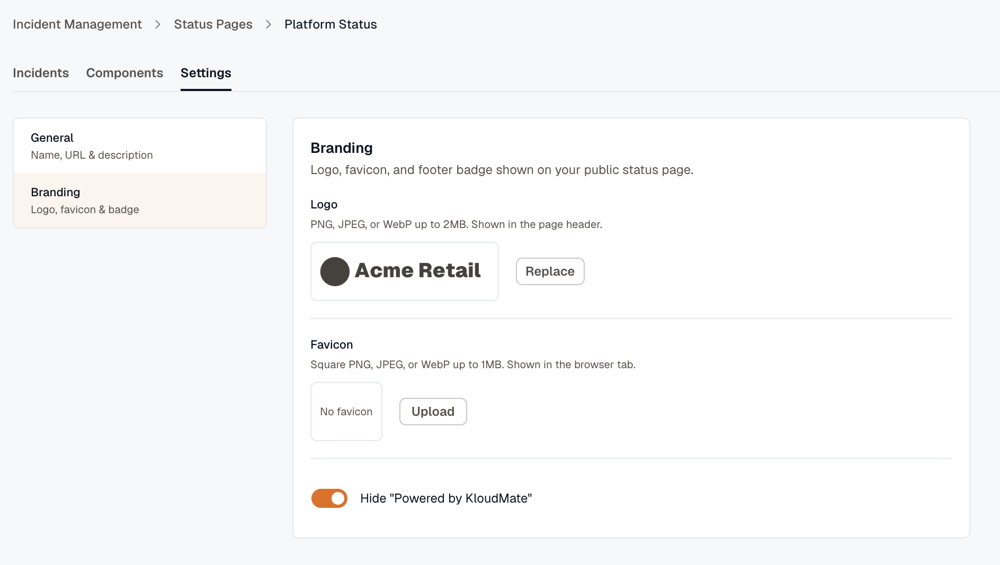
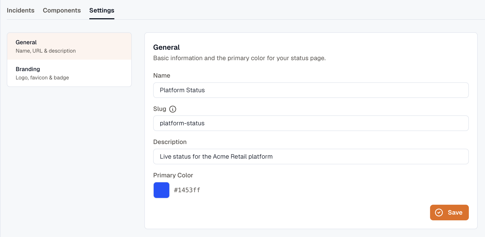
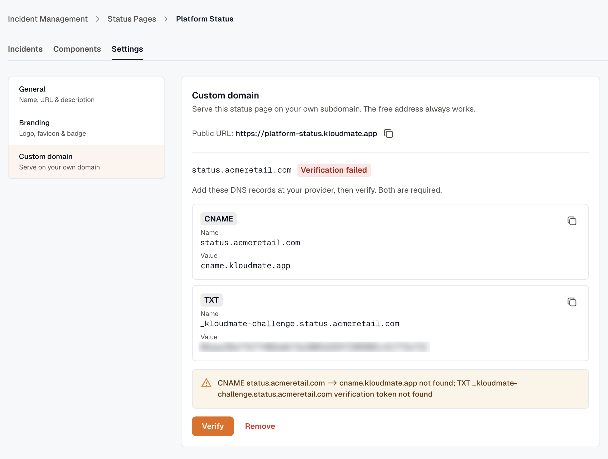

import { Steps } from '@astrojs/starlight/components';

Branding makes the status page look like yours rather than a generic KloudMate page; a custom domain puts it on a URL your customers already trust. Both live under the editor's **Settings** tab.

## Branding

Set these in **Settings → Branding**:

- **Logo** — PNG, JPEG, or WebP, up to **2 MB**. KloudMate downscales it to a 512px longest edge.
- **Favicon** — PNG, JPEG, or WebP, up to **1 MB**, square (1:1). It's downscaled to 256px.
- **Hide "Powered by KloudMate"** — removes the KloudMate footer badge. This is a paid add-on; you'll be prompted to upgrade if your plan doesn't include it.

When you upload a logo or favicon, a crop dialog lets you frame it before it's saved.



The page's **primary color**, its accent, is set separately in **Settings → General**, alongside the name, slug, and description.



## The default URL

Every status page is reachable for free at a KloudMate-hosted address built from its slug:

```
https://<slug>.<your-status-domain>
```

This works the moment you publish — no DNS setup required. Use it as-is, or move to a custom domain.

## Custom domain

A custom domain serves the page from a subdomain of your own — for example `status.example.com`. Custom domains are a paid feature, and only an **organization owner** can set one up.

<Steps>
1. In **Settings**, open the custom domain panel and enter your **subdomain** (for example `status.example.com`). It has to be a subdomain — an apex domain like `example.com` isn't supported.

2. KloudMate returns two DNS records: a **CNAME** and a **TXT** record.

3. Add both records at your DNS provider.

4. Come back and click **Verify**. The domain's status moves to **pending** while KloudMate checks the records.

5. Once the records resolve, the status flips to **active** and TLS is provisioned automatically. Your page is now live on the custom domain.
</Steps>

If verification doesn't go through, the status shows **failed** — double-check that both records match exactly and that DNS has had time to propagate, then verify again.



## Related

- [Status Pages overview](../) — components and publishing.
- [Post incidents and updates](../posting-incidents/) — what visitors read on the page.
