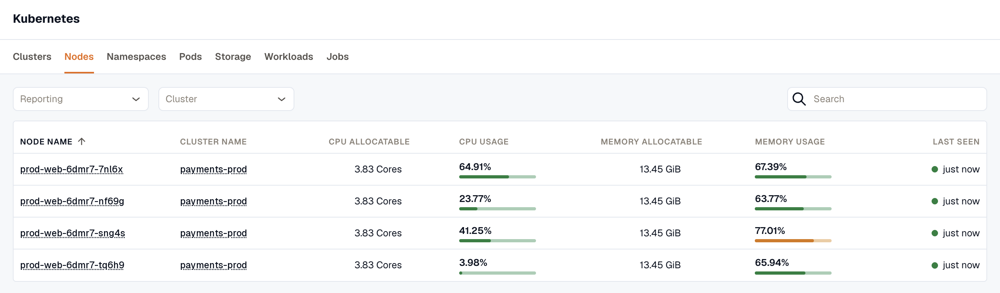
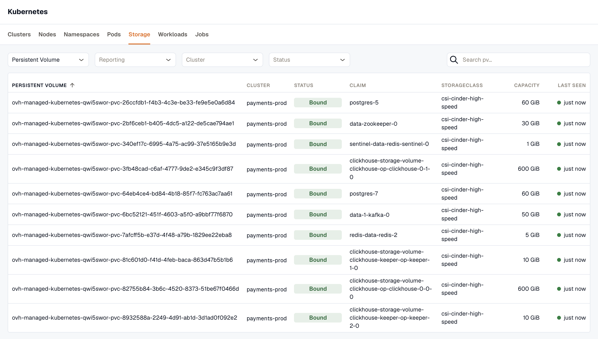
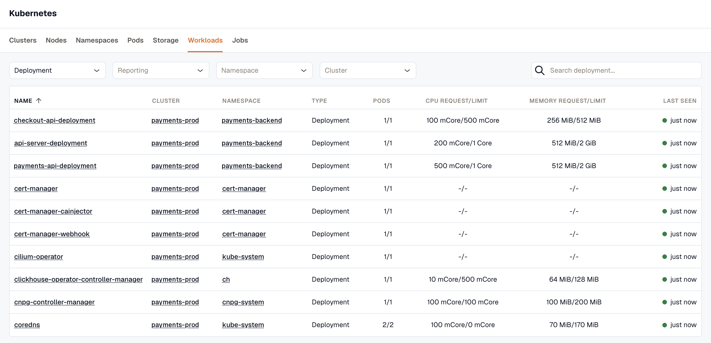
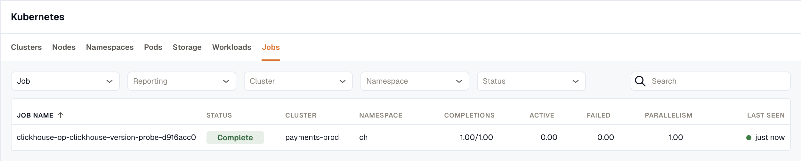
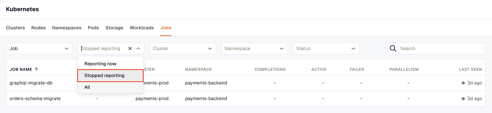

Kubernetes Monitoring in KloudMate gives you visibility into cluster health, workload availability, resource usage, pod behavior, and related telemetry collected by the KloudMate Agent.

KloudMate organizes Kubernetes data into tabs for clusters, nodes, namespaces, pods, storage, workloads, and jobs, so you can move from fleet-level health to pod-level troubleshooting quickly.

## What This Covers

- cluster, node, namespace, pod, and workload metrics
- container logs and Kubernetes events
- optional application telemetry through Kubernetes auto-instrumentation
- prebuilt dashboards and alerting workflows built on top of the collected data

## Install the Kubernetes Agent

Use the [Kubernetes Agent installation guide](../../../kloudmate-agent/installation/kubernetes-agent/) to deploy the KloudMate Agent into your cluster.

:::info
The same installation flow supports self-managed Kubernetes and managed services such as AKS, EKS, and GKE Standard. For GKE Autopilot, see the [Monitoring GKE Autopilot Clusters](./monitoring-gke-autopilot-clusters/) guide.
:::

## What You Can Do After Installation

- detect performance issues early
- track CPU and memory utilization across nodes, pods, and workloads
- identify unhealthy or unstable workloads
- investigate incidents with logs, events, and metrics together
- build dashboards and alerts around cluster health

Once data is flowing, use:

- [Explore](../../../visualize-data/explore/) for ad hoc queries
- [Log Explorer](../../../logs/log-explorer/) to investigate pod logs
- [Dashboards](../../../visualize-data/dashboards/) for curated visualizations
- [Alerts](../../alerts/) to notify on resource or availability issues

## Unified Monitoring for Apps and Databases

When applications and databases run inside Kubernetes, KloudMate can correlate their telemetry with infrastructure metrics from the same cluster.

Use these guides when you need deeper service-level visibility:

- [Traces](../../../apm-and-tracing/)
- [Database Monitoring](../../../database-monitoring/)
- [KloudMate Agent APM Setup Instructions](../../../kloudmate-agent/installation/kubernetes-agent/#apm-setup-instructions)

## What Kubernetes Monitoring Covers

KloudMate provides visibility into all major Kubernetes components:

### Clusters

The **Clusters** tab lists every connected cluster, with overall health, capacity, and scale at a glance. Use it as the starting point before drilling into a specific node, namespace, or workload.

### Nodes

The **Nodes** tab lists every node across your clusters, showing node health and infrastructure-level resource usage: allocatable CPU and memory alongside current usage for each. Use it to spot nodes running hot before they affect scheduling.

### Namespaces

The **Namespaces** tab breaks resource distribution down by namespace, so you can see how CPU, memory, and workload counts spread across the teams, applications, or environments sharing a cluster.

### Pods

The **Pods** tab lists every pod across your clusters, with its performance, restart count, and resource consumption. Use it to find pods that are restarting frequently or running hot before they affect the workloads they belong to.

### Storage

The **Storage** tab lists Persistent Volumes across your clusters, with their status, claim, storage class, and capacity. Use it to see what's provisioned and bound without checking each cluster individually. To list Persistent Volume Claims instead, select **Persistent Volume Claim** as the storage type.

### Workloads

The **Workloads** tab lists deployments, daemonsets, statefulsets, and other workload types across your clusters, showing their health and availability alongside pod counts and CPU and memory requests and limits. Filter by workload type, namespace, or cluster to narrow the list.

### Jobs

The **Jobs** tab lists Jobs across your clusters, with their status, completions (succeeded out of desired, the same count `kubectl` shows), and active, failed, and parallelism counts. Filter by cluster, namespace, or status to find Jobs that failed or haven't completed. To list CronJobs instead, select **CronJob** as the job type. Each CronJob shows its cluster, namespace, and number of active jobs.

## Find resources that stopped reporting

Every tab includes a **Last seen** column. A resource stays in the list for seven days after it last reported, and its **Last seen** dot turns from green to gray once it has gone 15 minutes without reporting. If a resource reported nothing in the selected time range, its metric cells show a dash.

Set the **Reporting** filter to **Reporting now** to list only live resources, or to **Stopped reporting** to find resources that stopped sending data. When the filter is empty, the pod, ReplicaSet, and Job lists show only resources that are reporting now, and every other list shows everything seen in the last seven days.

## Validation Checklist

After the agent is installed:

- open the Kubernetes module in KloudMate
- confirm that clusters and nodes appear within a few minutes
- verify CPU and memory metrics for nodes, pods, and workloads
- validate logs and events in the related views if those features are enabled

KloudMate also provides prebuilt dashboard templates for common Kubernetes views. See [Create a Dashboard](../../../visualize-data/dashboards/create-a-dashboard/) for template usage.

## Common Kubernetes Metrics

When Kubernetes Monitoring is enabled, KloudMate automatically collects a set of common Kubernetes metrics. No additional configuration is required.

### Cluster and Workload Metrics

- k8s\_container\_cpu\_limit
- k8s\_container\_cpu\_request
- k8s\_container\_memory\_limit
- k8s\_container\_memory\_request
- k8s\_container\_ready
- k8s\_container\_restarts
- k8s\_deployment\_available
- k8s\_deployment\_desired

### Node and Container Metrics

- container\_cpu\_time
- container\_cpu\_usage
- container\_memory\_usage
- container\_memory\_working\_set
- k8s\_node\_cpu\_usage
- k8s\_node\_memory\_usage
- k8s\_node\_network\_io

These metrics are sourced from the upstream OpenTelemetry receivers:

- [k8sclusterreceiver](https://github.com/open-telemetry/opentelemetry-collector-contrib/blob/main/receiver/k8sclusterreceiver/documentation.md)
- [kubeletstatsreceiver](https://github.com/open-telemetry/opentelemetry-collector-contrib/blob/main/receiver/kubeletstatsreceiver/documentation.md)
