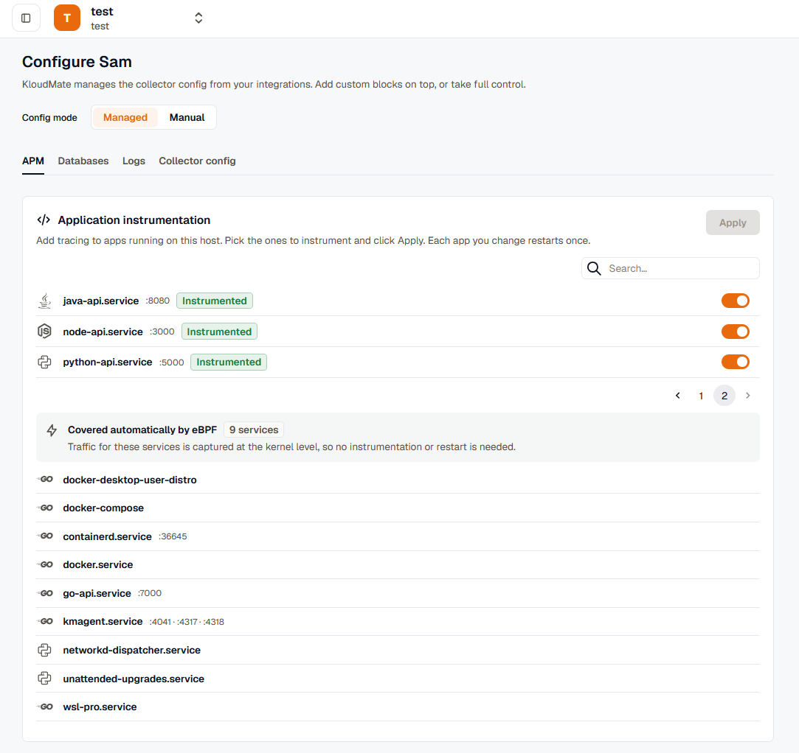

import { LinkCard, CardGrid } from '@astrojs/starlight/components';

Discovery is the foundation of every opt-in action in the agent. It builds a live inventory of what runs on each host or cluster, so the web interface can offer to instrument a service or monitor a database instead of asking you to configure it by hand. Discovery runs on all deployment modes.

## What discovery finds

The agent enumerates two kinds of things:

- **Application services**, classified by runtime (Java, .NET, Node.js, Python, PHP, Go, and Ruby), with framework and web-server hints (nginx, Apache, and php-fpm) where they apply.
- **Databases and middleware** running locally, such as PostgreSQL, MySQL, Redis, and MongoDB.

For each service, discovery records how it is managed and which ports it listens on, so instrumentation and database wiring know what to act on.

## The Discovered Services list

Discovery surfaces its inventory as a **Discovered Services** list on the host detail page in the web interface. Each entry shows:

- **Name** and **runtime** (for example, `checkout` running Java).
- **Runtime version**, where it affects a decision (for example, the PHP major and minor version, or whether a .NET app runs on .NET Framework or .NET Core).
- **Kind**: how the service is managed, such as a systemd unit, a bare process, a container, a Windows service, or an Internet Information Services (IIS) application pool.
- **Listen ports**.
- **State**: `running` or `idle`. Discovery also reports installed-but-not-running services as `idle`, so you can choose to instrument one on its next start.
- **Instrumentable** flag: whether the agent has a way to attach application tracing to that runtime.

:::note
The `instrumentable` flag reflects whether an injection path exists for the runtime. Java, .NET, Node.js, and Python are instrumentable. PHP is instrumentable when a tracer is available for the detected version. Go is not injected: it is covered by the eBPF baseline instead, so it appears as covered rather than instrumentable.
:::

## Stable service identity

Each discovered service is assigned a **stable identity** that survives restarts and process-ID churn. This is what lets an "Instrument" choice keep applying after a service restarts or its process ID changes. The identity is chosen in this order of preference:

1. The **systemd unit name** (for example, `checkout.service`) when the process belongs to a unit. This is the most stable key.
2. The **container image or Compose service** when the service runs in a container, so a selection survives container restarts rather than tracking a throwaway container ID.
3. A **fingerprint** of the executable path, normalized command line, and listen ports for a bare process.

Because the identity is derived the same way on the agent and in the control plane, both sides agree on which service is which without extra coordination.

## Where discovery gets its data

Discovery combines several sources so it stays accurate on any kernel:

- **eBPF service detection** is the primary source where the extended Berkeley Packet Filter (eBPF) baseline is enabled. It already detects services and languages and watches process lifecycle.
- A **process scan** runs alongside for completeness, catching idle or just-started services that eBPF has not reported yet.
- On kernels without eBPF, the process scan is the fallback, so discovery still works.
- On **Windows**, discovery reads IIS sites and application pools, the Service Control Manager, and Windows Management Instrumentation (WMI) to enumerate services and their listen ports. See [Windows platform notes](../../platform-notes/windows/).

## Privacy and safety

Discovery is designed to keep sensitive data on the host:

- It **never sends raw environment variables or full command lines** to the control plane, because these can contain secrets. It extracts only the signals it needs to classify a service (runtime, version, and listen ports) and discards the rest.
- It respects a deny-list so it does not surface or try to instrument the agent itself or developer tools.

## How discovery powers the rest of the agent

The Discovered Services list is the entry point for the opt-in layers:

- **Application APM:** each instrumentable service carries an **Instrument** toggle that starts the per-service tracing flow. See [Application APM](../../auto-instrumentation/overview/).
- **Database monitoring:** a discovered database starts the monitoring wizard, which prefills the engine and endpoint. See [Database monitoring](../../database-monitoring/overview/).

## Next steps

<CardGrid>
  <LinkCard title="Layered instrumentation" href="../layered-instrumentation/" description="Where discovery sits in the L0 to L5 model." />
  <LinkCard title="Application APM" href="../../auto-instrumentation/overview/" description="Instrument a discovered service." />
  <LinkCard title="Database monitoring" href="../../database-monitoring/overview/" description="Monitor a discovered database." />
</CardGrid>
