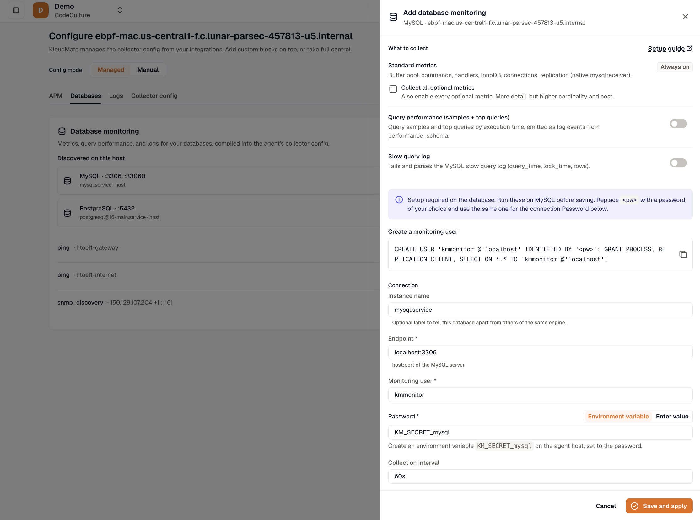

import { LinkCard, CardGrid } from '@astrojs/starlight/components';

Database monitoring gives you a full picture of your databases, and the agent sets up the collection for you through a wizard instead of hand-written configuration. In the [layered model](../../concepts/layered-instrumentation/), this is Layer 4, and it works alongside the eBPF baseline at Layer 2.

## Two views of your databases

The agent shows your databases in two ways that work together:

- **From eBPF, automatically and with no credentials.** Database Activity Monitoring (DAM) shows the queries your applications run against the database, with their timing, as part of your distributed traces and the service map. This turns on by default. See [eBPF observability](../../ebpf-observability/).
- **From the database, when you opt in.** Database monitoring reads the database's own health metrics (connections, cache hit ratio, replication lag, and more), query performance, and logs. This needs a monitoring user's credentials.

The two views line up on a shared database identity, so a slow query you see in a trace matches the server's health metrics for the same database. See [Telemetry identity](../../reference/telemetry-identity/).

## Coverages

You choose what to monitor for a database as a set of **coverages**, such as standard metrics, query performance, locks, or logs. You pick the coverages you want, and the agent sets up the collection. See [Engines and coverages](../engines-and-coverages/) for what each engine supports.

## The wizard

You set up monitoring for a database through a wizard, usually starting from a database the agent already found:

1. **Pick the engine.** The agent lists databases it discovered, so the engine and endpoint are often prefilled.
2. **Choose coverages.** Turn on the coverage areas you want, such as standard metrics, query performance, or locks.
3. **Provide credentials.** Enter the monitoring user and its secret. By default, the secret is stored as a reference and never leaves the host. See [Database credentials](../credentials/).
4. **Follow the setup steps.** The wizard shows the exact grants and prerequisites each coverage needs, ready to copy.
5. **Review and apply.** The wizard previews what will be collected, and on save the agent starts collecting.

## Safe to apply

The agent checks the setup before it applies it, so a bad database setting does not affect your other telemetry. Each database is handled on its own, so one misconfigured database does not affect the others.

## Where to run it

<CardGrid>
  <LinkCard title="On a VM" href="../on-vm/" description="Monitor databases on a Linux or Windows host." />
  <LinkCard title="On Kubernetes" href="../on-kubernetes/" description="Monitor in-cluster databases from the cluster collector." />
  <LinkCard title="Engines and coverages" href="../engines-and-coverages/" description="Which engines and coverages are available." />
  <LinkCard title="Credentials" href="../credentials/" description="How to provide database credentials safely." />
</CardGrid>
