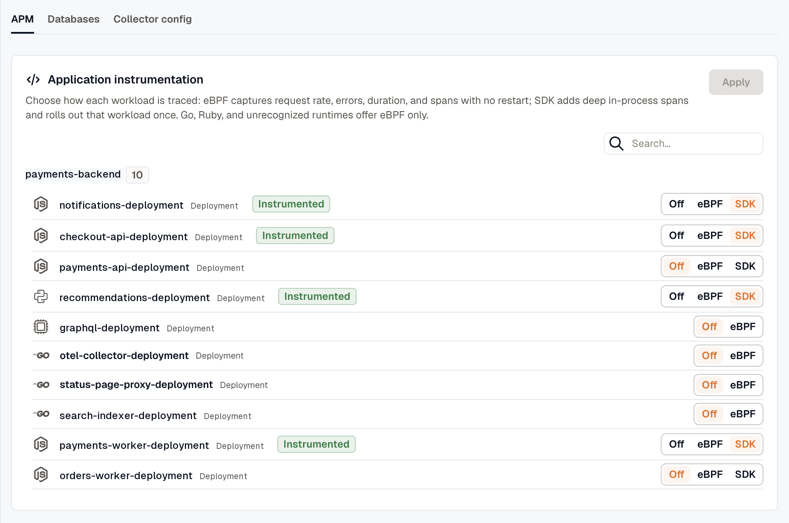

This document will guide you to instrument Kubernetes using the **KloudMate Agent** via **DaemonSet** and **Deployment**.

**What the Kubernetes Agent Monitors**

Once installed, the Kubernetes Agent collects:

- **Cluster metrics:** CPU, memory, disk, network usage
- **Node metrics:** Resource usage, health, availability
- **Namespace metrics:** Workloads, events per namespace
- **Pod metrics:** CPU, memory, restarts, and lifecycle events
- **Workload metrics:** Deployment and replica status, resource utilization
- **Container logs:** stdout/stderr from pods
- **Cluster events:** Pod failures, scaling events, and other events
- **Optional APM metrics:** Instrumented applications (Python, Node.js, Java, .NET, Go)

:::note
  These are the raw metrics and logs collected by the agent. Visualization, alerts, and dashboards are accessed separately.
:::

## **Accessing Your Data**

View all Kubernetes data in these KloudMate sections:

**1. Kubernetes Monitoring**

- Explore metrics and events for your cluster, nodes, namespaces, pods, and workloads
- Track availability, resource usage, pod restarts, and workload health

[Kubernetes Monitoring](../../../infrastructure/kubernetes/)

**2. Dashboards**

- Use the following pre-built dashboards to visualize Kubernetes metrics:
  - [Cluster Metrics Dashboard](https://templates.kloudmate.com/k8s-cluster-dashboard/index.html)
  - [Node Metrics Dashboard](https://templates.kloudmate.com/k8s-node-dashboard/index.html)
  - [Namespace Metrics Dashboard](https://templates.kloudmate.com/k8s-namespace-dashboard/index.html)
  - [Pod Metrics Dashboard](https://templates.kloudmate.com/k8s-pod-dashboard/index.html)
- Build custom dashboards for specific workloads, namespaces, or pods

[Creating a Dashboard](../../../visualize-data/dashboards/)

**3. Log Explorer**

- Search and filter pod logs and cluster events
- Correlate logs with metrics to troubleshoot container or application issues

[Log Explorer](../../../logs/log-explorer/)

## Install Agent

:::note
  The commands below are for reference only. Log in to KloudMate and copy your account-specific command to install the Agent.
:::

### Step 1: Getting started

Use the KloudMate Kubernetes Agent to monitor your Kubernetes infrastructure and optionally your applications (APM) without any code changes.

**Pre-requisites**

- Kubernetes version 1.24 or above
- Helm version 3.0 or above
- Cert Manager version v1.18.2 or above
- Network access to the [required URLs](../../reference/network-requirements/) if your outbound traffic is restricted

### Step 2: Install Cert Manager

Skip this step if you already have Cert Manager installed.

```bash
helm install \
  cert-manager oci://quay.io/jetstack/charts/cert-manager \
  --namespace cert-manager \
  --create-namespace \
  --set crds.enabled=true
```

### Step 3: Enter cluster details

Provide a name for your Kubernetes cluster. This name will be used to identify the cluster inside KloudMate.

### Step 4: Set preferences

Configure how KloudMate should collect data from this cluster:

- **Collect container logs:** Toggle on/off based on whether you want to ingest container logs from the cluster.
- **Enable auto instrumentation for APM:** Turn this on to automatically instrument supported application runtimes (Python, Node.js, Java, .NET, Go) for APM.
- **Monitored namespaces:** Enter a comma‑separated list of namespaces to monitor for events and APM (for example, `redis, kafka, prod-app`).

:::note
  Leave this field empty to monitor all namespaces (system namespaces are excluded by default).
:::

### Step 5: Run the installation command

The UI will generate a Helm command based on your inputs. Run this command in your terminal to install the KloudMate Agent in your Kubernetes cluster.

```bash
helm repo add kloudmate https://charts.kloudmate.com
helm repo update
helm install kloudmate-release kloudmate/km-kube-agent \
  --namespace km-agent --create-namespace \
  --set API_KEY="" \
  --set COLLECTOR_ENDPOINT="https://otel.kloudmate.dev:4318" \
  --set clusterName="test" \
  --set monitoredNamespaces="default, prod, dev" \
  --set featuresEnabled.logs="true" \
  --set featuresEnabled.apm="false"
```

## Installing the Agent on Tainted Nodes

If your Kubernetes cluster has nodes with taints, the agent pods must be assigned matching tolerations to be scheduled successfully. By default, the agent does not include any tolerations, but you can configure them during installation by using Helm parameters.

Example Helm installation command with tolerations:

```bash
helm install kloudmate-release kloudmate/km-kube-agent --namespace km-agent --create-namespace \
--set API_KEY="" --set COLLECTOR_ENDPOINT="https://otel.kloudmate.com:4318" \
--set clusterName="" \
--set "monitoredNamespaces={MONITORED_NS}" \
--set tolerations[0].key="env" --set tolerations[0].operator="Equal" --set tolerations[0].value="uat" --set tolerations[0].effect="NoSchedule" \
--set tolerations[1].key="env" --set tolerations[1].operator="Equal" --set tolerations[1].value="sb-uat-node" --set tolerations[1].effect="NoSchedule" \
```

In this example, two separate tolerations are defined to match the taints configured on the cluster nodes, enabling the agent pods to be scheduled on all required nodes.

:::note
  - You can add any number of tolerations by incrementing the index (`tolerations[0]`, `tolerations[1]`, etc.).
  - Ensure that the key, operator, value, and effect match the taints applied to your nodes.
  - If your cluster does not have taints, these parameters can be omitted. The agent pods will then be scheduled on untainted nodes by default.
:::

## APM Setup Instructions

There are two ways to enable **Application Performance Monitoring (APM)** in your cluster:

### 1.  Enable APM via Dashboard

- After installing the agent, open the APM configuration tab in the dashboard.
- Use the toggle button to enable or disable APM.
- Once enabled, the agent will automatically detect all running microservices and identify their respective programming languages.



- After turning on APM, wait a few minutes to begin receiving metrics, then verify them on the dashboard.

### 2. Enable APM via the Patch Method

In some cases, the agent may not automatically detect certain applications. In such scenarios, use deployment annotations to enable APM for your applications.

**Steps:**

1\. Identify each application that requires APM.

2\. You can enable APM using either of the following methods:

### **Java:**

- **Option 1 – Patch command**

```bash
kubectl patch deployment <name> -n <ns> -p '{"spec":{"template":{"metadata":{"annotations":{"instrumentation.opentelemetry.io/inject-java":"km-agent/km-agent-instrumentation-crd"}}}}}'
```

- **Option 2 – Add annotation**

```yaml
 annotations
    instrumentation.opentelemetry.io/inject-java: km-agent/km-agent-instrumentation-crd   
```

### **Python:**

- **Option 1 – Patch command**

```bash
kubectl patch deployment <name> -n <ns> -p '{"spec":{"template":{"metadata":{"annotations":{"instrumentation.opentelemetry.io/inject-python":"km-agent/km-agent-instrumentation-crd"}}}}}'
```

- **Option 2 – Add annotation**

```yaml
annotations
      instrumentation.opentelemetry.io/inject-python: km-agent/km-agent-instrumentation-crd 
```

### **Node.js:**

- **Option 1 – Patch command**

```bash
kubectl patch deployment <name> -n <ns> -p '{"spec":{"template":{"metadata":{"annotations":{"instrumentation.opentelemetry.io/inject-nodejs":"km-agent/km-agent-instrumentation-crd"}}}}}'
```

- **Option 2 – Add annotation**

```yaml
annotations
    instrumentation.opentelemetry.io/inject-nodejs: km-agent/km-agent-instrumentation-crd
```

### **.NET:**

- **Option 1 – Patch command**

```bash
kubectl patch deployment <name> -n <ns> -p '{"spec":{"template":{"metadata":{"annotations":{"instrumentation.opentelemetry.io/inject-dotnet":"km-agent/km-agent-instrumentation-crd"}}}}}'
```

- **Option 2 – Add annotation**

```yaml
annotations
    instrumentation.opentelemetry.io/inject-dotnet: km-agent/km-agent-instrumentation-crd
```

3\. Restart the deployments after adding the annotations.

## Configuration and next checks

On Kubernetes, one agent represents one cluster: a fleet-manager pod applies the configuration, and the DaemonSet and Deployment collector pods do the collecting. The Helm chart installs the cluster role-based access control (RBAC) the agent needs. See [Kubernetes platform notes](../../platform-notes/kubernetes/).

- Node, pod, and cluster telemetry starts flowing automatically. See [Host metrics and logs](../../baseline/host-metrics-and-logs/).
- Where nodes run a supported kernel, the [eBPF baseline](../../ebpf-observability/) turns on per node.
- Use the **Discovered Services** view to instrument workloads for APM, or enable auto-instrumentation as shown above. See [Application APM on Kubernetes](../../auto-instrumentation/kubernetes/).
- To monitor in-cluster databases, provide credentials through a Kubernetes Secret referenced by the `dbMonitoring.secretName` Helm value. See [Database monitoring on Kubernetes](../../database-monitoring/on-kubernetes/).

## **Next Steps**

- Open **Kubernetes Monitoring** to view metrics and events for your *cluster*, **nodes**, **namespaces**, **pods**, and **workloads**
- Use **Dashboards** to create visualizations or view **pre-built dashboards**
- Use **Log Explorer** to investigate logs and correlate them with metrics
- Configure **alerts** for any of these components based on thresholds
