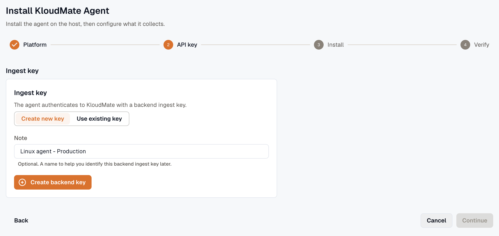

Install the **KloudMate Agent** on a Linux machine.

**Supported Platforms:** Debian/Ubuntu, RHEL/CentOS.

If your outbound traffic is restricted, see [Before you start](../before-you-start/) for the URLs and permissions to allow first.

:::note
  The commands below are for reference only. Log in to KloudMate and copy your account-specific command to install the Agent.
:::

## What the Linux Agent Monitors

After installation, the agent sends telemetry to KloudMate. From there you can monitor system health and investigate issues.

Key capabilities:

- Monitoring CPU, memory, disk, and network usage
- Tracking performance trends over time
- Detecting resource bottlenecks
- Collecting and analyzing system and application logs
- Monitoring Docker containers on the host, when Docker is present
- Visualizing data with dashboards
- Creating alerts for critical conditions

## **Accessing Your Data**

View all data in these KloudMate sections:

**1. Infrastructure Monitoring**

- View connected Linux hosts
- Monitor real-time and historical resource usage
- Track host availability and uptime

[Infrastructure Monitoring](../../../infrastructure/)

**2. Dashboards**

- Use the pre-built [Host Metrics – Linux](https://templates.kloudmate.com/host-metrics/index.html) dashboard template to visualize server performance
- Build custom dashboards based on your monitoring needs

[Creating a Dashboard](../../../visualize-data/dashboards/)

**3. Log Explorer**

- Search and filter logs
- Correlate logs with metrics
- Troubleshoot issues

[Log Explorer](../../../logs/log-explorer/)

## Install Agent

**Step 1:** Navigate to the **Settings → Agents** section in your KloudMate account.

**Step 2:** Click **Add Agent**, select **Linux**, and click **Continue**. On the **API key** step, click **Create backend key**, or select **Use existing key** and paste your backend ingest key. Then click **Continue**.

**Step 3:** Copy and run the Linux agent install command in your terminal to download and install the agent.

**Step 4:** Run the agent status command to check if the agent is active.

**Step 5:** Execute the "Check Logs" command to confirm the agent is functioning correctly.

## **Log Integration**

By default, the KloudMate Agent collects host metrics. It does not collect system logs on Linux — to collect the systemd journal, add it with a [custom config override](../../custom-config-override/).

To collect your own application log **files**, use log monitoring. In the agent's **Logs** tab, point the agent at a folder and file-name pattern, then choose how to parse each line: plain text, JSON, or a regular expression. Multiline grouping, for stack traces or pretty-printed JSON, works on top of any format. You can preview the parsed records before you save. See [Log monitoring](../../log-monitoring/).

For a hand-written `filelog` receiver in manual mode, see [Collect File Logs with KloudMate Agent](../../../logs/collect-file-logs/).

## Monitor Docker containers on the host

If the host runs Docker, the agent finds the Docker socket and starts collecting **container metrics and container logs** on its own, the same telemetry a Docker-mode agent collects. This happens as soon as the agent starts, before and independent of application tracing. To turn it off, set `KM_DOCKER_STATS=false` for metrics or `KM_DOCKER_LOGS=false` for logs.

Each container also shows up in the **Application instrumentation** card on the agent's **APM** tab, where you can turn on per-container tracing. Most containers offer **Off** or **eBPF**: eBPF captures RED metrics and trace spans in the kernel, with no code change and no restart. There's no in-process **SDK** option for them, because the agent can't change a running container's start-time environment. Host processes that aren't containerized still offer **Off**, **eBPF**, or **SDK**.

PHP containers are the exception: they can take an **SDK** option that injects the tracer and reloads the web server (Apache or php-fpm), with no redeploy and no container restart. On a Linux host this is opt-in. Set `KM_CONTAINER_INSTRUMENT_ENABLED=true`, and PHP containers start offering **SDK** on the agent's **APM** tab. In Docker mode that option is on by default.

For monitoring containers, a Linux service and a Docker-mode agent are equivalent. Choose between them by how you want to run the agent, not by what they can see. See [Docker mode vs the Linux agent](../../platform-notes/docker/#docker-mode-vs-the-linux-agent).

## Configuration and next checks

New agents start in **managed mode**, with a default of host metrics and eBPF monitoring. You review and change what is collected from the web interface, without editing files on the host. See the [configuration model](../../concepts/config-model/).

The agent's own settings, such as the API key, host name, and self-health reporting, live in `agent.yaml` on the host. See the [configuration reference](../../reference/agent-config/) for the full list of settings and their environment-variable equivalents.

After the agent is running, confirm what it collects and explore what it found:

- Host metrics and logs start flowing automatically. See [Host metrics and logs](../../baseline/host-metrics-and-logs/).
- On a supported Linux kernel (4.14 or newer), [eBPF monitoring](../../ebpf-observability/) turns on automatically and adds RED metrics and a service map.
- To see what the agent found and instrument a service, go to **Settings → Agents**, open the agent's actions menu (⋮), and select **Configure**. See [Discovery](../../concepts/discovery/).

## Next Steps

- Open **Hosts** to confirm your Linux hosts are visible
- Go to **Dashboards** to review system performance
- Use **Logs** to start investigating logs
- Set up **alerts and notifications** for critical events

## Uninstall Agent

Run the provided uninstall command to remove the agent.

