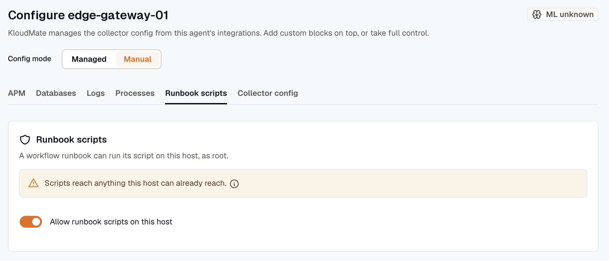

The KloudMate Agent is managed centrally from the web UI, so there is no need to SSH into servers or edit local YAML files. Changes made in the dashboard are pushed to the agents automatically.

## Agents Overview

The KloudMate agent's landing page lets you view, add, and manage agents. After an agent is integrated, it appears in the table:


- **Host:** The agent's host machine name, with its platform and architecture underneath (for example, `Linux · amd64`).
- **Status:** The agent's current reachability, such as **Healthy** or **Unreachable**, plus a **Restart pending** tag while a restart is in progress.
- **Mode:** Whether the agent is in **Managed** or **Manual** configuration mode. See [Managed and manual mode](#managed-and-manual-mode).
- **Agent Version:** Version of the KloudMate agent used during integration.
- **Last Seen:** How long ago the agent last checked in.

## Adding a New Agent

1. Click the **Add Agent** button located at the top-right corner of the page.


2. Choose where you want to install the agent.


:::note
  After choosing a platform, refer to the corresponding installation guide:

  [Linux](../installation/linux-agent/) | [Docker](../installation/docker-agent/) | [Windows](../installation/windows-agent/) | [Kubernetes](../installation/kubernetes-agent/) | [Amazon ECS](../installation/ecs-agent/)
:::

## Configuring an Agent

The agent watches for remote configuration changes over a secure connection and updates itself automatically.

:::danger
  **Do not hand-edit local files in managed mode.**
  In managed mode, KloudMate regenerates the collector configuration from your toggles, so manual edits to ConfigMaps or local configuration files will be overwritten. Always use the **Configure** action in the web UI.
:::

Open the actions menu (⋮) for an agent to manage it:


- **Configure:** Opens the agent's Configuration page, with tabs for **APM**, **Databases**, **Logs**, **Processes**, **Runbook scripts**, and **Collector config**. Updates apply automatically wherever the agent is installed.
- **Restart agent:** Restart the agent when needed.
- **Delete:** Remove the agent from the KloudMate Agent landing page and clear all of its configuration.

:::caution
Deleting an agent decommissions it. Its instrumented applications restart so their instrumentation is removed, and its database and log monitoring stop. If the agent is still running on the host, it checks back in and reappears as a new, unconfigured agent. To remove it for good, also uninstall it from the host. See the [installation guides](../installation/linux-agent/) for the uninstall command.
:::

### Managed and manual mode

Each agent runs in one of two configuration modes:

- **Managed mode** (the default for new agents): KloudMate generates the collector configuration from the features and integrations you toggle, and the YAML editor shows a read-only preview. This is the recommended way to configure an agent.
- **Manual mode:** the raw YAML is edited directly, and the feature toggles are disabled. This is for advanced, hand-tuned setups.

You can switch an agent between modes. Switching from manual to managed replaces the hand-edited YAML with generated configuration, so review the change first. For the full model, see the [configuration model](../concepts/config-model/).

### Rolling back a change

To undo a managed change, turn the toggle back. There is no separate history or rollback button. Switching an agent from manual to managed mode saves your hand-edited YAML first, so you never lose it. See the [configuration model](../concepts/config-model/).

### Runbook scripts

The **Runbook scripts** tab decides whether a [workflow](../../workflows/) can run its scripts on this host with the [Run Command on Host](../../workflows/actions/#run-command-on-host) step. Scripts are off until someone with the **Developer** role turns on **Allow runbook scripts on this host**, and the change reaches the agent within a minute. Only Linux host agents have this setting.



Scripts run as root and can reach anything the host can already reach, such as a kubeconfig, a cloud instance profile, or an SSH key on disk. Allow them only on hosts where that's acceptable.

To block scripts on a host whatever the workspace setting says, set `job-types` to `none` in the host's `agent.yaml`. See [Runbook scripts](../reference/agent-config/#runbook-scripts) in the agent configuration reference.

### Common Configurations

:::note
The snippets below are for manual mode. In managed mode, you set these through the feature and integration toggles instead. See [eBPF observability](../ebpf-observability/) and [Database monitoring](../database-monitoring/overview/).
:::

#### Feature Flags

You can control which telemetry signals the agent collects by updating the feature flags in the configuration:

| Flag                    | Default | Description                                |
| ----------------------- | ------- | ------------------------------------------ |
| featuresEnabled.metrics | true    | Enables metrics collection                 |
| featuresEnabled.traces  | true    | Enables trace collection                   |
| featuresEnabled.apm     | false   | Enables application performance monitoring |
| featuresEnabled.logs    | false   | Enables log collection                     |

#### eBPF Configuration

To configure the eBPF receiver in your `config.yaml`, use a snippet like this:

```yaml
metrics:
  features:
    - application          # HTTP, gRPC, SQL operation metrics (RED metrics)
    - application_span     # Trace spans for transactions
    - network              # L3/L4 Network flow metrics

discovery:
  services:
    - name: all-services
      namespace: default
      open_ports: '80, 443, 8080, 8443, 5432, 3306, 6379, 9092, 27017'

network:
  enable: true
  source: tc
  direction: both

attributes:
  kubernetes:
    enable: true
```

#### Database Monitoring Configuration

Enable heuristic SQL detection and tune caches for high-load environments to capture database query performance:

```yaml
ebpf:
  heuristic_sql_detect: true
  mysql_prepared_statements_cache_size: 1024
  postgres_prepared_statements_cache_size: 1024
```

## See the agent's own errors

When an agent shows as **Unreachable** or **Degraded** in **Settings → Agents**, you'll usually want its logs. Each agent sends its own **ERROR-level logs** to your workspace, so you can read them in **Log Explorer** without SSHing into the host or running `docker logs` or `kubectl logs`.

These logs are sent independently of the collector, so they still arrive even when the collector fails to start on an invalid config. Both the agent and its collector log this way, so a failure in either one appears in the same place.

### Find them in Log Explorer

Open **Log Explorer** and filter on the agent's service name:

- `service.name = kmagent`: the agent's logs are a distinct service, separate from your application telemetry
- Add a `host.name` filter to narrow to a single agent

Every entry includes a few attributes for context:

- **`host.name`**: links the agent's errors to the rest of that host's data
- **`agent.version`** and **`collector.version`**: which build reported the error
- On Kubernetes, also **`k8s.cluster.name`**, **`k8s.node.name`**, **`k8s.pod.name`**, and **`kmagent.role`**

### Turn it off

Error-log shipping is on by default. It reuses the same `KM_API_KEY` and `KM_COLLECTOR_ENDPOINT` as the rest of the agent, so there's nothing extra to set up. To disable it, set `KM_AGENT_ERROR_LOGS=false` (every agent reads this), or pass `--agent-error-logs=false` to the Linux/host agent.

:::note
  Only the agent's **own** operational logs are sent this way, and only at ERROR level and above. Your application logs and other telemetry always flow through the normal pipeline. These logs go to your own workspace using your own key.
:::

## Agent health and status

Beyond the status shown on the landing page, each agent reports on its own health so you can confirm it is running and see when something goes wrong:

- **Health metrics** tell you whether the agent and its collector are up, and classify why the collector is down if it is. See [Agent health metrics](../self-observability/health-metrics/).
- **Self-logs** bring the agent's own error messages into KloudMate, so you can diagnose a failure without logging in to the host. See [Agent self-logs](../self-observability/self-logs/).

After a configuration change, confirm it applied by checking that telemetry is still flowing and that the agent's health metrics report a clean apply.

## Resource usage

The agent is light. On a virtual machine or host, it runs as a single process and typically uses around **185 MiB of memory** and **under 2% of one CPU core**. Usage grows with the amount of telemetry it handles and the number of services it watches.

On Kubernetes, usage is split across the per-node collector and a few cluster-wide components. See [Resource usage and sizing](../platform-notes/kubernetes/#resource-usage-and-sizing) for per-component figures and suggested CPU and memory requests and limits.

## Updating the agent

Update the agent by upgrading its package on the host or the Helm release on Kubernetes, the same way you installed it. The bundled instrumentation agents are versioned with the KloudMate agent, so they update together. See the [installation guides](../installation/linux-agent/).

## Best Practices

- Use filters and search on the Agents landing page to quickly locate agents by **host**, **platform**, or **status**.
- For clusters with multiple agents, consider **bulk restarting** or **updating collectors** where supported.
- Always confirm that agent configurations have applied successfully by checking your dashboards.
