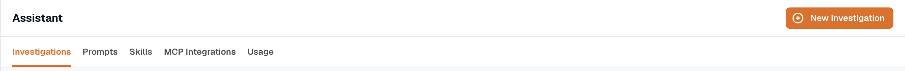

KloudMate Assistant is an AI-driven observability assistant designed to simplify how you monitor, analyze, and operate your systems. Instead of navigating multiple dashboards or writing complex queries, you can interact using natural language — for example, "show CPU usage," "analyze recent errors," or "create a dashboard for my Kubernetes cluster."

The assistant works across your entire observability stack, including metrics, logs, traces, profiles, and connected data sources. It interprets context, correlates signals, and points to likely causes, reducing the need to switch between tools or know every underlying system in depth.

### What KloudMate Assistant Can Do

KloudMate Assistant supports three core modes of operation:

- **KloudMate Assistant:** Provides real-time guidance and answers across the KloudMate platform. Ask questions, explore your data, and get instant insights through a conversational interface.
- **KloudMate Dashboarding:** Drafts dashboards and alerts on your behalf. For example, you can say "Create a dashboard for Kubernetes" and the Assistant generates a structured, ready-to-use dashboard.
- **KloudMate Investigator:** Collects an investigation brief and launches a background root cause analysis (RCA) workflow for serious incidents. The Investigator runs asynchronously and surfaces findings when complete.

### Accessing KloudMate Assistant

To start a chat or run an investigation, click the Assistant icon in the top navigation bar to open the assistant panel.

Open **Assistant** to review investigations, track AI credit usage, and manage the Assistant's prompts, skills, and MCP integrations. It has tabs for **Investigations**, **Prompts**, **Skills**, **MCP Integrations**, and **Usage**. For details, see:

- [Investigations](./investigations/)
- [Chat Modes](./chat-modes/)
- [Prompts, Skills, and MCP Integrations](./settings/)
- [Usage](./usage/)

