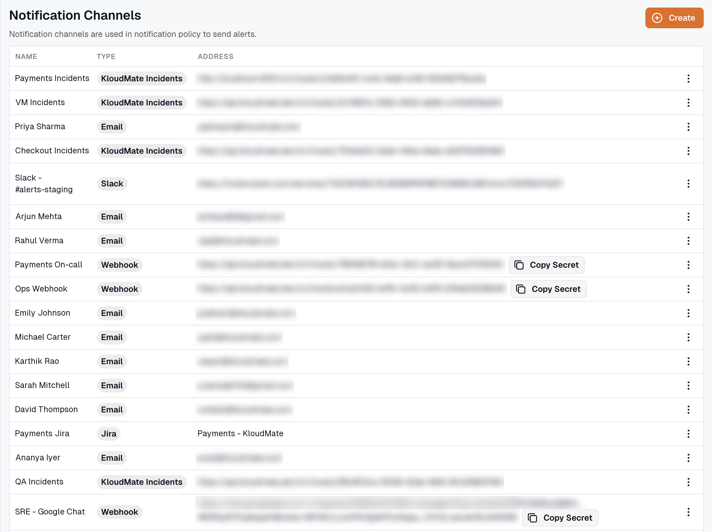
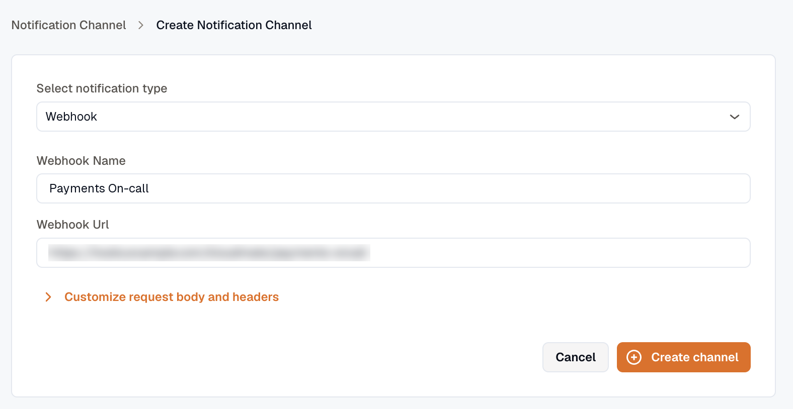
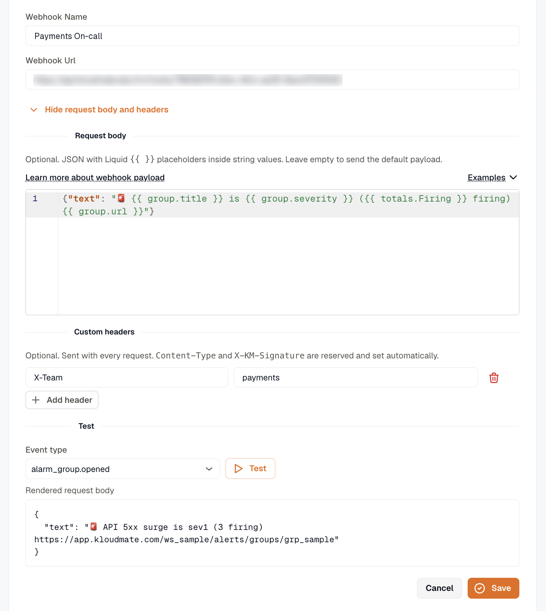
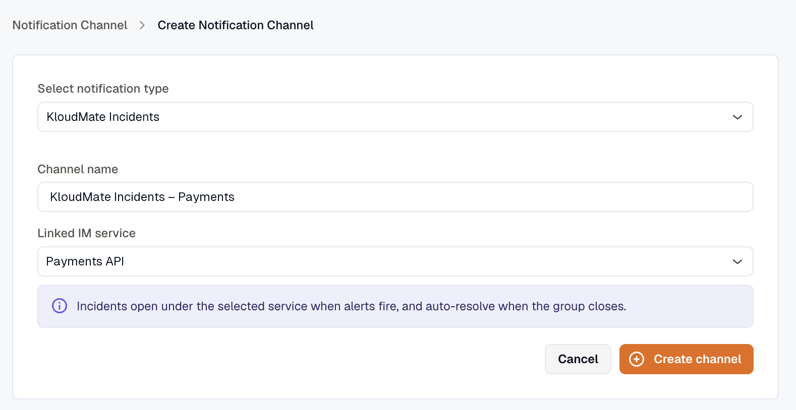

import { Tabs, TabItem } from '@astrojs/starlight/components';

To receive notifications from KloudMate, you need to set up notification channels — the communication platforms where alerts and incident updates are sent.

KloudMate supports the following notification channels:
- [Email](#email)
- [Slack](#slack)
- [SNS](#sns)
- [MS Teams](#ms-teams)
- [Webhook](#webhooks)
- [Jira](#jira)
- [KloudMate Incidents](#kloudmate-incidents) — bridges alerts and synthetic checks into [Incident Management](../../../incident-management/)

A Slack or Jira channel can reuse an account you've already connected instead of asking for its own credential. The channel form lists the [connections](../connections/) carrying the **Notifications** capability, and offers to connect a new one inline. Reusing one means a single place to rotate the credential when it changes.

:::info
In the case of multiple workspaces and AWS accounts, you must set up notifications for each account in their respective **Settings**.
:::

Navigate to **Settings** > **Notification Channels**. The screen displays all existing channels with their name, type, and address. A channel whose last delivery failed is marked **Error**, with the reason and the time it happened shown under its address.



1. Click the **Create** button at the top-right corner.
2. Select the desired channel type from the dropdown.


Once created, the channel appears in the list. You can **Edit** or **Delete** any channel using the more options (⋯) icon. 


Below are the configuration steps for each specific channel type:

### Email

1. Select **Email** from the dropdown menu.
2. Enter a **Name** for the channel (e.g., demo) and your email address in the Address field.
3. Click **Submit**.


### Slack

KloudMate uses a single unified Slack app for both notifications and IM ChatOps. Installing it once gives you threaded notifications, message attribution, and the ability to acknowledge or resolve incidents directly from Slack.

1. Select **Slack** from the dropdown menu.
2. Pick a connected **Slack account**. If none is connected yet, click **Connect Slack** and approve the install in the popup that opens.
3. Enter a **Channel name** for the KloudMate side, then pick the **Slack channel** to post into. The list searches your Slack workspace's public and private channels through the connected bot, so type to narrow it.
4. Click **Create channel**.


The same Slack install appears under [Settings → Connections](../connections/) and under **Incidents → Chat Ops**. Connect it once and reuse it for every Slack channel you create here.

### MS Teams

1. Select **MS Teams** from the dropdown menu.
2. Create an incoming webhook URL from Microsoft Teams by going to **Channel** > **Connectors** > **Incoming Webhooks** in the Microsoft Teams Apps.
3. Enter the **Team Channel Name** and the **Webhook Address** in their respective fields.
4. Click **Submit**.


:::info
Optionally, you can download the KloudMate logo from the link provided on the screen to update the webhook’s image in MS Teams.
:::

### SNS

1. Select **SNS** from the dropdown menu.
2. Copy the KloudMate SNS Access Policy displayed on the screen. Navigate to your AWS Console and paste the policy into your SNS topic. Update the placeholders in the policy with the correct values.
3. Return to KloudMate, enter a **Name** and your **Topic ARN** in their respective fields.
4. Click **Submit**.


### Webhooks

1. Select **Webhook** from the dropdown menu.
2. Enter a **Webhook Name** and the **Webhook Url** in their respective fields.
3. Click **Create channel**.



KloudMate generates a secret for the channel and uses it to sign every request with an HMAC-SHA256 signature, so you can verify that a request came from KloudMate. With the **Developer** role, you can copy the secret from the channel list with **Copy Secret**.

A webhook channel is also how an alert reaches a [workflow](../../../workflows/). Point the URL at the workflow's own hook URL, attach the channel to a routing rule, and each notification starts a run with the alert group payload as its body. See [Triggers](../../../workflows/triggers/#start-a-workflow-from-an-alert).

#### Customize the Request Body and Headers

By default, a webhook sends KloudMate's standard JSON payload, which some receivers reject. Google Chat, for example, accepts only a message object like `{"text": "..."}`, with its auth token in the webhook URL, so no header or secret is needed. The same `{"text": ...}` body also works for Slack incoming webhooks and Microsoft Teams. A webhook channel can rewrite its outgoing body and add headers to match.

In the webhook channel editor, click **Customize request body and headers** to expand the options.



**Request body** takes JSON with Liquid `{{ }}` placeholders inside string values, filled from the event. Leave it empty to send the default payload. The **Examples** menu fills it with a starter template, and [Notification Payloads](#notification-payloads) lists the fields each event type exposes.

**Custom headers** are key/value pairs sent with every request. `Content-Type` and `X-KM-Signature` are reserved and set automatically.

**Test** previews the rendered body against a sample event. The **Event type** list picks which event to sample.

Saving runs the same check as **Test**, so a channel with invalid JSON, invalid Liquid, or a reserved header won't save. If a custom body still fails to render when a notification goes out, the channel is marked **Error** and that delivery isn't retried.

#### Webhook Signature Validation

When KloudMate sends a webhook to your configured URL, it includes an `X-KM-Signature` HTTP header. This signature is an HMAC-SHA256 hash generated using the payload body and the channel's secret.

To ensure the webhook is genuinely from KloudMate, you should compute the hash on your server and compare it with the `X-KM-Signature` header.

Here are examples of how to perform this validation in common programming languages:

<Tabs>
  <TabItem label="Node.js (Express)" icon="node">
    ```javascript
    const crypto = require('crypto');

    // Ensure you have access to the raw request body.
    // For Express, you might use express.raw({ type: 'application/json' }) 
    function verifySignature(req) {
      const signatureHeader = req.headers['x-km-signature'];
      const secret = 'YOUR_WEBHOOK_SECRET';
      
      // Create HMAC-SHA256 hash of the raw JSON body
      const expectedSignature = crypto
        .createHmac('sha256', secret)
        .update(req.rawBody) // Pass the raw JSON string here
        .digest('hex');

      return signatureHeader === expectedSignature;
    }
    ```
  </TabItem>
  <TabItem label="Python" icon="seti:python">
    ```python
    import hmac
    import hashlib

    def verify_signature(payload_body: bytes, secret: str, signature_header: str) -> bool:
      # payload_body must be the raw bytes of the request body
      expected_signature = hmac.new(
        secret.encode('utf-8'),
        payload_body,
        hashlib.sha256
      ).hexdigest()
      
      return hmac.compare_digest(expected_signature, signature_header)
    ```
  </TabItem>
  <TabItem label="Go" icon="seti:go">
    ```go
    import (
      "crypto/hmac"
      "crypto/sha256"
      "encoding/hex"
    )

    func verifySignature(payloadBody []byte, secret string, signatureHeader string) bool {
      mac := hmac.New(sha256.New, []byte(secret))
      mac.Write(payloadBody)
      expectedMAC := hex.EncodeToString(mac.Sum(nil))
      
      return hmac.Equal([]byte(expectedMAC), []byte(signatureHeader))
    }
    ```
  </TabItem>
</Tabs>

#### Notification Payloads

Every webhook is a single `POST` with a JSON body and `Content-Type: application/json`. Without a custom request body, this is what KloudMate sends, and a template reads its fields from the same payload. Receivers that verify the signature should hash the raw body before parsing it.

Each notification has an event type. The **Event type** picker in the channel editor lists all of them, and a template can reference any field from the matching payload.

| Event type | Payload |
| --- | --- |
| `alarm_group.opened` | Alert group, `event` is `opened` |
| `alarm_group.appended` | Alert group, `event` is `appended` |
| `alarm_group.repeat` | Alert group, `event` is `repeat` |
| `alarm_group.resolved` | Alert group, `event` is `resolved` |
| `alarm_group.rca_completed` | Alert group, `event` is `rca_completed` |
| `issue.created` | New issue |
| `slo.burn_rate.firing` | SLO burn rate |
| `slo.burn_rate.resolved` | SLO burn rate |
| `synthetics.incident.created` | Synthetic monitor |
| `synthetics.incident.resolved` | Synthetic monitor |
| `investigation.completed` | AI investigation |

The alarm group payload sets a top-level `event` field to the lifecycle stage. The other payloads carry no `event` field. A receiver tells them apart by their distinctive top-level keys: `slo_name` for SLO burn rate, `monitor_id` for a synthetic monitor, `serviceName` for a new issue, and `investigationId` for an AI investigation.

The tabs below show one representative example of each payload, the fields most useful in a template, and notes on how the variants differ.

<Tabs>
  <TabItem label="Alert group">
    **Event types:** `alarm_group.opened`, `alarm_group.appended`, `alarm_group.repeat`, `alarm_group.resolved`, `alarm_group.rca_completed`. **Fields for templates:** `group.title`, `group.severity`, `group.state`, `group.url`, `group.opened_at`, `totals.Firing`, `rca.summary`, `rules[0].alarm_name`, `rules[0].instances[0].labels.<key>`.

    Sent when an [alert group](../../../alerts/) opens, appends new alerts, repeats while it stays open, resolves, or completes a root-cause analysis. The `event` field names which one. `workspace` identifies the workspace (tenant) the alert belongs to. `group` carries the group's id, title, state, severity, `labels`, `annotations`, and its link in KloudMate. `rules` lists each alarm rule in the group; each rule's `instances` array holds every matched instance with its own `labels`, `annotations`, and `state`, and `commonLabels`/`commonAnnotations` are the values shared by all of them. `totals` and each rule's `counts` are keyed by state: `Firing`, `Resolved`, `No Data`, `Error`, `Normal`. `group.mode` is `"group"` for a correlated group or `"standalone"` for a single alarm rule.

    ```json
    {
      "event": "opened",
      "emitted_at": "2026-05-23T10:00:05.123Z",
      "workspace": { "id": "ws-1", "name": "Acme Production" },
      "group": {
        "id": "550e8400-e29b-41d4-a716-446655440000",
        "title": "High CPU on payments-api",
        "state": "Open",
        "severity": "sev1",
        "opened_at": "2026-05-23T10:00:00.000Z",
        "resolved_at": null,
        "labels": { "service": "payments-api", "env": "production" },
        "annotations": { "runbook": "https://wiki.example.com/runbooks/cpu" },
        "routing_rule": { "id": "rr-1", "name": "Production critical" },
        "workspace_id": "ws-1",
        "signal_count": 2,
        "url": "https://app.kloudmate.com/ws-1/alerts/groups/550e8400-e29b-41d4-a716-446655440000",
        "mode": "group"
      },
      "totals": { "Firing": 2 },
      "rules": [
        {
          "alarm_id": "alarm-cpu-1",
          "alarm_name": "CPU > 90%",
          "commonLabels": { "service": "payments-api", "env": "production" },
          "commonAnnotations": { "runbook": "https://wiki.example.com/runbooks/cpu" },
          "counts": { "Firing": 2 },
          "instances": [
            {
              "source_event_id": "3f2504e0-4f89-41d3-9a0c-0305e82c3301",
              "state": "Firing",
              "labels": { "service": "payments-api", "env": "production", "host": "ip-10-0-1-23" },
              "annotations": {
                "runbook": "https://wiki.example.com/runbooks/cpu",
                "summary": "CPU at 96% on ip-10-0-1-23"
              },
              "received_at": "2026-05-23T10:00:00.000Z"
            },
            {
              "source_event_id": "9b1deb4d-3b7d-4bad-9bdd-2b0d7b3dcb6d",
              "state": "Firing",
              "labels": { "service": "payments-api", "env": "production", "host": "ip-10-0-1-24" },
              "annotations": {
                "runbook": "https://wiki.example.com/runbooks/cpu",
                "summary": "CPU at 93% on ip-10-0-1-24"
              },
              "received_at": "2026-05-23T10:00:02.000Z"
            }
          ],
          "dashboardUrl": "https://app.kloudmate.com/ws-1/dashboards/db-1?panel=4"
        }
      ],
      "rca": null
    }
    ```

    **Variants by `event`:**
    - `opened` — the group's first notification. `state` is `"Open"`; `resolved_at` and `rca` are `null`.
    - `appended` — new activity on an open group. Each instance shows its current `state`.
    - `repeat` — a reminder that the group is still open, sent on the cadence set by the routing rule's [Repeat interval](../../../alerts/routing-rules/#repeat-interval). The body is identical to an `appended`: the same `totals`, the same `rules`. Only the `event` field tells them apart.
    - `resolved` — the group has cleared. `state` is `"Resolved"`, `resolved_at` is set, and instances show their final state (`Resolved`, `Normal`, `No Data`, or `Error`).
    - `rca_completed` — a root-cause investigation finished. The group's state does not change; `rca` is filled in instead of `null`:

    ```json
    "rca": {
      "investigation_id": "inv-9",
      "summary": "Deployment v1.42 introduced a regression in the payments service.",
      "url": "https://app.kloudmate.com/ws-1/assistant/investigations/inv-9"
    }
    ```
  </TabItem>
  <TabItem label="New issue">
    **Event type:** `issue.created`. **Fields for templates:** `subject`, `serviceName`, `severity`, `errorMessage`, `occurrence`, `lastOccurrenceAt`, `actionUrl`, and `actionLabel`.

    Sent when a new [issue](../../../issues/) is created for a service.

    ```json
    {
      "subject": "[FATAL] New Issue - api (workspace-name / org-name)",
      "serviceName": "api",
      "severity": "FATAL",
      "errorMessage": "TypeError: Cannot read property 'x' of undefined",
      "occurrence": 7,
      "lastOccurrenceAt": "2026-05-23T09:55:00.000Z",
      "actionUrl": "https://app.kloudmate.com/ws-1/issues/iss-1",
      "actionLabel": "View in KloudMate"
    }
    ```
  </TabItem>
  <TabItem label="SLO burn rate">
    **Event types:** `slo.burn_rate.firing`, `slo.burn_rate.resolved`. **Fields for templates:** `subject`, `slo_name`, `severity_tier`, `threshold`, `short_window`, `long_window`, `observed_short_burn`, `observed_long_burn`, `status_line`, and `actionUrl`.

    Sent when an [SLO burn-rate alert](../../../reliability/burn-rate-alerts/) starts firing or resolves. `threshold` and the observed burn rates are formatted with a trailing `×` (an infinite rate renders as `∞`); windows render as `5m`, `1h`, etc.

    ```json
    {
      "subject": "🔥 SLO burn-rate firing: Checkout availability",
      "slo_name": "Checkout availability",
      "alert_name": "Fast burn",
      "severity_tier": "critical",
      "threshold": "14.4×",
      "short_window": "5m",
      "long_window": "1h",
      "observed_short_burn": "21.3×",
      "observed_long_burn": "16.8×",
      "status_line": "Firing since 2026-05-23 10:00:00 UTC",
      "actionUrl": "https://app.kloudmate.com/ws-1/slos/slo-1",
      "actionLabel": "View SLO"
    }
    ```

    On resolve, `subject` becomes `"✅ SLO burn-rate resolved: Checkout availability"` and `status_line` becomes a duration, e.g. `"Fired for 17 minutes"`. `severity_tier` is one of `critical`, `high`, `medium`, or `low`.
  </TabItem>
  <TabItem label="Synthetic monitor">
    **Event types:** `synthetics.incident.created`, `synthetics.incident.resolved`. **Fields for templates:** `subject`, `name`, `target`, `cause`, `start_time`, `duration`, `monitor_id`, `actionUrl`, and `actionLabel`.

    Sent when a [synthetic monitor](../../../synthetic/) goes down or recovers.

    ```json
    {
      "subject": "🔴 Monitor is DOWN: API health",
      "monitor_id": "mon-1",
      "name": "API health",
      "target": "https://api.example.com/healthz",
      "cause": "HTTP 503",
      "start_time": "2026-05-23 10:00:00 UTC",
      "duration": "",
      "actionUrl": "https://app.kloudmate.com/ws-1/synthetics/mon-1",
      "actionLabel": "View Details"
    }
    ```

    On recovery, `subject` becomes `"🟢 Monitor is UP: API health"`, `duration` is populated (e.g. `"15 minutes"`), and an `end_time` field is added.
  </TabItem>
  <TabItem label="AI investigation">
    **Event type:** `investigation.completed`. **Fields for templates:** `subject`, `title`, `rootCauseAnalysisText`, `completedAt`, `actionUrl`, and `actionLabel`.

    Sent when an [AI investigation](../../../kloudmate-assistant/investigations/) completes. `rootCauseAnalysisText` is plain text, truncated to 8000 characters.

    ```json
    {
      "investigationId": "inv-1",
      "workspaceId": "ws-1",
      "title": "API outage investigation",
      "subject": "[AI Investigation Completed] API outage (workspace-name / org-name)",
      "workspaceName": "workspace-name",
      "orgName": "org-name",
      "completedAt": "2026-05-23 10:00:00 UTC",
      "rootCauseAnalysisText": "Deployment v1.42 introduced a regression in the payments service.",
      "actionUrl": "https://app.kloudmate.com/ws-1/assistant/investigations/inv-1",
      "actionLabel": "View Investigation"
    }
    ```
  </TabItem>
</Tabs>

### KloudMate Incidents

KloudMate Incidents is the channel type that bridges into [Incident Management](../../../incident-management/). When an alert routes through a KloudMate Incidents channel, KloudMate opens an incident on the linked IM service automatically — no separate webhook plumbing required.



1. Select **KloudMate Incidents** from the dropdown menu.
2. Enter a **Channel name**, such as `KloudMate Incidents – Payments`.
3. Pick the IM service you want to bridge into from the **Linked IM service** dropdown. If you don't have any services yet, KloudMate prompts you to create one first.
4. Click **Create channel**.

KloudMate automatically creates two rows:

- A KloudMate Alert integration under the linked service.
- A notification channel pointing at the integration's signed loop URL.

KloudMate Incidents channels are **HMAC-signed by default** — the signing secret is generated and stored automatically; you don't need to copy or paste it. The signing secret and linked service are fixed at creation; to change either, delete the channel and create a new one.

To wire it into the alert flow, add the channel as a destination on a [Routing Rule](../../../alerts/routing-rules/).

### Jira

1. Select **Jira** from the dropdown menu, then pick a connected **Jira account**. If none is connected yet, click **Connect Jira**.

2. Approve access in the popup that opens.


3. Back on the channel form, enter a **Channel name** and fill in the rest:


- **Site**: your Jira site
- **Project**: the Jira project to link
- **Issue type**: the type of issue to create, for example Task
- **Status that maps to Open**: the Jira status for an open ticket, for example To Do
- **Status that maps to Closed**: the Jira status for a closed ticket, for example Done

Each list loads from the one above it, so changing the site clears the project, and changing the project clears the three below it.

4. Click **Create channel**.

If the Jira authorization has expired, the form says so and offers **Reconnect Jira**.

:::info
The Jira integration is one-way. Status changes in KloudMate are reflected in Jira, but changes made in Jira are not reflected in KloudMate.
:::

#### Alert and Issue Details in Jira

**Alert details in Jira**

| KloudMate | Jira |
| --- | --- |
| Alert name | Ticket title |
| KloudMate account name | Ticket title |
| Alert description | Ticket description |
| Alert value | Ticket description |
| Regression alerts | Ticket comment |

**Issues details in Jira**

| KloudMate | Jira |
| --- | --- |
| Issue's service name | Ticket title |
| KloudMate account name | Ticket title |
| Regression Issues | Ticket title |
| Issue name | Ticket description |
| Issue comments | Ticket comments |

#### Creating a Manual Jira Ticket

You can create a Jira ticket directly from an issue or alert details page to raise individual tickets that are not bound to a routing rule.

**Prerequisite:** A Jira notification channel must already be configured.

1. Navigate to the **Issue** or **Alert** details page.
2. Click the **Create in Jira** button. A dialog opens showing all Jira channels integrated with your KloudMate account, along with any previously linked Jira tickets for that issue.


3. Under Jira Channels, select the checkbox(es) for the channel(s) you want to raise a ticket in.
4. Click **Create Ticket**.

#### Unlinking a Jira Ticket

1. On the issue or alert details page, click the **settings** icon next to the Create in Jira button to open the Jira Tickets panel.
2. The panel displays all Jira tickets currently linked to the issue, showing the Ticket ID, Site, Project, and Issue Type.
3. Click the **unlink** icon next to the ticket you want to remove to unlink it from KloudMate.


