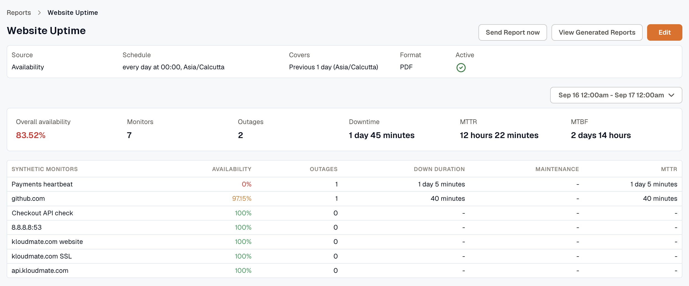
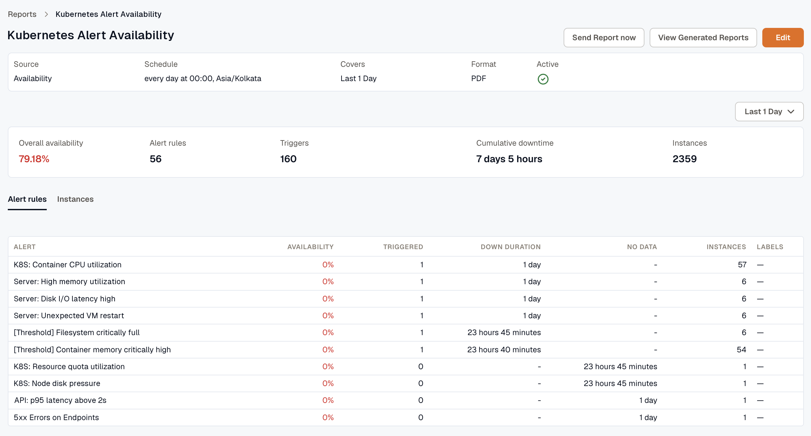
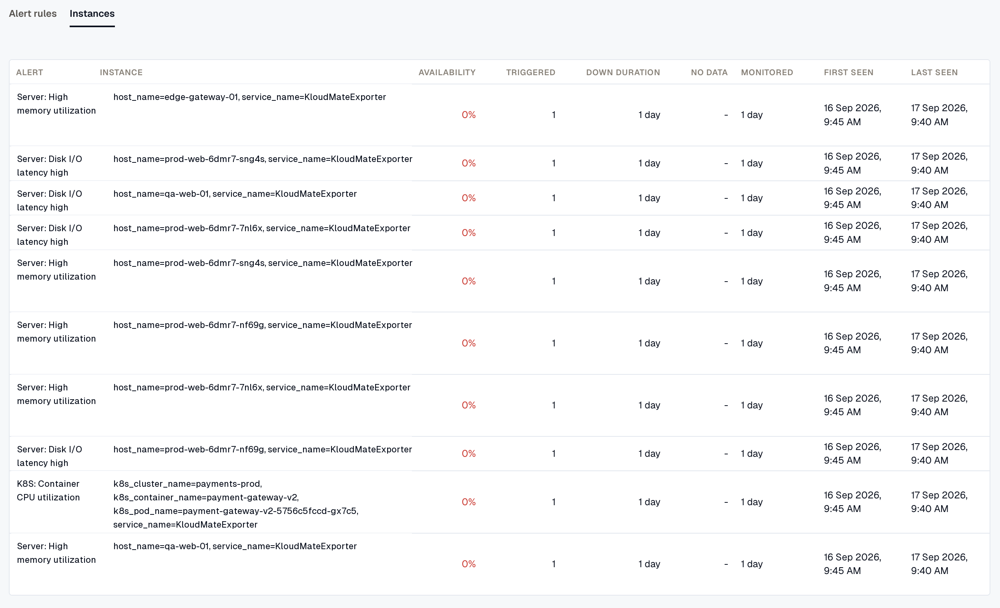

An Availability report shows how much of the report period your synthetic monitors or alert rules were up, and where the downtime came from. The **Monitor type** you choose when you [create the report](../create-report/#choose-a-source) sets which view you get: [Synthetic monitors](#synthetic-monitors) or [Alerts](#alerts).

## Synthetic monitors

With **Monitor type** set to **Synthetic monitors**, the report has one row per monitor. A monitor's **Availability** is the share of its checks that passed. Checks that run during a maintenance window don't count toward availability, and that time appears under **Maintenance** instead.

The summary combines every monitor in the report.

| Figure | What it measures |
| --- | --- |
| **Overall availability** | Up time across all monitors, divided by up time plus down time. It's weighted by time, so it isn't an average of the rows. |
| **Monitors** | The number of monitors in the report. |
| **Outages** | The number of times a monitor went from up to down. |
| **Downtime** | The down time of every monitor, added together. |
| **MTTR** | The average length of an outage: total down time divided by the number of outages. |
| **MTBF** | The average up time between outages: total up time divided by the number of outages. |

Each row shows the monitor's **Availability**, **Outages**, **Down duration**, **Maintenance** time, and **MTTR**.

## Alerts

With **Monitor type** set to **Alerts**, the report measures availability for alert rules and for the instances they evaluate, such as each host or pod.

### How the numbers are calculated

- **Availability** is up time divided by up time, down time, and no data time. Time inside a maintenance window is left out entirely.
- **No data** is time an instance stopped reporting or its evaluation failed. It isn't counted as downtime, but it still lowers availability.
- Downtime starts when the alert condition began. If an alert waits for its condition to persist before notifying, downtime starts before the notification you received.
- An alert rule is down whenever any of its instances is down. A rule's **Down duration** is the clock time during which at least one instance was down, so two instances that are down during the same hour add one hour.

The summary shows **Overall availability**, **Alert rules**, **Triggers**, **Cumulative downtime**, and **Instances**. **Cumulative downtime** adds up the down duration of every rule, so if two rules are down during the same hour, that hour counts twice. **Instances** counts every instance the rules evaluated in the period, including healthy ones.

### Alert rules tab

The **Alert rules** tab has one row per rule:

- **Alert:** the name of the alert rule.
- **Availability:** how much of its monitored time the rule was up.
- **Triggered:** the number of times the rule went from up to down.
- **Down duration:** the clock time during which at least one of the rule's instances was down.
- **No data:** the time none of the rule's instances had data.
- **Instances:** the number of instances the rule evaluated.
- **Labels:** the labels on the rule, if any.

### Instances tab

The **Instances** tab has one row per instance, so you can see which host or pod caused a rule's downtime. **Availability**, **Triggered**, **Down duration**, and **No data** are measured for that instance alone.

- **Instance:** the labels that identify the instance, such as `host=vm1, pod=api`.
- **Monitored:** how much of the period the instance had data. If an instance was added or removed partway through the period, its availability covers only the time it was monitored. An instance at 100% with a short **Monitored** time was healthy while it ran, not for the whole period.
- **First seen** and **Last seen:** the first and last time the instance reported during the period.

When a report matches more instances than it can list, it keeps the instances with the most downtime.

### PDF and XLSX files

The PDF lists alert rules only. The XLSX adds an **Alert Instances** sheet with a row for each instance.

:::tip
The Availability report doesn't include SLA Target, SLA Achieved, or SLA Status columns. To track reliability targets, [set up SLOs](../../reliability/), or schedule an [SLO Compliance report](../../reliability/slo-compliance-report/).
:::

To send the report outside its schedule or download earlier files, see [Send a report now](../#send-a-report-now) and [Download generated reports](../#download-generated-reports).
