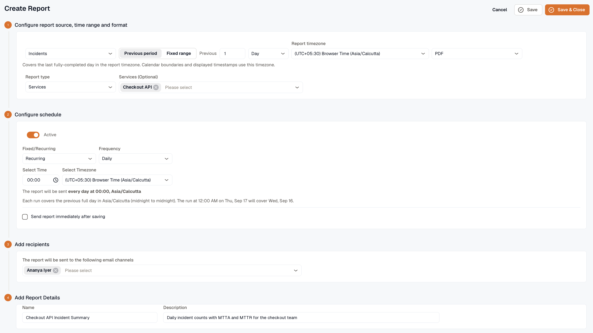
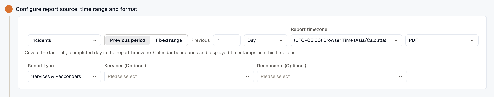
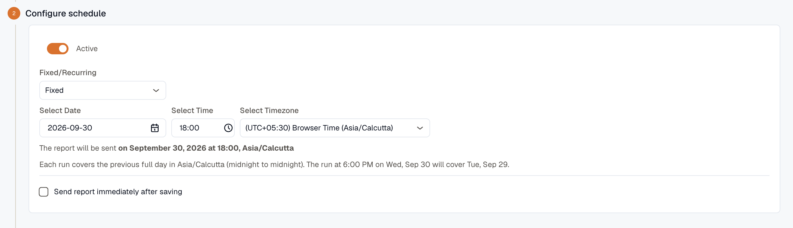
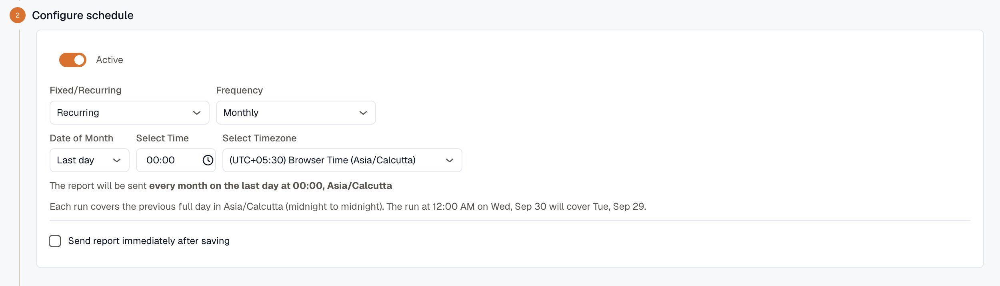
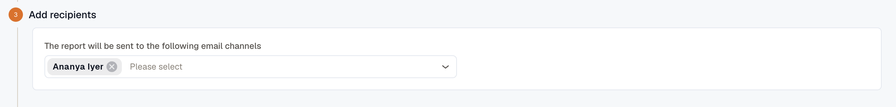
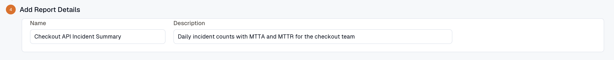

Create a report to email your team the same summary every day, week, or month, or to send it once on a date you choose. Open **Reports** and click **Create Report**. You need the **Developer** role in the workspace.

## Choose a source

Select the source the report pulls from, and fill in the settings for that source.

- **Availability:** uptime for synthetic monitors or alert rules. Choose a **Monitor type**:
  - **Synthetic monitors** is the default. To report on specific monitors, pick them in **Synthetic monitors (Optional)**. Leave it empty to include every synthetic monitor.
  - **Alerts** reports on alert rules. Use **Match alerts by tags** to match the labels on your alert rules, or pick rules in **Select Alerts**. A rule must carry every tag you list. If you select alerts, the tags are ignored. Leave both empty to include every alert rule.
- **Incidents:** incident metrics from Incident Management. Choose a **Report type** of **Services**, **Responders**, or **Services & Responders**. **Services (Optional)** limits the report to the services you pick, and it applies to both tabs. **Responders (Optional)** appears when the report type includes responders, and it limits the Responders tab to the people you pick.
- **Dashboards:** PDF snapshots of dashboards. Pick one or more in **Select dashboards**, and set variable values for each dashboard that has variables. Select **Attach table panels as XLSX** to also get table, logs, and spans panels as a spreadsheet.
- **SLO Compliance:** every enabled SLO in the workspace. This source has no other settings.

For what each report contains, see [Availability Report](../availability-report/), [Incident Report](../incident-report/), [Dashboard Report](../dashboard-report/), and [SLO Compliance report](../../reliability/slo-compliance-report/).

## Set the period the report covers

Choose **Previous period** or **Fixed range**.

**Previous period** covers the most recent complete days, weeks, or months in the **Report timezone**. Set the number of periods and choose **Day**, **Week**, or **Month**. New reports default to 1 **Day**. Weeks run Monday through Sunday.

A scheduled run covers the periods that ended before its scheduled time, and a manual send covers the periods that ended before you send it. For example, a report set to 1 **Week** that runs on a Wednesday covers Monday through Sunday of the previous week. A report set to 1 **Month** that runs on March 1 covers February.

**Fixed range** covers a specific start and end date and time, and every run covers those same dates. Use it for a one-time report on a known window, such as the week of a migration.

:::tip
For a recurring schedule, use **Previous period**. A **Fixed range** repeats the same dates on every run.
:::

The report timezone also affects which period a scheduled run covers. See [Delivery time and report timezone](#delivery-time-and-report-timezone).

## Choose a format

Choose **PDF** or **XLSX**. Dashboard reports are always PDF. To get a dashboard's tables as a spreadsheet, select **Attach table panels as XLSX**.

## Schedule delivery

Turn on **Active** to send the report on a schedule. Leave it off if you only want to send the report manually.

In **Fixed/Recurring**, choose **Fixed** or **Recurring**.

- **Fixed** sends the report one time, on the **Select Date** and **Select Time** you set.
- **Recurring** sends the report at a regular interval. Set **Frequency** to **Daily**, **Weekly**, or **Monthly**, and set **Select Time**. A weekly report also needs a **Day of week**, and a monthly report needs a **Date of Month**.

:::caution
If you set **Date of Month** to 29, 30, or 31, the report isn't sent in months that don't have that day. For a month-end report, choose **Last day**.
:::

Select **Send report immediately after saving** to also send the report as soon as you save it.

### Delivery time and report timezone

- **Select Timezone** sets when the report is delivered. Delivery stays at the same local time when daylight saving time starts or ends.
- **Report timezone** sets where each day, week, or month starts and ends, and the timezone of the timestamps inside the report. With **Fixed range**, set the timezone in the date range picker instead.

Both start out as your browser's timezone.

Each run covers the most recent periods that have fully ended in the report timezone at the time of delivery. When the two timezones match, a daily report covers the previous day, whatever time it's delivered. When they differ, a run can cover an earlier period than you expect.

For example, suppose you deliver a daily report at 8:00 AM Asia/Tokyo with **Report timezone** set to UTC. At 8:00 AM in Tokyo, it's still 11:00 PM the previous day in UTC. That UTC day hasn't ended yet, so the run covers the day before it. By 9:00 AM in Tokyo, the UTC day has ended, so a delivery at 9:00 AM or later covers it.

With **Previous period** and an active schedule, the schedule step shows which dates the next run will cover. It also suggests a later delivery time when delivering later the same day would cover a more recent period.

## Add recipients

Select at least one email channel to receive the report. The list includes the email channels set up in [Notification Channels](../../platform/settings/notification-channels/).

## Name and save the report

Enter a **Name** and, optionally, a **Description**. Both appear in the Reports list.

Click **Save** to save and keep editing, or **Save & Close** to save and return to the Reports list.

After you save, you can [send the report now](../#send-a-report-now) with a different period, format, or recipients, without changing the saved report.
