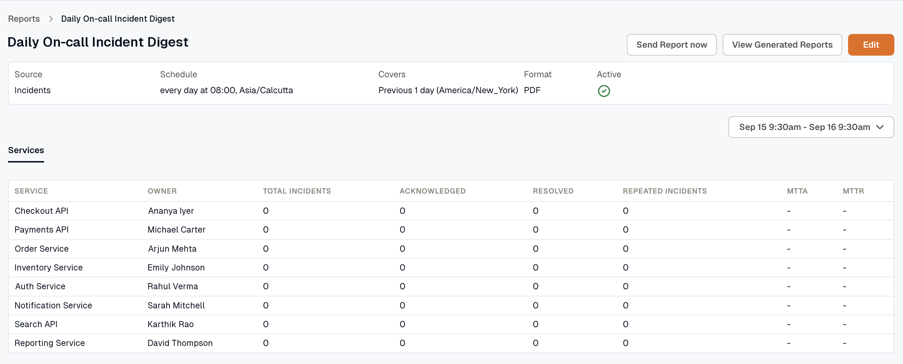
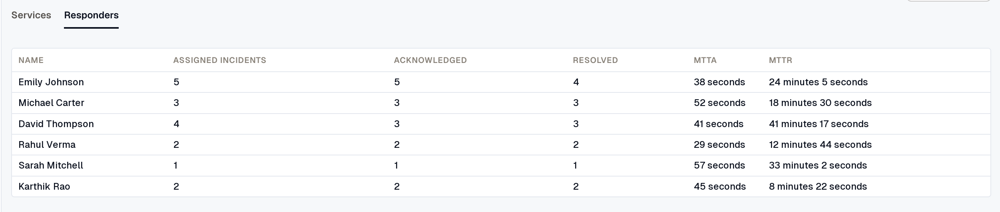

An Incident report shows how many incidents were triggered in the report period and how quickly your team acknowledged and resolved them. The tabs follow the **Report type** you chose when you [created the report](../create-report/#choose-a-source): **Services**, **Responders**, or both for **Services & Responders**.

Every count covers incidents **triggered** in the report period, whenever they were acknowledged or resolved. For example, an incident triggered at 11:00 PM on Monday and resolved at 1:00 AM on Tuesday counts in a report for Monday. If that report runs before the incident is resolved, the incident counts toward **Total Incidents** but not **Resolved**.

## Services

The **Services** tab has one row per service. If you picked services in **Services (Optional)**, the report includes only those services, and the Responders tab counts only their incidents.

- **Service:** the name of the service.
- **Owner:** the owner responsible for the service.
- **Total Incidents:** the number of incidents triggered in the period.
- **Acknowledged:** how many of those incidents have been acknowledged.
- **Resolved:** how many of those incidents have been resolved.
- **Repeated Incidents:** how many of those incidents recurred.
- **MTTA (Mean Time to Acknowledge):** the average time from trigger to acknowledgment.
- **MTTR (Mean Time to Resolve):** the average time from trigger to resolution.

:::tip
The Incident report doesn't include SLA Target, SLA Achieved, or SLA Status columns. To track reliability targets, [set up SLOs](../../reliability/), or schedule an [SLO Compliance report](../../reliability/slo-compliance-report/).
:::

## Responders

The **Responders** tab lists the people on the escalation policies of the services in the report. Someone who isn't on one of those escalation policies doesn't appear, even if they acknowledged an incident. If you picked people in **Responders (Optional)**, only those people appear.

- **Name:** the name of the responder.
- **Assigned Incidents:** the number of incidents the responder was assigned.
- **Acknowledged:** the number of incidents the responder acknowledged.
- **Resolved:** the number of incidents the responder resolved.
- **MTTA (Mean Time to Acknowledge):** the average time from trigger to this responder's acknowledgment.
- **MTTR (Mean Time to Resolve):** the average time from trigger to this responder's resolution.

To send the report outside its schedule or download earlier files, see [Send a report now](../#send-a-report-now) and [Download generated reports](../#download-generated-reports).
