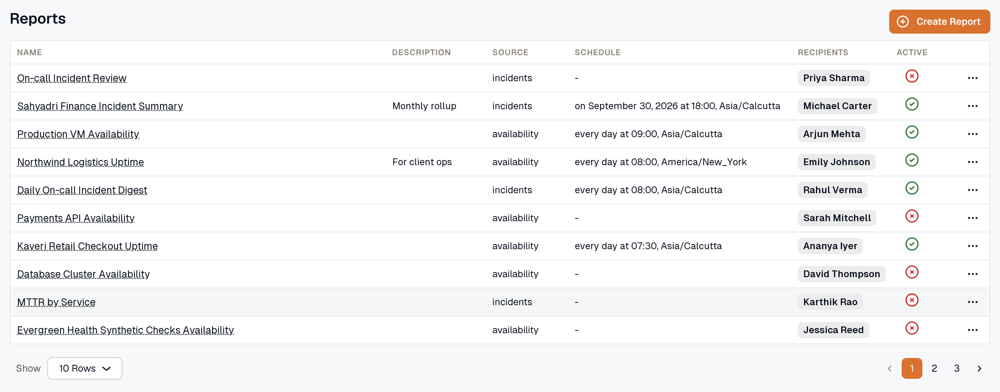
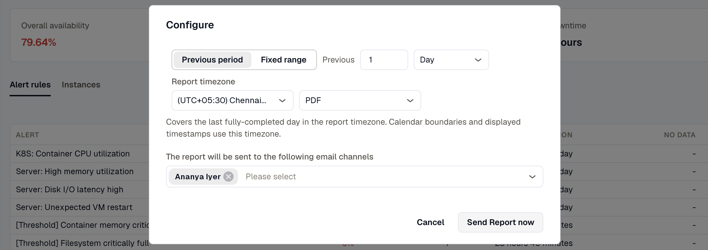

Use reports to email your team a regular summary as a PDF or XLSX file. Each report pulls from one source:

- [Availability](./availability-report/): uptime, outages, and downtime for synthetic monitors or alert rules.
- [Incidents](./incident-report/): incident counts, MTTA, and MTTR by service and by responder.
- [Dashboards](./dashboard-report/): PDF snapshots of one or more dashboards.
- [SLO Compliance](../reliability/slo-compliance-report/): the latest compliance and error budget for every enabled SLO.

## The Reports list

Open **Reports** to see the reports saved in the workspace. To find the files a report has already generated, open the report and click **View Generated Reports**.

- **Name:** the report's name. Select it to open the report.
- **Description:** a short summary of the report's purpose.
- **Source:** the data the report pulls from.
- **Schedule:** when the report is sent, if its schedule is active.
- **Recipients:** the email channels the report is sent to.
- **Active:** whether the report's schedule is turned on.

Use the row menu to **Edit** or **Delete** a report.

## Who can manage reports

You need the **Developer** role in the workspace to create, edit, or delete reports. With the **Viewer** role, you can still open any report, send it now, and download its generated files.

## Open a report

On the report page, **Covers** shows the period each run reports on, such as the previous day in the report timezone.

For every source except Dashboards, the page also previews the report's data, starting at the report's own period. Changing the time range updates only the preview. The saved report and the files it sends keep their own period.

## Send a report now

Click **Send Report now** to generate the report and email it right away, without waiting for the schedule. Before it's sent, you can change the period, format, and recipients for this one send. The saved report doesn't change.

A report set to **Previous period** covers the periods that ended before you send it. For example, a report set to 1 **Day** that you send at 3:00 PM covers yesterday in the report timezone. The file is also added to the report's generated reports.

## Download generated reports

Click **View Generated Reports** on a report to see every file it has produced, from both scheduled runs and manual sends.

**Period Covered** is shown in the report timezone. A **Previous period** report shows dates only, and a **Fixed range** report shows dates and times. Select several files to download them together as a ZIP file.

***

## Related Resources

- [Create a report](./create-report/)
- [Notification Channels](../platform/settings/notification-channels/)
